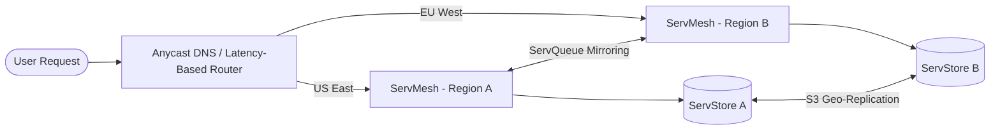

# Multi-Region Deployment Guide

This guide describes the end-to-end architecture, configuration, and synchronization workflows for deploying the Servverse ecosystem across multiple geographic regions.

---

## Architecture Overview

The multi-region setup focuses on three main pillars:
1. **ServStore Replication**: Bi-directional asynchronous object synchronization.
2. **ServQueue Mirroring**: Inter-region message topic mirroring.
3. **ServMesh Geo-Routing**: Latency-based traffic management.

---

## 1. ServStore Geo-Replication

To ensure object durability and low-latency local reads, ServStore objects are replicated asynchronously across regions:

### Primary-Secondary Configuration
- **Write Path**: Clients write to their local regional bucket (e.g., `us-east-1` bucket).
- **Sync Mechanism**: ServStore utilizes cross-region bucket replication rules configured at the object store level (e.g. AWS S3 Replication, Google Cloud Storage Object Replication).
- **Metadata Sync**: File records and catalog databases are synchronized via global replication clusters or write-through regional caches.

---

## 2. ServQueue Mirroring

For event-driven architectures spanning regions, queues must mirror messages to ensure high availability:

### Topic Mirroring
- **Mirroring Broker**: Create a mirror connection bridge between the local region broker (`Region A`) and remote region broker (`Region B`).
- **STOMP Configuration**: Configure the mirror bridge to subscribe to `*.enterprise` topics in Region A and republish them in Region B.
- **Failover Queue depth**: If Region A fails, subscribers in Region B continue processing events from the mirrored queue without loss.

---

## 3. ServMesh Geo-Routing & Failover

ServMesh acts as the geo-router, directing client requests to the nearest healthy service instance:

### Latency-Based Routing
- Set up an Anycast DNS or latency-based DNS routing rule mapping to the external IP addresses of regional `ServGate` instances.
- DNS routes traffic to the nearest geographic Gateway.

### Active-Passive Mesh Failover
- **Health Checks**: Regional Gateways continuously ping local health check endpoints (`/health`).
- **Failover**: If a regional service (e.g., `ServAuth` in Region A) goes down, `ServMesh` automatically routes the auth request to the healthy `ServAuth` instance in Region B via the mesh VPN tunnel.
