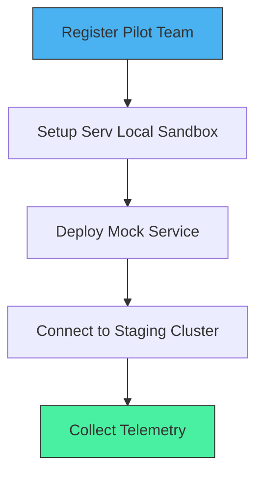

# ServVerse Customer Pilot Program Playbook

Welcome to the **ServVerse Customer Pilot Program**. This guide outlines onboarding steps, configuration guidelines, and feedback collection routines for our pilot engineering teams.

---

## 1. Program Milestones & Objectives

The goal of this pilot is to evaluate the ServVerse unified ecosystem in real-world staging workloads before marking v1.0.0 stable.

* **DX Friction Discovery**: Spot syntax bottlenecks, LSP editor latency, and deployment pipeline bugs.
* **Performance Baseline**: Verify p99 response times under 20ms and evaluate connection pool (ServPool) behavior.
* **Ecosystem Reliability**: Test zero-trust mTLS (ServMesh) and structured logging outputs under active loads.

---

## 2. Onboarding Workflow



### Step 1: Install Unified Environment
Run the setup command on developer workstations:
```bash
# Windows
irm https://raw.githubusercontent.com/vyuvaraj/servverse-repo/main/scripts/install.ps1 | iex
```

### Step 2: Configure Staging Cluster
Create an ecosystem discovery profile (`serv-discovery.json`):
```json
{
  "registry": "http://staging-registry.internal:8080",
  "mesh": "http://staging-mesh.internal:8081",
  "gateway": "http://staging-gateway.internal:8082"
}
```
Set environment profiles:
```powershell
$env:SERVVERSE_DISCOVERY="C:\Path\To\serv-discovery.json"
```

### Step 3: Connect Observability
Configure ServConsole to forward metrics/spans to your existing dashboard endpoints (e.g. Datadog / Grafana Tempo):
```yaml
observability:
  otel_exporter_otlp_endpoint: "http://otel-collector.internal:4317"
```

---

## 3. Communication & Feedback Loops

* **Staging Slack Channel**: Direct linkage to the core ecosystem development team for rapid assistance.
* **Weekly Diagnostics Sync**: 15-minute review covering LSP diagnostics performance and sandbox issues.
* **GitHub Issue Tagging**: Tag staging bugs using labels: `pilot-blocker`, `dx-friction`, or `performance-regression`.
