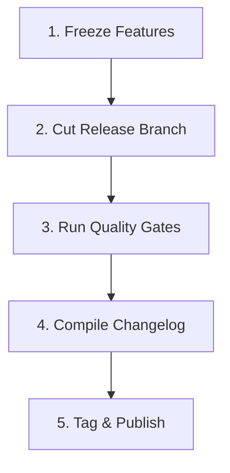

# Monthly Release Cadence & Versioning Strategy

This document outlines the versioning strategy, release cadence, and branch management workflows for all components in the Servverse ecosystem.

---

## Release Schedule
- **Frequency**: Predictable monthly releases on the **first Tuesday of every month**.
- **Version Cadence**:
  - Minor updates (e.g., `v0.2.0`, `v0.3.0`) group new feature sets, performance enhancements, and standard library extensions.
  - Patch updates (e.g., `v0.2.1`) address critical bugs or security vulnerabilities and are published on an ad-hoc basis.

---

## Semantic Versioning (SemVer)
We follow strictly [Semantic Versioning 2.0.0](https://semver.org/):
- **MAJOR (`X.y.z`)**: Reserved for incompatible API changes.
- **MINOR (`x.Y.z`)**: Added backwards-compatible features, standard library modules, or tooling upgrades.
- **PATCH (`x.y.Z`)**: Backwards-compatible bug fixes and security hotfixes.

---

## Release Process Checklist



### 1. Feature Freeze (T-5 Days)
- No new features are merged into the `main` branch.
- Focus shifts entirely to bug fixes, integration testing, and documentation hardening.

### 2. Cut Release Branch (T-3 Days)
- Cut a release branch from `main` named `release/vX.Y.0` (e.g., `release/v0.2.0`).
- Increment the version strings in `go.mod`, package versions, and console configurations on the release branch.

### 3. Quality Gate Verification (T-2 Days)
- Ensure all CI workflows pass cleanly on the release branch:
  - API backward compatibility check.
  - Test coverage gate (checks minimum statement coverage requirements).
  - Performance SLA gate (checks for p99 latency regressions).

### 4. Compile Changelog (T-1 Day)
- Generate a summary of features, bug fixes, and breaking changes.
- Append the release notes to `CHANGELOG.md`.

### 5. Tag and Publish (Release Day)
- Merge `release/vX.Y.0` back into `main`.
- Create and push a signed git tag:
  ```bash
  git tag -a vX.Y.0 -m "Release vX.Y.0"
  git push origin vX.Y.0
  ```
- The release tag triggers the automated build pipeline to publish Docker images, WASM binaries, and update the docs page.

---

## Emergency Hotfix Process
When a critical vulnerability or regression is found in production:
1. Cut a branch from the last release tag: `hotfix/vX.Y.Z` (e.g., `hotfix/v0.2.1`).
2. Apply the fix and verify it with unit tests.
3. Merge back into `main` and tag the release as `vX.Y.Z`.
