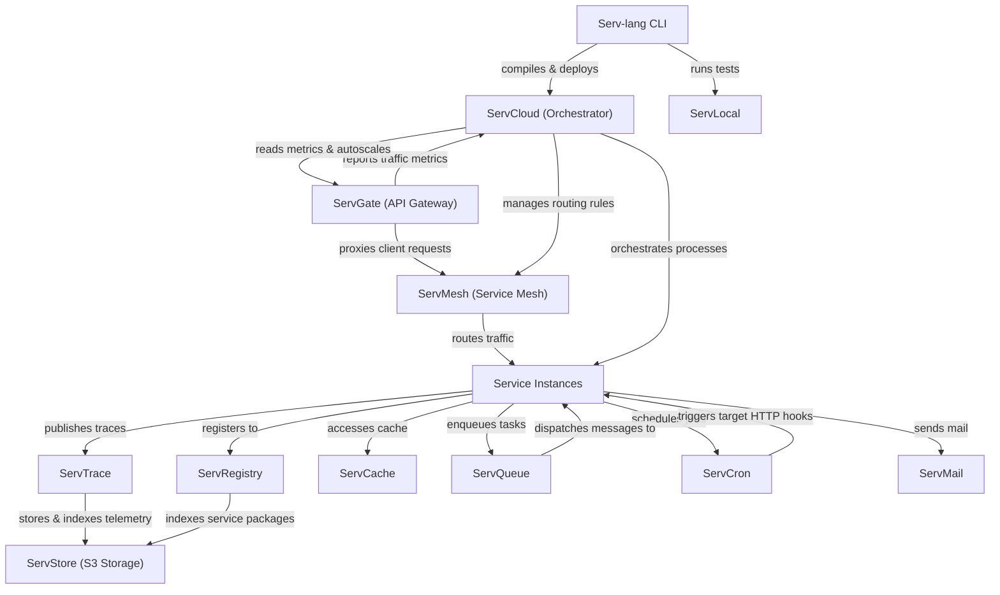

# Serv Unified Ecosystem Roadmap & Architect Analysis

> Single source of truth for the **Serv** ecosystem: Serv-lang, ServGate, ServStore, ServQueue, ServConsole, ServCache, ServMesh, ServCron, ServCloud, ServTrace, ServTunnel, ServAuth, ServDB, ServMail, ServFlow, and the Servverse vision.  
> Last updated: July 5, 2026

---

## Phase 9: Scale & Enterprise Hardening (Active)

### Completion Tracker

| Initiative Area | Total Items | Completed | Pending | Progress | Status Bar |
|-----------------|-------------|-----------|---------|----------|------------|
| **⚡ Performance, Scaling & HA** | 2 | 2 | 0 | **100%** | ████████████████████ |
| **🔐 Security & Integrity** | 1 | 1 | 0 | **100%** | ████████████████████ |
| **🛠️ Developer Experience** | 1 | 1 | 0 | **100%** | ████████████████████ |
| **🌐 DevOps & Infrastructure** | 3 | 3 | 0 | **100%** | ████████████████████ |
| **📋 API Versioning & Scaling** | 1 | 1 | 0 | **100%** | ████████████████████ |
| **📟 Diagnostics & Operations** | 1 | 1 | 0 | **100%** | ████████████████████ |
| **🚀 Next-Level Core Enhancements** | 4 | 3 | 1 | **75%** | ███████████████░░░░░ |
| **TOTAL WORK** | **13** | **12** | **1** | **92%** | ██████████████████░░ |

---

### 🚀 Next-Level Core Enhancements (Pending)

| CORE.6 | **Built-in Multi-Agent AI Framework** — ✅ First-class support for AI agents, memory, tools, RAG, and MCP schemas in `serv-lang` via `agent` block declarations | Serv-lang | High |
| ARCH.9 | **Unified Distributed Runtime (Serv Runtime)** — Host agent encapsulating service discovery, retries, configurations, and telemetry dynamically | ServMesh, ServShared | High |

---

## Phase 10: Productization & Cloud PaaS Platform (Future)

Phase 10 targets commercialization, natural language app generation, round-trip visual editors, and hosted serverless scaling:

### Proposed Projects

| # | Feature | Components Affected | Priority |
|---|---------|-------------------|----------|
| DX.11 | **AI-Powered Scaffolder** — Natural language scaffolding generator (`serv create "<prompt>"`) | Serv-lang | High |
| UI.3 | **Visual Architecture Designer** — Interactive drag-and-drop designer with round-trip sync | ServConsole, Serv-lang | Medium |
| UI.4 | **Visual Workflow Designer** — Drag-and-drop stateful workflow editor generating native `serv-lang` code | ServConsole, ServFlow | High |
| AI.9 | **Autonomous Tuning & Self-Optimization** — Production telemetry analysis applying dynamic indexes/caches | ServTrace, ServShared | Medium |
| REG.3 | **Package Developer Marketplace** — Shared package hub for templates, WASM filters, and workflows | ServRegistry | Medium |
| CLOUD.1 | **Servverse Cloud Platform** — Managed serverless PaaS hosting environment | ServCloud, ServGate | High |
| CLOUD.2 | **ServEdge Computing Runtime** — Edge-deployed WASM execution with dynamic geo-routing and offline sync | Serv-lang, ServMesh | Medium |
| CORE.7 | **Event Sourcing & CQRS Framework** — Native event-sourced projection engines utilizing ServQueue and ServStore | Serv-lang, ServQueue, ServStore | High |
| DATA.1 | **Universal Data Fabric** — Consistent query abstraction layer unified across SQL, NoSQL, Cache, and Object APIs | Serv-lang, ServShared | Medium |
| DX.12 | **Serv Studio Desktop IDE** — Cross-platform desktop environment with integrated visual debugging and monitoring | ServConsole, Serv-lang | Medium |
| OPS.16 | **Platform Intelligence & Governance** — Architecture compliance scoring, cost analysis, and security posture checks | All Services | Medium |
| DX.13 | **Time-Travel Workflow Replay** — Debug complex workflow errors by replaying trace logs step-by-step locally | ServFlow, ServTrace | High |
| DX.14 | **Declarative Schema Migrations** — Native DSL table definitions with automated structural migration checks | Serv-lang, ServDB | High |
| DX.15 | **Hot-Reloading Dev Server (`serv dev`)** — ✅ Watcher running local tests, hot-reloading code, and refreshing the console | Serv-lang, servverse-repo | Medium |
| DX.16 | **Autogenerated Clients & OpenAPI SDKs** — Compilation hook generating clean TypeScript, Dart, and Swift API clients | Serv-lang, ServGate | Medium |
| CORE.8 | **Distributed Lock Manager (`ServLock`)** — Cross-cutting locking coordinator providing `@mutex` guarantees across services | ServMesh, ServShared | High |
| SEC.17 | **Unified Dynamic Policy Enforcement (`ServPolicy`)** — Declarative schema-based security, data, and rate policy engine | All Services | Medium |
| API.8 | **Ecosystem-Wide Schema Registry** — Schema broker validating DTOs across REST requests, STOMP messages, and S3 payloads | ServRegistry, ServGate | High |
| OPS.17 | **Chaos Fault Injection Middleware** — Inject transport latencies, connection drops, and queue dropouts dynamically in development | ServMesh, ServShared | Medium |

---

## Appendix A: Cross-Service Runtime Dependency Diagram

---

## Appendix B: Component Maturity Matrix

| Component | API Contract | Persistence | Security | Observability | Tests | Docs | Overall Maturity |
|-----------|--------------|-------------|----------|---------------|-------|------|------------------|
| **Serv-lang** | 🟢 Production | ⚪ N/A | 🟡 Medium | 🟢 Production | 🟢 Production | 🟢 Production | **Production-Ready** |
| **ServGate** | 🟢 Production | ⚪ N/A | 🟢 Production | 🟢 Production | 🟢 Production | 🟢 Production | **Production-Ready** |
| **ServMesh** | 🟢 Production | ⚪ N/A | 🟢 Production | 🟢 Production | 🟢 Production | 🟢 Production | **Production-Ready** |
| **ServCloud** | 🟢 Production | 🟢 Production | 🟡 Medium | 🟢 Production | 🟢 Production | 🟢 Production | **Production-Ready** |
| **ServTrace** | 🟢 Production | 🟢 Production | 🟡 Medium | 🟢 Production | 🟢 Production | 🟢 Production | **Production-Ready** |
| **ServStore** | 🟢 Production | 🟢 Production | 🟡 Medium | 🟡 Medium | 🟡 Medium | 🟡 Medium | **Stable** |
| **ServQueue** | 🟢 Production | 🟢 Production | 🟡 Medium | 🟡 Medium | 🟢 Production | 🟡 Medium | **Stable** |
| **ServCache** | 🟢 Production | 🟢 Production | 🟡 Medium | 🟡 Medium | 🟢 Production | 🟡 Medium | **Stable** |
| **ServCron** | 🟢 Production | 🟢 Production | 🟡 Medium | 🟡 Medium | 🟢 Production | 🟡 Medium | **Stable** |
| **ServMail** | 🟢 Production | 🟡 Medium | 🟡 Medium | 🟡 Medium | 🟢 Production | 🟡 Medium | **Stable** |
| **ServRegistry**| 🟢 Production | 🟢 Production | 🟡 Medium | 🟡 Medium | 🟡 Medium | 🟡 Medium | **Stable** |
| **ServDocs** | 🟡 Medium | ⚪ N/A | ⚪ N/A | ⚪ N/A | 🟡 Medium | 🟢 Production | **Beta** |
