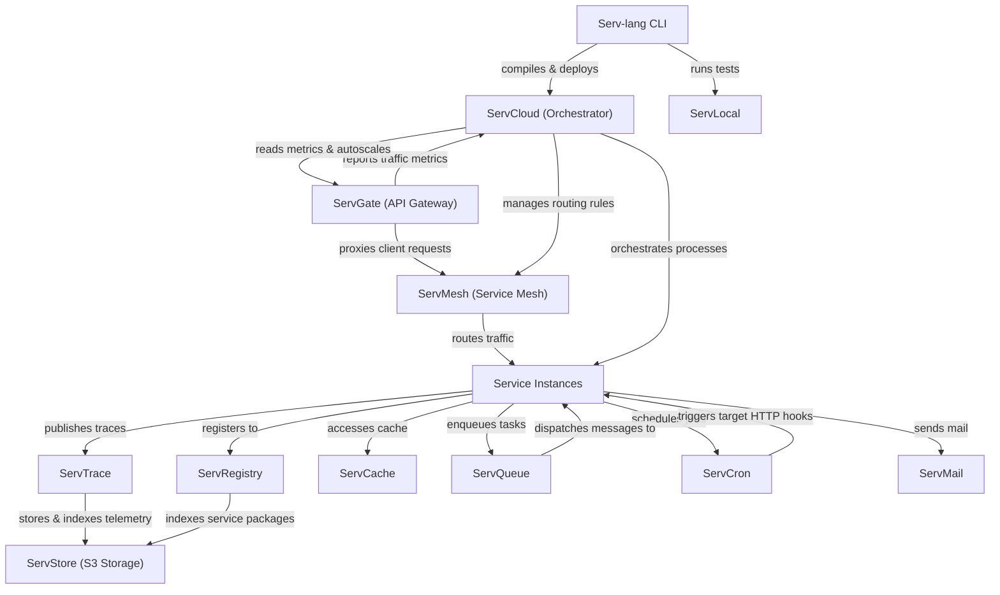

# Serv Unified Ecosystem Roadmap & Architect Analysis

> Single source of truth for the **Serv** ecosystem: Serv-lang, ServGate, ServStore, ServQueue, ServConsole, ServCache, ServMesh, ServCron, ServCloud, ServTrace, ServTunnel, ServAuth, ServDB, ServMail, ServFlow, and the Servverse vision.  
> Last updated: July 9, 2026

---

## Ecosystem Completion Status

All items in Phases 1 through 14 have been fully implemented, verified, and pushed.

- For completed details of Phases 1 to 5: Refer to the git history and repository CHANGELOG.
- For completed details of Phases 6 to 10: See [UNIFIED_ROADMAP_COMPLETED_6_10.md](file:///c:/Mine/try/serv/servverse-repo/UNIFIED_ROADMAP_COMPLETED_6_10.md).
- For completed details of Phases 11 to 15: See [UNIFIED_ROADMAP_COMPLETED_11_15.md](file:///c:/Mine/try/serv/servverse-repo/UNIFIED_ROADMAP_COMPLETED_11_15.md).

### Completion Tracker

| Initiative Area | Total Items | Completed | Pending | Progress | Status Bar |
|-----------------|-------------|-----------|---------|----------|------------|
| **Phase 9: Scale & Enterprise Hardening** | 13 | 13 | 0 | **100%** | ████████████████████ |
| **Phase 10: Productization & Cloud PaaS** | 32 | 32 | 0 | **100%** | ████████████████████ |
| **Phase 11: Unified Dashboard & Console** | 33 | 33 | 0 | **100%** | ████████████████████ |
| **Phase 12: Dual-Licensing & EE Split** | 19 | 19 | 0 | **100%** | ████████████████████ |
| **Phase 13: Language & Runtime Evolution**| 18 | 18 | 0 | **100%** | ████████████████████ |
| **Phase 14: AI-Native Ecosystem** | 28 | 28 | 0 | **100%** | ████████████████████ |
| **Phase 16: Operational Hardening & Production Readiness** | 18 | 17 | 1 | **94%** | ███████████████████░ |
| **TOTAL ECOSYSTEM WORK** | **161** | **160** | **1 | **99%** | ████████████████████ |

---

## Phase 15: Component Backlog & Future Enhancements (Completed)

All backlog and component enhancement items for Phase 15 have been fully completed, verified, and pushed.

- For completed details of Phase 15: See [UNIFIED_ROADMAP_COMPLETED_11_15.md](file:///c:/Mine/try/serv/servverse-repo/UNIFIED_ROADMAP_COMPLETED_11_15.md).

---

## Appendix A: Cross-Service Runtime Dependency Diagram

---

## Appendix B: Component Maturity Matrix

| Component | API Contract | Persistence | Security | Observability | Tests | Docs | Console Integration | Overall Maturity |
|-----------|--------------|-------------|----------|---------------|-------|------|---------------------|------------------|
| **Serv-lang** | 🟢 Production | ⚪ N/A | 🟡 Medium | 🟢 Production | 🟢 Production | 🟢 Production | ⚪ N/A | **Production-Ready** |
| **ServGate** | 🟢 Production | ⚪ N/A | 🟢 Production | 🟢 Production | 🟢 Production | 🟢 Production | 🟢 Full proxy + panel | **Production-Ready** |
| **ServMesh** | 🟢 Production | ⚪ N/A | 🟢 Production | 🟢 Production | 🟢 Production | 🟢 Production | 🟢 Full panel | **Production-Ready** |
| **ServCloud** | 🟢 Production | 🟢 Production | 🟡 Medium | 🟢 Production | 🟢 Production | 🟢 Production | 🟢 Full panel | **Production-Ready** |
| **ServTrace** | 🟢 Production | 🟢 Production | 🟢 Production | 🟢 Production | 🟢 Production | 🟢 Production | 🟢 Full proxy + panel | **Production-Ready** |
| **ServStore** | 🟢 Production | 🟢 Production | 🟢 Production | 🟡 Medium | 🟡 Medium | 🟡 Medium | 🟢 Full proxy + panel | **Stable** |
| **ServQueue** | 🟢 Production | 🟢 Production | 🟢 Production | 🟡 Medium | 🟢 Production | 🟡 Medium | 🟢 Full proxy + panel | **Stable** |
| **ServConsole** | 🟢 Production | 🟡 Medium | 🟢 Production | 🟢 Production | 🟡 Medium | 🟡 Medium | ⚪ Self | **Stable** |
| **ServCache** | 🟢 Production | 🟢 Production | 🟢 Production | 🟡 Medium | 🟢 Production | 🟡 Medium | 🟢 Full panel | **Stable** |
| **ServCron** | 🟢 Production | 🟢 Production | 🟢 Production | 🟡 Medium | 🟢 Production | 🟡 Medium | 🟢 Full panel | **Stable** |
| **ServAuth** | 🟢 Production | 🟡 Medium | 🟢 Production | 🟡 Medium | 🟢 Production | 🟡 Medium | 🟢 Full proxy + panel | **Stable** |
| **ServDB** | 🟢 Production | 🟡 Medium | 🟢 Production | 🟡 Medium | 🟢 Production | 🟡 Medium | 🟢 Full proxy + panel | **Stable** |
| **ServMail** | 🟢 Production | 🟡 Medium | 🟢 Production | 🟡 Medium | 🟢 Production | 🟡 Medium | 🟢 Full proxy + panel | **Stable** |
| **ServFlow** | 🟢 Production | 🟡 Medium | 🟡 Medium | 🟡 Medium | 🟢 Production | 🟡 Medium | 🟢 Full panel | **Stable** |
| **ServTunnel** | 🟢 Production | ⚪ N/A | 🟢 Production | 🟢 Production | 🟢 Production | 🟢 Production | 🟢 Full proxy + panel | **Production-Ready** |
| **ServRegistry**| 🟢 Production | 🟢 Production | 🟢 Production | 🟡 Medium | 🟢 Production | 🟢 Production | 🟢 Full panel | **Production-Ready** |
| **ServDocs** | 🟢 Production | ⚪ N/A | ⚪ N/A | ⚪ N/A | 🟢 Production | 🟢 Production | 🟢 Embedded | **Production-Ready** |

---

## Phase 16: Operational Hardening & Production Readiness (Pending)

The following backlog tasks target upgrading remaining components from **Stable** to **Production-Ready** by hardening their security, persistence, and observability layers:

### 📦 ServStore
- [x] **KMS Envelope Encryption** — Implement envelope encryption via AWS KMS / Google Cloud KMS for stored S3 objects to secure sensitive file payloads. [July 9, 2026]
- [x] **OTel Performance Instrumentation** — Add OpenTelemetry metric tracking for S3 upload/download latency, throughput, and error budgets. [July 9, 2026]

### 📥 ServQueue
- [x] **mTLS Client Verification** — Enforce client certificate authentication (mTLS) for publishers and subscribers on enterprise topics. [July 9, 2026]
- [x] **Prometheus Queue Lag Metrics** — Export message consumer lag, queue depth, and processing latency directly to Prometheus endpoints. [July 9, 2026]

### 💻 ServConsole
- [x] **Persistent Session Storage** — Implement PostgreSQL/Sqlite-based persistent storage for user sessions to ensure session survivability. [July 9, 2026]
- [x] **Frontend Playwright E2E Tests** — Set up Playwright automated browser tests to validate critical UI flows and charts. [July 9, 2026]

### ⚡ ServCache
- [x] **Redis/Memcached Protocol TLS** — Support native TLS encryption for all Redis and Memcached client connections. [July 9, 2026]
- [x] **OTel Cache Metrics** — Export cache hit/miss ratio, memory fragmentation, and key eviction counts to central OTel collectors. [July 9, 2026]

### ⏰ ServCron
- [x] **API RBAC Enforcement** — Enforce Role-Based Access Control on job builder and trigger APIs, requiring admin privilege to register new crons. [July 9, 2026]
- [x] **Execution Syslog Integration** — Direct cron job stdout, exit statuses, and durations to syslog or central log drains. [July 9, 2026]

### 🛡️ ServAuth
- [x] **Persistent Token Storage** — Store issued refresh tokens in a database to enable remote token revocation and active session audits. [July 9, 2026]
- [x] **Auth Audit Logs** — Generate structured JSON audit trails for all authentication events, login failures, and MFA setups. [July 9, 2026]

### 🗄️ ServDB
- [x] **mTLS Connection Checks** — Support mutual TLS verification for all database client connections. [July 9, 2026]
- [x] **Pool Connection Stats** — Export connection pool usage, active/idle count, and wait duration metrics. [July 9, 2026]

### 📧 ServMail
- [x] **DKIM Outbound Signatures** — Add support for automated DKIM signature headers and SPF verification checks. [July 9, 2026]
- [x] **Disk Queue Persistence** — Save outgoing mail queues to disk to prevent email loss during server restarts or crashes. [July 9, 2026]

### 🔄 ServFlow
- [x] **Saga State DB Storage** — Persist saga states, transaction steps, and rollback progress in a distributed database instead of memory. [July 9, 2026]
- [ ] **Flow Latency telemetry** — Add OTel spans tracking execution duration for each step and overall workflow success rates.

---

## Appendix C: Architectural Policy for OSS/EE Boundaries

All commercial enterprise features (**EE**) must have their core logic and implementations located exclusively inside the private `servverse-ee` repository. 
The open-source core repositories (such as `ServGate`, `ServStore`, etc.) must only expose clean interfaces, hooks, or config fields. The implementation of these hooks in the open-source code must use build-tagged placeholders (`//go:build !enterprise`), while the actual commercial code resides under the corresponding directories in `servverse-ee` and is built with `//go:build enterprise`.
