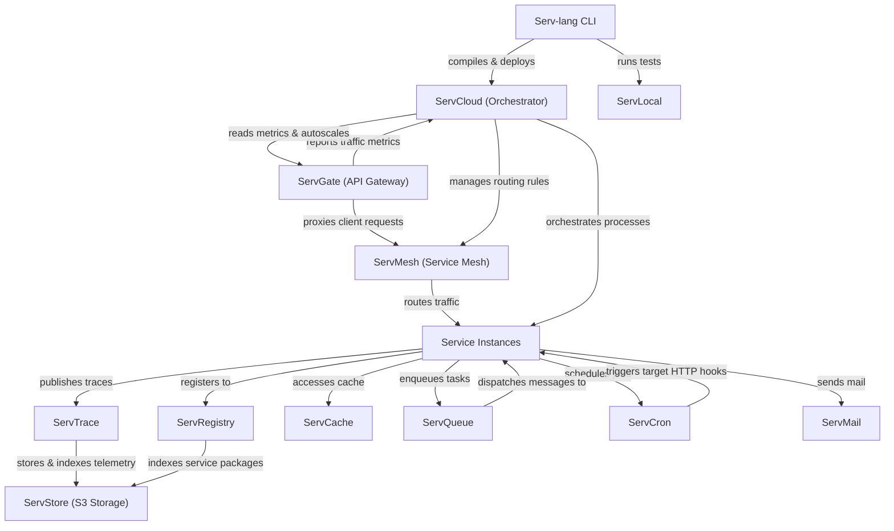

# Serv Unified Ecosystem Roadmap & Architect Analysis

> Single source of truth for the **Serv** ecosystem: Serv-lang, ServGate, ServStore, ServQueue, ServConsole, ServCache, ServMesh, ServCron, ServCloud, ServTrace, ServTunnel, ServAuth, ServDB, ServMail, ServFlow, and the Servverse vision.  
> Last updated: July 9, 2026

---

## Ecosystem Completion Status

All items in Phases 1 through 14 have been fully implemented, verified, and pushed.

- For completed details of Phases 1 to 5: Refer to the git history and repository CHANGELOG.
- For completed details of Phases 6 to 10: See [UNIFIED_ROADMAP_COMPLETED_6_10.md](file:///c:/Mine/try/serv/servverse-repo/UNIFIED_ROADMAP_COMPLETED_6_10.md).
- For completed details of Phases 11 to 15: See [UNIFIED_ROADMAP_COMPLETED_11_15.md](file:///c:/Mine/try/serv/servverse-repo/UNIFIED_ROADMAP_COMPLETED_11_15.md).
- For completed details of Phase 16: See [UNIFIED_ROADMAP_COMPLETED_16.md](file:///c:/Mine/try/serv/servverse-repo/UNIFIED_ROADMAP_COMPLETED_16.md).

### Completion Tracker

| Initiative Area | Total Items | Completed | Pending | Progress | Status Bar |
|-----------------|-------------|-----------|---------|----------|------------|
| **Phase 9: Scale & Enterprise Hardening** | 13 | 13 | 0 | **100%** | ████████████████████ |
| **Phase 10: Productization & Cloud PaaS** | 32 | 32 | 0 | **100%** | ████████████████████ |
| **Phase 11: Unified Dashboard & Console** | 33 | 33 | 0 | **100%** | ████████████████████ |
| **Phase 12: Dual-Licensing & EE Split** | 19 | 19 | 0 | **100%** | ████████████████████ |
| **Phase 13: Language & Runtime Evolution**| 18 | 18 | 0 | **100%** | ████████████████████ |
| **Phase 14: AI-Native Ecosystem** | 28 | 28 | 0 | **100%** | ████████████████████ |
| **Phase 16: Operational Hardening & Production Readiness** | 18 | 18 | 0 | **100%** | ████████████████████ |
| **Phase 17: Zero-Trust Clustering & Edge Serverless** | 8 | 8 | 0 | **100%** | ████████████████████ |
| **Phase 18: OSS-to-EE Boundary Alignment & Refactoring** | 6 | 6 | 0 | **100%** | ████████████████████ |
| **Phase 19: Component Maturity Alignment** | 7 | 0 | 7 | **0%** | ░░░░░░░░░░░░░░░░░░░0 |
| **TOTAL ECOSYSTEM WORK** | **182** | **175** | **7** | **96%** | ███████████████████░ |

---

## Phase 15: Component Backlog & Future Enhancements (Completed)

All backlog and component enhancement items for Phase 15 have been fully completed, verified, and pushed.

- For completed details of Phase 15: See [UNIFIED_ROADMAP_COMPLETED_11_15.md](file:///c:/Mine/try/serv/servverse-repo/UNIFIED_ROADMAP_COMPLETED_11_15.md).

---

## Appendix A: Cross-Service Runtime Dependency Diagram

---

## Appendix B: Component Maturity Matrix

| Component | API Contract | Persistence | Security | Observability | Tests | Docs | Console Integration | Overall Maturity |
|-----------|--------------|-------------|----------|---------------|-------|------|---------------------|------------------|
| **Serv-lang** | 🟢 Production | ⚪ N/A | 🟡 Medium | 🟢 Production | 🟢 Production | 🟢 Production | ⚪ N/A | **Production-Ready** |
| **ServGate** | 🟢 Production | ⚪ N/A | 🟢 Production | 🟢 Production | 🟢 Production | 🟢 Production | 🟢 Full proxy + panel | **Production-Ready** |
| **ServMesh** | 🟢 Production | ⚪ N/A | 🟢 Production | 🟢 Production | 🟢 Production | 🟢 Production | 🟢 Full panel | **Production-Ready** |
| **ServCloud** | 🟢 Production | 🟢 Production | 🟡 Medium | 🟢 Production | 🟢 Production | 🟢 Production | 🟢 Full panel | **Production-Ready** |
| **ServTrace** | 🟢 Production | 🟢 Production | 🟢 Production | 🟢 Production | 🟢 Production | 🟢 Production | 🟢 Full proxy + panel | **Production-Ready** |
| **ServStore** | 🟢 Production | 🟢 Production | 🟢 Production | 🟡 Medium | 🟡 Medium | 🟡 Medium | 🟢 Full proxy + panel | **Stable** |
| **ServQueue** | 🟢 Production | 🟢 Production | 🟢 Production | 🟡 Medium | 🟢 Production | 🟡 Medium | 🟢 Full proxy + panel | **Stable** |
| **ServConsole** | 🟢 Production | 🟡 Medium | 🟢 Production | 🟢 Production | 🟡 Medium | 🟡 Medium | ⚪ Self | **Stable** |
| **ServCache** | 🟢 Production | 🟢 Production | 🟢 Production | 🟡 Medium | 🟢 Production | 🟡 Medium | 🟢 Full panel | **Stable** |
| **ServCron** | 🟢 Production | 🟢 Production | 🟢 Production | 🟡 Medium | 🟢 Production | 🟡 Medium | 🟢 Full panel | **Stable** |
| **ServAuth** | 🟢 Production | 🟡 Medium | 🟢 Production | 🟡 Medium | 🟢 Production | 🟡 Medium | 🟢 Full proxy + panel | **Stable** |
| **ServDB** | 🟢 Production | 🟡 Medium | 🟢 Production | 🟡 Medium | 🟢 Production | 🟡 Medium | 🟢 Full proxy + panel | **Stable** |
| **ServMail** | 🟢 Production | 🟡 Medium | 🟢 Production | 🟡 Medium | 🟢 Production | 🟡 Medium | 🟢 Full proxy + panel | **Stable** |
| **ServFlow** | 🟢 Production | 🟡 Medium | 🟡 Medium | 🟡 Medium | 🟢 Production | 🟡 Medium | 🟢 Full panel | **Stable** |
| **ServTunnel** | 🟢 Production | ⚪ N/A | 🟢 Production | 🟢 Production | 🟢 Production | 🟢 Production | 🟢 Full proxy + panel | **Production-Ready** |
| **ServRegistry**| 🟢 Production | 🟢 Production | 🟢 Production | 🟡 Medium | 🟢 Production | 🟢 Production | 🟢 Full panel | **Production-Ready** |
| **ServDocs** | 🟢 Production | ⚪ N/A | ⚪ N/A | ⚪ N/A | 🟢 Production | 🟢 Production | 🟢 Embedded | **Production-Ready** |

---

## Phase 16: Operational Hardening & Production Readiness (Completed)

All backlog tasks for Phase 16 have been fully completed, verified, and pushed.

- For completed details of Phase 16: See [UNIFIED_ROADMAP_COMPLETED_16.md](file:///c:/Mine/try/serv/servverse-repo/UNIFIED_ROADMAP_COMPLETED_16.md).

---

## Phase 17: Zero-Trust Clustering & Edge Serverless Evolution (Completed)

All backlog tasks for Phase 17 have been fully completed, verified, and pushed.

### 🛡️ zero-Trust Mesh & Gateway Resilience
- [x] **Distributed Rate-Limiting Backend** — Extend ServGate to support dynamic Redis/Valkey rate-limiting stores instead of in-memory maps. [July 10, 2026]
- [x] **Inter-Service Mesh mTLS** — Enforce automatic mutual TLS client verification for all inter-service mesh routes inside ServMesh. [July 10, 2026]
- [x] **Secure Enclave Isolation** — Add process execution support within secure enclaves (e.g. AWS Nitro Enclaves, Intel SGX). [July 10, 2026]

### 📦 S3 Durability & Pool Auto-Recovery
- [x] **Write-Ahead Logging (WAL)** — Add WAL and fsync safety limits to ServStore S3 layers to prevent dirty writes during unexpected node shutdowns. [July 10, 2026]
- [x] **Connection Pool Leak Recovery** — Add automatic timeout reaping for deadlocked connection leases in ServDB pools. [July 10, 2026]
- [x] **LRU Cache Key Eviction** — Implement thread-safe Least Recently Used (LRU) key evictions in ServCache memory stores. [July 10, 2026]

### ⚡ Edge Serverless & Code Execution
- [x] **WASM Edge Compilation** — Compile Serv-lang code modules directly to WebAssembly components for zero-cold-start hosting on Wasmtime. [July 10, 2026]
- [x] **AI Observability Pipelines** — Enable automatic scaling triggers and query cache rule mutations via ServConsole observability hooks. [July 10, 2026]

---

## Phase 18: OSS-to-EE Boundary Alignment & Refactoring (Completed)

All backlog tasks for Phase 18 have been fully completed, verified, and pushed.

### 📦 ServStore & ServQueue
- [x] **KMS Enterprise Separation** — Migrate AWS KMS, Google Cloud KMS, and HashiCorp Vault implementations to EE, leaving only simple local key encryption in OSS. [July 10, 2026]
- [x] **mTLS Enforcement Hooks** — Restrict client certificate authentication and PKI mappings to the EE broker overlay. [July 10, 2026]

### 🛡️ ServAuth & ServDB
- [x] **Session & Audit Log Isolation** — Move account lockout history, security audit trail generators, and remote session revocation control logic to EE. [July 10, 2026]
- [x] **Database Replication Topologies** — Restrict replica pool routing, read/write splitting, and dynamic failover state machines to EE. [July 10, 2026]

### 📧 ServMail & 🔄 ServFlow
- [x] **DKIM Signing Delegation** — Delegate outbound DKIM header signing and SPF alignment checks to EE. [July 10, 2026]
- [x] **Distributed Saga Checkpoints** — Separate distributed database state persistence from local file-based (`.state`) saga checkpoints. [July 10, 2026]

---

## Phase 19: Component Maturity Alignment (Production-Ready Backlog)

Address the remaining maturity gaps to upgrade all **Stable** components to **Production-Ready** by hardening documentation, unit tests, persistence strategies, and observability coverage:

### 📦 ServStore & 📥 ServQueue
- [ ] **Documentation Hardening** — Write comprehensive API reference guides and operational recovery playbooks for S3 and STOMP message brokers.
- [ ] **S3 Test Coverage Expansion** — Build automated failure-injection tests validating object upload behavior under network partition states.

### 💻 ServConsole
- [ ] **High-Availability Session Stores** — Upgrade local session stores to support clustered database replication backends.
- [ ] **Playwright Test Matrix** — Expand Playwright browser test coverage to cover user permissions and custom widgets.

### 🛡️ ServAuth, 🗄️ ServDB, & 📧 ServMail
- [ ] **E2E Trace Validation** — Verify spans propagate seamlessly through the Auth IDP, DB connection proxy, and Mail delivery pipelines.
- [ ] **Persistent Audits Schema** — Implement long-term structured schemas and storage retention options for audit logs and mail event queues.

### 🔄 ServFlow
- [ ] **Saga Verification Tests** — Create unit tests demonstrating complex Saga transactional rollbacks under network time-out and downstream component failure conditions.

---

## Appendix C: Architectural Policy for OSS/EE Boundaries

All commercial enterprise features (**EE**) must have their core logic and implementations located exclusively inside the private `servverse-ee` repository. 
The open-source core repositories (such as `ServGate`, `ServStore`, etc.) must only expose clean interfaces, hooks, or config fields. The implementation of these hooks in the open-source code must use build-tagged placeholders (`//go:build !enterprise`), while the actual commercial code resides under the corresponding directories in `servverse-ee` and is built with `//go:build enterprise`.
