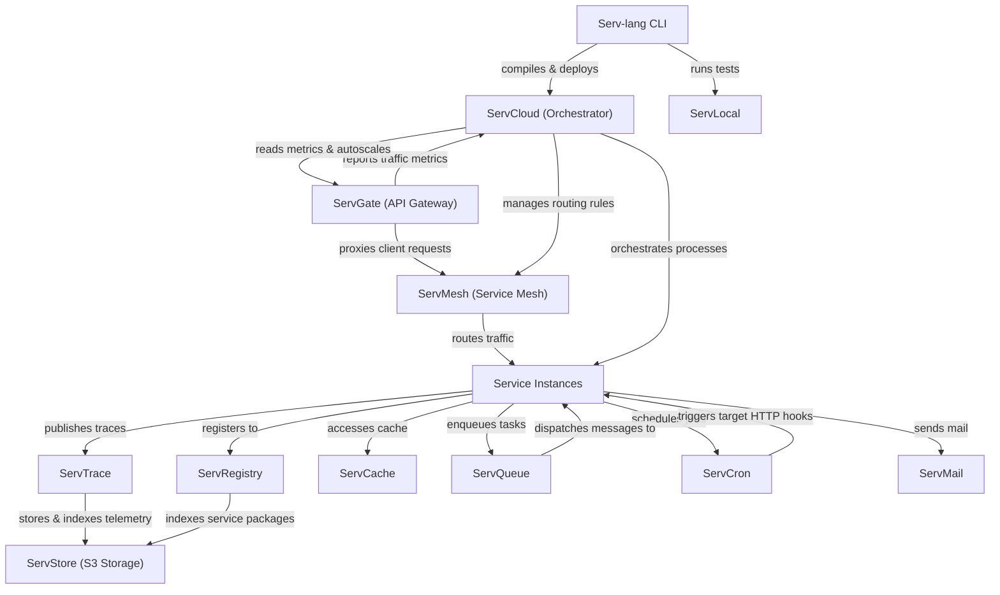

# Serv Unified Ecosystem Roadmap & Architect Analysis

> Single source of truth for the **Serv** ecosystem: Serv-lang, ServGate, ServStore, ServQueue, ServConsole, ServCache, ServMesh, ServCron, ServCloud, ServTrace, ServTunnel, ServAuth, ServDB, ServMail, ServFlow, and the Servverse vision.  
> Last updated: July 5, 2026

---

## Phase 9: Scale & Enterprise Hardening (Active)

### Completion Tracker

| Initiative Area | Total Items | Completed | Pending | Progress | Status Bar |
|-----------------|-------------|-----------|---------|----------|------------|
| **⚡ Performance, Scaling & HA** | 2 | 2 | 0 | **100%** | ████████████████████ |
| **🔐 Security & Integrity** | 1 | 1 | 0 | **100%** | ████████████████████ |
| **🛠️ Developer Experience** | 1 | 1 | 0 | **100%** | ████████████████████ |
| **🌐 DevOps & Infrastructure** | 3 | 3 | 0 | **100%** | ████████████████████ |
| **📋 API Versioning & Scaling** | 1 | 1 | 0 | **100%** | ████████████████████ |
| **📟 Diagnostics & Operations** | 1 | 1 | 0 | **100%** | ████████████████████ |
| **🚀 Next-Level Core Enhancements** | 4 | 4 | 0 | **100%** | ████████████████████ |
| **TOTAL WORK** | **13** | **13** | **0** | **100%** | ████████████████████ |

---

### 🚀 Next-Level Core Enhancements (Completed)

| CORE.6 | **Built-in Multi-Agent AI Framework** — ✅ First-class support for AI agents, memory, tools, RAG, and MCP schemas in `serv-lang` via `agent` block declarations | Serv-lang | High |
| ARCH.9 | **Unified Distributed Runtime (Serv Runtime)** — ✅ `ServRuntime` host agent with OTel init, mesh registration, heartbeat loop, and `MeshResolver` interface | ServMesh, ServShared | High |

---

## Phase 10: Productization & Cloud PaaS Platform (Future)

Phase 10 targets commercialization, natural language app generation, round-trip visual editors, and hosted serverless scaling:

### Proposed Projects

| # | Feature | Components Affected | Priority |
|---|---------|-------------------|----------|
| DX.11 | **AI-Powered Scaffolder** — ✅ Natural language scaffolding generator (`serv create "<prompt>"`) | Serv-lang | High |
| UI.3 | **Visual Architecture Designer** — Interactive drag-and-drop designer with round-trip sync | ServConsole, Serv-lang | Medium |
| UI.4 | **Visual Workflow Designer** — Drag-and-drop stateful workflow editor generating native `serv-lang` code | ServConsole, ServFlow | High |
| AI.9 | **Autonomous Tuning & Self-Optimization** — Production telemetry analysis applying dynamic indexes/caches | ServTrace, ServShared | Medium |
| REG.3 | **Package Developer Marketplace** — Shared package hub for templates, WASM filters, and workflows | ServRegistry | Medium |
| CLOUD.1 | **Servverse Cloud Platform** — Managed serverless PaaS hosting environment | ServCloud, ServGate | High |
| CLOUD.2 | **ServEdge Computing Runtime** — Edge-deployed WASM execution with dynamic geo-routing and offline sync | Serv-lang, ServMesh | Medium |
| CORE.7 | **Event Sourcing & CQRS Framework** — Native event-sourced projection engines utilizing ServQueue and ServStore | Serv-lang, ServQueue, ServStore | High |
| DATA.1 | **Universal Data Fabric** — Consistent query abstraction layer unified across SQL, NoSQL, Cache, and Object APIs | Serv-lang, ServShared | Medium |
| DX.12 | **Serv Studio Desktop IDE** — Cross-platform desktop environment with integrated visual debugging and monitoring | ServConsole, Serv-lang | Medium |
| OPS.16 | **Platform Intelligence & Governance** — Architecture compliance scoring, cost analysis, and security posture checks | All Services | Medium |
| DX.13 | **Time-Travel Workflow Replay** — Debug complex workflow errors by replaying trace logs step-by-step locally | ServFlow, ServTrace | High |
| DX.14 | **Declarative Schema Migrations** — ✅ Native `table` DSL with `@primary` / `@unique` / `@default` annotations; `serv migrate` applies CREATE/ALTER TABLE SQL | Serv-lang, ServDB | High |
| DX.15 | **Hot-Reloading Dev Server (`serv dev`)** — ✅ Watcher running local tests, hot-reloading code, and refreshing the console | Serv-lang, servverse-repo | Medium |
| DX.16 | **Autogenerated Clients & OpenAPI SDKs** — Compilation hook generating clean TypeScript, Dart, and Swift API clients | Serv-lang, ServGate | Medium |
| CORE.8 | **Distributed Lock Manager (`ServLock`)** — ✅ TTL-based lock store in `ServMesh/pkg/lock`; `/api/lock/{acquire,release,extend,status,list}` HTTP API; `DistributedLocker` interface + `HTTPLockClient` + `WithLock`/`WithLockRetry` helpers in `ServShared` | ServMesh, ServShared | High |
| SEC.17 | **Unified Dynamic Policy Enforcement (`ServPolicy`)** — Declarative schema-based security, data, and rate policy engine | All Services | Medium |
| API.8 | **Ecosystem-Wide Schema Registry** — Schema broker validating DTOs across REST requests, STOMP messages, and S3 payloads | ServRegistry, ServGate | High |
| OPS.17 | **Chaos Fault Injection Middleware** — Inject transport latencies, connection drops, and queue dropouts dynamically in development | ServMesh, ServShared | Medium |

---

## Phase 11: ServConsole — True Unified Dashboard (Pending — Q3 2026)

> **Gap identified:** ServConsole currently proxies only 9 of 15 services. ServMesh, ServCron, ServCloud, ServCache, ServRegistry, and ServDocs have zero console visibility. Health monitoring only covers 4 services.

### 11.1 Integration Completeness

| # | Feature | Components | Priority | Status |
|---|---------|-----------|----------|--------|
| UC.1 | **Full 15-service discovery** — Add CLI flags + `ServDiscovery` fields for ServMesh, ServCron, ServCloud, ServCache, ServRegistry, ServDocs | ServConsole | 🔴 High | [ ] |
| UC.2 | **Unified health aggregation** — `/api/status` and alert loop monitor ALL connected services, not just 4 | ServConsole | 🔴 High | [ ] |
| UC.3 | **ServMesh panel** — Service registry, circuit breaker states, mTLS cert expiry, routing rules, canary weights | ServConsole, ServMesh | 🟡 Medium | [ ] |
| UC.4 | **ServCron panel** — Scheduled jobs, next 5 runs, execution history, failure counts, visual cron builder | ServConsole, ServCron | 🟡 Medium | [ ] |
| UC.5 | **ServCache panel** — Per-namespace keys, hit/miss ratios, memory pressure, eviction rates, hot keys | ServConsole, ServCache | 🟡 Medium | [ ] |
| UC.6 | **ServCloud panel consolidation** — Full proxy with resource quotas, scaling, deploy previews | ServConsole, ServCloud | 🟢 Low | [ ] |
| UC.7 | **ServRegistry panel** — Published packages, download stats, dependency trees, license warnings | ServConsole, ServRegistry | 🟡 Medium | [ ] |
| UC.8 | **ServDocs embedding** — Generated documentation browser within console documentation tab | ServConsole, ServDocs | 🟢 Low | [ ] |

### 11.2 Cross-Service Intelligence

| # | Feature | Components | Priority | Status |
|---|---------|-----------|----------|--------|
| UC.9 | **End-to-end request flow visualization** — Full lifecycle: Client → Gate → Backend → Queue → Store across all 15 services in one timeline | ServConsole, ServTrace | 🔴 High | [ ] |
| UC.10 | **Ecosystem dependency matrix** — Auto-generated runtime dependency map from OTel traces, interactive call volume/latency per edge | ServConsole, ServTrace | 🟡 Medium | [ ] |
| UC.11 | **Unified configuration editor** — Central panel for cross-service config: rate limits, TTLs, schedules, routing — all validated in one place | ServConsole, All | 🟡 Medium | [ ] |
| UC.12 | **Cross-service log correlation** — Click any trace_id → chronological log lines from all services with that trace_id | ServConsole, All | 🟡 Medium | [ ] |
| UC.13 | **Ecosystem upgrade dashboard** — Current versions vs latest from ServRegistry, incompatibility warnings, one-click upgrade via ServCloud | ServConsole, ServRegistry, ServCloud | 🟡 Medium | [ ] |

### 11.3 Operational Intelligence

| # | Feature | Components | Priority | Status |
|---|---------|-----------|----------|--------|
| UC.14 | **Capacity planning view** — Aggregate resource metrics, project growth trends, alert on approaching limits | ServConsole, ServCloud | 🟡 Medium | [ ] |
| UC.15 | **Change correlation engine** — Overlay deploys + config changes + incidents on unified timeline, correlate "what changed" with "what broke" | ServConsole, ServCloud, ServTrace | 🔴 High | [ ] |
| UC.16 | **Service comparison mode** — Side-by-side: latency, throughput, error rate, resources. For canary validation | ServConsole | 🟢 Low | [ ] |
| UC.17 | **Ecosystem startup orchestrator** — `serv console --start-all` boots services in dependency order, waits for health, opens dashboard | ServConsole, All | 🟡 Medium | [ ] |
| UC.18 | **Unified API documentation portal** — Aggregate all service OpenAPI specs into single interactive portal | ServConsole, ServDocs, ServGate | 🟡 Medium | [ ] |

### 11.4 AI-Powered Operations

| # | Feature | Components | Priority | Status |
|---|---------|-----------|----------|--------|
| UC.19 | **AI root cause analysis** — On alert: correlate deploys, config changes, dependency failures, past incidents. Ranked hypotheses | ServConsole | 🟡 Medium | [ ] |
| UC.20 | **Natural language operations query** — "Show failed requests in last hour touching ServDB" → trace + log + error aggregation | ServConsole | 🟢 Low | [ ] |
| UC.21 | **Predictive alerting** — Trend-based prediction: disk full in 3 days, cert expiring, approaching rate limits | ServConsole, ServTrace | 🟡 Medium | [ ] |
| UC.22 | **Automated incident playbooks** — Detect alert patterns → auto-execute runbook: scale pool, route to replica, notify on-call | ServConsole | 🟡 Medium | [ ] |

---

## Phase 11.6: OSS/EE Feature Boundary Enforcement (Pending — Q3 2026)

> **Issue:** Several enterprise-grade features are fully implemented in public repos with no gating. This dilutes EE commercial value and provides no upgrade incentive. Move these behind `//go:build enterprise` tags with OSS stubs returning "requires Enterprise Edition".

### Immediate (High EE Value — Move Now)

| # | Feature | Current Location | OSS Stub Behavior | Status |
|---|---------|-----------------|-------------------|--------|
| EE.10 | **Multi-tenant resource isolation** | ServShared `TenantMiddleware`, `IsolateTopic`, `IsolateDBPool`, `IsolateBucket` | OSS: single "default" tenant only, middleware passes through. EE: full tenant verification + isolation | [ ] |
| EE.11 | **ServStore federation** | ServStore `pkg/s3/api.go` (federation rules, cross-cluster routing, proxy) | OSS: single-cluster only. EE: multi-cluster namespace federation | [ ] |
| EE.12 | **ServQueue federation** | ServQueue (cross-cluster event mirroring) | OSS: single-cluster. EE: geo-distributed topic mirroring | [ ] |
| EE.13 | **SLO tracking & error budgets** | ServConsole `handleSLO` + `pkg/incidents/` | OSS: return 403 EE required. EE: full SLO dashboard | [ ] |
| EE.14 | **Cost estimation panel** | ServConsole `handleCostEstimation` | OSS: return 403. EE: infrastructure cost projections | [ ] |

### Next Sprint (Medium EE Value)

| # | Feature | Current Location | OSS Stub Behavior | Status |
|---|---------|-----------------|-------------------|--------|
| EE.15 | **Runbook automation** | ServConsole `handleRunbooks`, `handleExecuteRunbook` | OSS: read-only runbook list (no execute). EE: full auto-execute | [ ] |
| EE.16 | **Custom dashboard builder** | ServConsole `handleDashboards` | OSS: fixed default dashboard. EE: drag-and-drop custom dashboards | [ ] |
| EE.17 | **Infrastructure provisioning** | ServConsole `handleProvisionStore`, `handleProvisionQueue` | OSS: read-only view. EE: create/delete buckets/topics from console | [ ] |
| EE.18 | **Diagnostics terminal** | ServConsole `handleDiagnosticExec` | OSS: disabled (security risk). EE: interactive exec with audit log | [ ] |
| EE.19 | **Multi-environment management** | ServConsole `handleEnvironments`, `handleSelectEnvironment` | OSS: single environment. EE: dev/staging/prod with config promotion | [ ] |
| EE.20 | **Deployment rollback** | ServConsole `handleRollback` | OSS: view deploy history only. EE: one-click rollback via ServCloud | [ ] |

---

## Phase 11.5: Documentation Overhaul (Pending — Q3 2026)

> **Critical gap:** Documentation reflects pre-implementation design specs. The LANGUAGE_GUIDE covers ~40% of actual features. Component docs show "🔴 Not Started" for services that are production-ready. No operational docs exist.

### Language & Compiler Documentation

| # | Item | Effort | Description | Status |
|---|------|--------|-------------|--------|
| DOC.5 | **LANGUAGE_GUIDE.md rewrite** | Large | Add all missing features: structs, interfaces, enums, generics, AI agents, MCP tools, table DSL, typed params, null safety, `?` operator, optional chaining, spread, slice expressions, collection/string methods, extern fn | [ ] |
| DOC.6 | **builtins.md update** | Medium | Add `ai.complete()`, `ai.chat()`, `ai.embed()`, `auth.*` helpers, `store.*` advanced ops, `broker.*` DLQ/delayed, `atomic.*`, `channel.*` | [ ] |
| DOC.7 | **cli.md update** | Small | Add `serv create`, `serv migrate`, `serv dev`, `serv doctor`, `serv deploy`, `serv add`, `serv audit`, `serv debug`, `serv generate`, `serv packages` | [ ] |
| DOC.8 | **stdlib.md completion** | Small | Document remaining 2 modules; add usage examples for each module category | [ ] |

### Ecosystem Component Documentation

| # | Item | Effort | Description | Status |
|---|------|--------|-------------|--------|
| DOC.9 | **Component catalog rewrite** | Medium | Rewrite `docs/components/README.md` — update all statuses from "🔴 Not Started" to actual state, remove aspirational 30-component framing, reflect 15 real services | [ ] |
| DOC.10 | **Component docs rewrite (all 15)** | Large | Replace pre-implementation design specs with actual API reference: endpoints, configuration (env vars/flags), port allocations, healthcheck paths, example usage | [ ] |
| DOC.11 | **RUNTIME_DEPENDENCIES.md update** | Medium | Full 15-service dependency graph (currently only shows 4 newer services). Include ServGate↔ServStore, ServMesh interactions, ServCron↔ServQueue | [ ] |
| DOC.12 | **DOCKER_GUIDE.md update** | Small | Add ServAuth, ServDB, ServMail, ServFlow to directory structure and compose examples | [ ] |

### Operational Documentation (New)

| # | Item | Effort | Description | Status |
|---|------|--------|-------------|--------|
| DOC.13 | **Configuration reference** | Large | Per-service doc: all env vars, CLI flags, default ports, config file format. Single searchable reference | [ ] |
| DOC.14 | **Runbooks** | Medium | Operational runbooks: service restart procedures, backup/restore, scaling, log investigation, incident response templates | [ ] |
| DOC.15 | **Troubleshooting guide** | Medium | Common issues and solutions: connectivity failures, auth token problems, OTel not reporting, build failures, migration conflicts | [ ] |
| DOC.16 | **Security hardening guide** | Medium | TLS setup, JWT key rotation, mTLS configuration, secret management best practices, network policies | [ ] |
| DOC.17 | **Architecture decision records** | Small | Document key design choices: why Go codegen, why WASM for transforms, why library-level mesh, why ServStore over external S3 | [ ] |

---

## Phase 12: Ecosystem-Wide Developer Experience (Pending — Q4 2026)

| # | Feature | Components | Priority | Status |
|---|---------|-----------|----------|--------|
| DX.17 | **Unified CLI subcommands** — All component CLIs as `serv` subcommands: `serv queue tail`, `serv mesh inspect`, `serv cache inspect`, `serv trace search` | Serv-lang, All | 🔴 High | [ ] |
| DX.18 | **E2E integration test suite** — `serv doctor --integration` boots full ecosystem via docker-compose, validates cross-service flows | servverse-repo | 🟡 Medium | [ ] |
| DX.19 | **Multi-service compose generation** — `serv init --full-stack` generates docker-compose.yml based on `.srv` infrastructure declarations | Serv-lang | 🟡 Medium | [ ] |
| DX.20 | **`serv bench` built-in load testing** — Auto-generate k6/vegeta scenarios from declared routes, run with `serv bench <file.srv>` | Serv-lang | 🟡 Medium | [ ] |
| DX.21 | **Schema-first development** — `serv generate --from-openapi <spec.yaml>` generates `.srv` route stubs + type definitions | Serv-lang | 🟡 Medium | [ ] |
| DX.22 | **`serv upgrade` ecosystem command** — Check and upgrade all installed Servverse components to compatible versions | Serv-lang | 🟢 Low | [ ] |
| DX.23 | **Observability-as-code** — `.serv/observability.yaml` declarative alert rules, SLOs, and dashboards committed to git. Auto-provisioned on deploy | ServConsole, Serv-lang | 🟡 Medium | [ ] |
| DX.24 | **`serv playground` web IDE** — Hosted browser-based editor: write → compile → run → see output. WASM compilation target | Serv-lang | 🟢 Low | [ ] |
| DX.25 | **Cross-service config propagation** — Central `.serv/config.yaml` propagated to all services on `serv deploy` | Serv-lang, ServCloud | 🟡 Medium | [ ] |
| DX.26 | **`serv dev` terminal dashboard** — k9s-style TUI showing routes, recent requests, errors, build status, connected services health | Serv-lang | 🟡 Medium | [ ] |

---

## Phase 13: Language & Runtime Evolution (Pending — 2027)

| # | Feature | Components | Priority | Status |
|---|---------|-----------|----------|--------|
| LANG.1 | **Sum types / tagged unions** — `type Result = Success { data } | Failure { err }` with exhaustive match | Serv-lang | 🟡 Medium | [ ] |
| LANG.2 | **Native GraphQL support** — `graphql` keyword for declaring schemas, resolvers, subscriptions directly in `.srv` | Serv-lang | 🟡 Medium | [ ] |
| LANG.3 | **Compiler plugin system** — `.srv.plugin.go` files registering AST visitors for custom lint rules, generators, optimizations | Serv-lang | 🟢 Low | [ ] |
| LANG.4 | **`serv migrate` rollback** — DROP COLUMN, rollback to previous version, migration squashing | Serv-lang | 🟡 Medium | [ ] |
| LANG.5 | **Distributed lock primitive** — `lock("resource", timeout)` / `unlock()` in runtime for cross-service mutual exclusion | Serv-lang, ServMesh | 🔴 High | [ ] |
| LANG.6 | **Hot module replacement for stdlib** — Override stdlib modules with `serv install <module>@version` without compiler upgrade | Serv-lang, ServRegistry | 🟢 Low | [ ] |
| LANG.7 | **Security scanning** — `serv audit --deps` outputs SARIF for CI; scans compiled dependency CVEs | Serv-lang | 🟡 Medium | [ ] |
| LANG.8 | **Interface satisfaction checking** — Compile-time verification that structs implement declared interfaces | Serv-lang | 🟡 Medium | [ ] |
| LANG.9 | **Native Service Mesh Declarations (`mesh`)** — Compiler-supported `mesh` keyword to define routing policies, circuit breakers, and automatic client bindings directly in `.srv` | Serv-lang, ServMesh | 🔴 High | [ ] |
| CORE.9 | **Event Sourcing & CQRS Framework** — Native event-sourced projection engines using ServQueue and ServStore | Serv-lang, ServQueue, ServStore | 🔴 High | [ ] |

| CORE.10 | **ServStore CDN mode** — Edge caching layer with Cache-Control headers and Cloudflare/Fastly origin pull | ServStore | 🟢 Low | [ ] |

---

## Appendix A: Cross-Service Runtime Dependency Diagram

---

## Appendix B: Component Maturity Matrix

| Component | API Contract | Persistence | Security | Observability | Tests | Docs | Console Integration | Overall Maturity |
|-----------|--------------|-------------|----------|---------------|-------|------|---------------------|------------------|
| **Serv-lang** | 🟢 Production | ⚪ N/A | 🟡 Medium | 🟢 Production | 🟢 Production | 🟢 Production | ⚪ N/A | **Production-Ready** |
| **ServGate** | 🟢 Production | ⚪ N/A | 🟢 Production | 🟢 Production | 🟢 Production | 🟢 Production | 🟢 Full proxy + panel | **Production-Ready** |
| **ServMesh** | 🟢 Production | ⚪ N/A | 🟢 Production | 🟢 Production | 🟢 Production | 🟢 Production | 🔴 No integration | **Production-Ready** |
| **ServCloud** | 🟢 Production | 🟢 Production | 🟡 Medium | 🟢 Production | 🟢 Production | 🟢 Production | 🟡 Partial (deploy only) | **Production-Ready** |
| **ServTrace** | 🟢 Production | 🟢 Production | 🟡 Medium | 🟢 Production | 🟢 Production | 🟢 Production | 🟢 Full proxy + panel | **Production-Ready** |
| **ServStore** | 🟢 Production | 🟢 Production | 🟡 Medium | 🟡 Medium | 🟡 Medium | 🟡 Medium | 🟢 Full proxy + panel | **Stable** |
| **ServQueue** | 🟢 Production | 🟢 Production | 🟡 Medium | 🟡 Medium | 🟢 Production | 🟡 Medium | 🟢 Full proxy + panel | **Stable** |
| **ServConsole** | 🟢 Production | 🟡 Medium | 🟢 Production | 🟢 Production | 🟡 Medium | 🟡 Medium | ⚪ Self | **Stable** |
| **ServCache** | 🟢 Production | 🟢 Production | 🟡 Medium | 🟡 Medium | 🟢 Production | 🟡 Medium | 🔴 No integration | **Stable** |
| **ServCron** | 🟢 Production | 🟢 Production | 🟡 Medium | 🟡 Medium | 🟢 Production | 🟡 Medium | 🔴 No integration | **Stable** |
| **ServAuth** | 🟢 Production | 🟡 Medium | 🟡 Medium | 🟡 Medium | 🟢 Production | 🟡 Medium | 🟢 Full proxy + panel | **Stable** |
| **ServDB** | 🟢 Production | 🟡 Medium | 🟡 Medium | 🟡 Medium | 🟢 Production | 🟡 Medium | 🟢 Full proxy + panel | **Stable** |
| **ServMail** | 🟢 Production | 🟡 Medium | 🟡 Medium | 🟡 Medium | 🟢 Production | 🟡 Medium | 🟢 Full proxy + panel | **Stable** |
| **ServFlow** | 🟢 Production | 🟡 Medium | 🟡 Medium | 🟡 Medium | 🟢 Production | 🟡 Medium | 🟡 Proxy only (no panel) | **Stable** |
| **ServTunnel** | 🟢 Production | ⚪ N/A | 🟡 Medium | 🟢 Production | 🟢 Production | 🟡 Medium | 🟢 Full proxy + panel | **Stable** |
| **ServRegistry**| 🟢 Production | 🟢 Production | 🟡 Medium | 🟡 Medium | 🟡 Medium | 🟡 Medium | 🔴 No integration | **Stable** |
| **ServDocs** | 🟡 Medium | ⚪ N/A | ⚪ N/A | ⚪ N/A | 🟡 Medium | 🟢 Production | 🔴 No integration | **Beta** |
