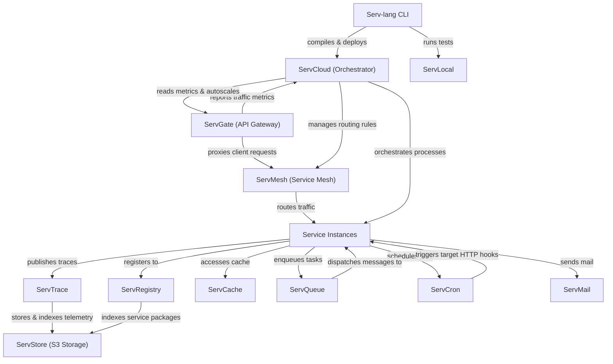

# Serv Unified Ecosystem Roadmap & Architect Analysis

> Single source of truth for the **Serv** ecosystem: Serv-lang, ServGate, ServStore, ServQueue, ServConsole, ServCache, ServMesh, ServCron, ServCloud, ServTrace, ServTunnel, ServAuth, ServDB, ServMail, ServFlow, and the Servverse vision.  
> Last updated: July 9, 2026

---

## Ecosystem Completion Status

All items in Phases 1 through 14 have been fully implemented, verified, and pushed.

- For completed details of Phases 1 to 5: Refer to the git history and repository CHANGELOG.
- For completed details of Phases 6 to 10: See [UNIFIED_ROADMAP_COMPLETED_6_10.md](file:///c:/Mine/try/serv/servverse-repo/UNIFIED_ROADMAP_COMPLETED_6_10.md).
- For completed details of Phases 11 to 15: See [UNIFIED_ROADMAP_COMPLETED_11_15.md](file:///c:/Mine/try/serv/servverse-repo/UNIFIED_ROADMAP_COMPLETED_11_15.md).

### Completion Tracker

| Initiative Area | Total Items | Completed | Pending | Progress | Status Bar |
|-----------------|-------------|-----------|---------|----------|------------|
| **Phase 9: Scale & Enterprise Hardening** | 13 | 13 | 0 | **100%** | ████████████████████ |
| **Phase 10: Productization & Cloud PaaS** | 32 | 32 | 0 | **100%** | ████████████████████ |
| **Phase 11: Unified Dashboard & Console** | 33 | 33 | 0 | **100%** | ████████████████████ |
| **Phase 12: Dual-Licensing & EE Split** | 19 | 19 | 0 | **100%** | ████████████████████ |
| **Phase 13: Language & Runtime Evolution**| 18 | 18 | 0 | **100%** | ████████████████████ |
| **Phase 14: AI-Native Ecosystem** | 28 | 28 | 0 | **100%** | ████████████████████ |
| **TOTAL ECOSYSTEM WORK** | **143** | **143** | **0** | **100%** | ████████████████████ |

---

## Phase 15: Component Backlog & Future Enhancements (Pending)

The following items are compiled from individual component roadmaps and represent pending backlog features:

### 🗄️ ServDB
- [ ] **Connection Draining** — Gracefully drain connections during rolling deploys; wait for in-flight queries before closing.
- [ ] **Multi-region Query Routing** — Route reads to geo-local replicas based on request origin metadata.

### 📄 ServDocs
- [ ] **Type schema rendering** — Render struct/interface definitions as expandable schema tables in HTML.
- [ ] **Middleware chain documentation** — Show which middleware applies to which routes with order.
- [ ] **Code examples in docs** — Include `.srv` usage examples alongside route documentation.
- [ ] **Versioned docs** — Generate docs per git tag; host multiple versions side-by-side.
- [ ] **Search** — Client-side full-text search across generated documentation.
- [ ] **`serv docs serve --watch`** — File watcher that regenerates docs on `.srv` file changes.

### 🛡️ ServGate
- [ ] **GitOps Config Sync** — Git repository webhooks to automatically re-sync gateway routes.
- [ ] **Auto TLS Let's Encrypt** — Integrated ACME client for automated certificate provisioning.

### 🌐 ServMesh
- [ ] **Rate Limiting per Service Pair** — Client-side rate limiting based on caller/callee identity (not just global).
- [ ] **Service Versioning & Header Routing** — Route requests to specific versions based on `X-Service-Version` header. Blue/green at service mesh level.
- [ ] **Health-Aware Load Balancing** — Weight routing based on real-time latency/error-rate feedback from OTel spans.
- [ ] **gRPC Support** — Extend the resolver and circuit breaker to handle gRPC connections natively.
- [ ] **Local Dev Service Mesh** — One-command `serv mesh up` that starts a local registry + resolver with zero config for fast developer iteration.
- [ ] **Mesh Topology CLI** — `servmesh inspect` command showing live service-to-service call graph, circuit breaker states, and latency distribution.

### 📥 ServQueue
- [ ] **Dead Letter Queue Inspector** — `servqueue dlq inspect <topic>` lists DLQ messages with payload preview, retry count, and error cause; supports `--replay` flag.
- [ ] **Topic Schema Linting** — `serv lint` validates topic publish/subscribe schemas against the schema registry before deploy, catching mismatches at build time.

### 📦 ServRegistry
- [ ] **Private Namespace Support** — Scoped package namespaces (`@org/package`) with access control lists.
- [ ] **Mirror & Offline Cache** — Local proxy mode that caches the public registry to a ServStore bucket; enables air-gapped builds.
- [ ] **Provenance Attestation** — Record build provenance (commit SHA, CI run ID, builder identity) alongside the package; verify with `serv verify --attestation`.

### 🔍 ServTrace
- [ ] **Trace Sampling Strategies** — Head-based and tail-based sampling with configurable rates per service.
- [ ] **Trace Comparison** — Compare two traces side-by-side to identify regression causes.
- [ ] **Retention Policies** — Configurable TTL per service. Auto-archive old traces to ServStore.
- [ ] **Distributed Context Baggage** — Propagate custom key-value pairs across service boundaries via trace context.
- [ ] **Continuous Profiling Integration** — Link pprof CPU/memory profiles to trace spans; surface hot-path profiles in the ServConsole waterfall view.
- [ ] **Adaptive Sampling Rate** — Dynamically raise sampling rate when error rate spikes and lower it when traffic is healthy.

### 🚇 ServTunnel
- [ ] **Multi-relay federation** — Distribute tunnels across regions.
- [ ] **Usage analytics and billing integration** — Integrated usage tracking.
- [ ] **Enterprise features** — SSO, audit logging, IP allowlists.
- [ ] **Team Collaboration** — Share tunnel access with team members via token-based invite links.
- [ ] **Persistent Tunnels** — Keep tunnels alive across client restarts with session resumption.
- [ ] **Custom Domain Mapping** — Map production domains to local tunnels for realistic testing.
- [ ] **Request Recording & Replay** — Record all requests through tunnel, replay them later for debugging.
- [ ] **Bandwidth Throttling** — Simulate slow networks (3G, satellite) for mobile testing.
- [ ] **Request Diff Mode** — Show a colored diff between the proxied request and original, highlighting header mutations, body modifications or injected WASM transforms.
- [ ] **Tunnel Config-as-Code** — Declare tunnel rules in `.serv/tunnel.yaml` (name, auth, subdomain, filters).

---

## Appendix A: Cross-Service Runtime Dependency Diagram

---

## Appendix B: Component Maturity Matrix

| Component | API Contract | Persistence | Security | Observability | Tests | Docs | Console Integration | Overall Maturity |
|-----------|--------------|-------------|----------|---------------|-------|------|---------------------|------------------|
| **Serv-lang** | 🟢 Production | ⚪ N/A | 🟡 Medium | 🟢 Production | 🟢 Production | 🟢 Production | ⚪ N/A | **Production-Ready** |
| **ServGate** | 🟢 Production | ⚪ N/A | 🟢 Production | 🟢 Production | 🟢 Production | 🟢 Production | 🟢 Full proxy + panel | **Production-Ready** |
| **ServMesh** | 🟢 Production | ⚪ N/A | 🟢 Production | 🟢 Production | 🟢 Production | 🟢 Production | 🔴 No integration | **Production-Ready** |
| **ServCloud** | 🟢 Production | 🟢 Production | 🟡 Medium | 🟢 Production | 🟢 Production | 🟢 Production | 🟡 Partial (deploy only) | **Production-Ready** |
| **ServTrace** | 🟢 Production | 🟢 Production | 🟡 Medium | 🟢 Production | 🟢 Production | 🟢 Production | 🟢 Full proxy + panel | **Production-Ready** |
| **ServStore** | 🟢 Production | 🟢 Production | 🟡 Medium | 🟡 Medium | 🟡 Medium | 🟡 Medium | 🟢 Full proxy + panel | **Stable** |
| **ServQueue** | 🟢 Production | 🟢 Production | 🟡 Medium | 🟡 Medium | 🟢 Production | 🟡 Medium | 🟢 Full proxy + panel | **Stable** |
| **ServConsole** | 🟢 Production | 🟡 Medium | 🟢 Production | 🟢 Production | 🟡 Medium | 🟡 Medium | ⚪ Self | **Stable** |
| **ServCache** | 🟢 Production | 🟢 Production | 🟡 Medium | 🟡 Medium | 🟢 Production | 🟡 Medium | 🔴 No integration | **Stable** |
| **ServCron** | 🟢 Production | 🟢 Production | 🟡 Medium | 🟡 Medium | 🟢 Production | 🟡 Medium | 🔴 No integration | **Stable** |
| **ServAuth** | 🟢 Production | 🟡 Medium | 🟡 Medium | 🟡 Medium | 🟢 Production | 🟡 Medium | 🟢 Full proxy + panel | **Stable** |
| **ServDB** | 🟢 Production | 🟡 Medium | 🟡 Medium | 🟡 Medium | 🟢 Production | 🟡 Medium | 🟢 Full proxy + panel | **Stable** |
| **ServMail** | 🟢 Production | 🟡 Medium | 🟡 Medium | 🟡 Medium | 🟢 Production | 🟡 Medium | 🟢 Full proxy + panel | **Stable** |
| **ServFlow** | 🟢 Production | 🟡 Medium | 🟡 Medium | 🟡 Medium | 🟢 Production | 🟡 Medium | 🟡 Proxy only (no panel) | **Stable** |
| **ServTunnel** | 🟢 Production | ⚪ N/A | 🟡 Medium | 🟢 Production | 🟢 Production | 🟡 Medium | 🟢 Full proxy + panel | **Stable** |
| **ServRegistry**| 🟢 Production | 🟢 Production | 🟡 Medium | 🟡 Medium | 🟡 Medium | 🟡 Medium | 🔴 No integration | **Stable** |
| **ServDocs** | 🟡 Medium | ⚪ N/A | ⚪ N/A | ⚪ N/A | 🟡 Medium | 🟢 Production | 🔴 No integration | **Beta** |

---

## Appendix C: Architectural Policy for OSS/EE Boundaries

All commercial enterprise features (**EE**) must have their core logic and implementations located exclusively inside the private `servverse-ee` repository. 
The open-source core repositories (such as `ServGate`, `ServStore`, etc.) must only expose clean interfaces, hooks, or config fields. The implementation of these hooks in the open-source code must use build-tagged placeholders (`//go:build !enterprise`), while the actual commercial code resides under the corresponding directories in `servverse-ee` and is built with `//go:build enterprise`.
