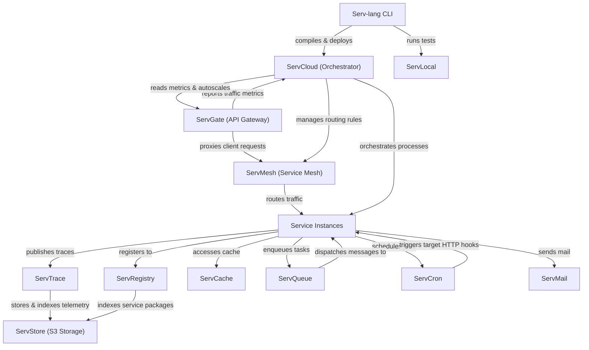

# Serv Unified Ecosystem Roadmap & Architect Analysis

> Single source of truth for the **Serv** ecosystem: Serv-lang, ServGate, ServStore, ServQueue, ServConsole, ServCache, ServMesh, ServCron, ServCloud, ServTrace, ServTunnel, ServAuth, ServDB, ServMail, ServFlow, and the Servverse vision.  
> Last updated: July 9, 2026

---

## Ecosystem Completion Status

All items in Phases 1 through 14 have been fully implemented, verified, and pushed.

- For completed details of Phases 1 to 5: Refer to the git history and repository CHANGELOG.
- For completed details of Phases 6 to 10: See [UNIFIED_ROADMAP_COMPLETED_6_10.md](file:///c:/Mine/try/serv/servverse-repo/UNIFIED_ROADMAP_COMPLETED_6_10.md).
- For completed details of Phases 11 to 15: See [UNIFIED_ROADMAP_COMPLETED_11_15.md](file:///c:/Mine/try/serv/servverse-repo/UNIFIED_ROADMAP_COMPLETED_11_15.md).
- For completed details of Phase 16-19: See [UNIFIED_ROADMAP_COMPLETED_16_20.md](file:///c:/Mine/try/serv/servverse-repo/UNIFIED_ROADMAP_COMPLETED_16_20.md).

### Completion Tracker

| Initiative Area | Total Items | Completed | Pending | Progress | Status Bar |
|-----------------|-------------|-----------|---------|----------|------------|
| **Phase 9: Scale & Enterprise Hardening** | 13 | 13 | 0 | **100%** | ████████████████████ |
| **Phase 10: Productization & Cloud PaaS** | 32 | 32 | 0 | **100%** | ████████████████████ |
| **Phase 11: Unified Dashboard & Console** | 33 | 33 | 0 | **100%** | ████████████████████ |
| **Phase 12: Dual-Licensing & EE Split** | 19 | 19 | 0 | **100%** | ████████████████████ |
| **Phase 13: Language & Runtime Evolution**| 18 | 18 | 0 | **100%** | ████████████████████ |
| **Phase 14: AI-Native Ecosystem** | 28 | 28 | 0 | **100%** | ████████████████████ |
| **Phase 16: Operational Hardening & Production Readiness** | 18 | 18 | 0 | **100%** | ████████████████████ |
| **Phase 17: Zero-Trust Clustering & Edge Serverless** | 8 | 8 | 0 | **100%** | ████████████████████ |
| **Phase 18: OSS-to-EE Boundary Alignment & Refactoring** | 6 | 6 | 0 | **100%** | ████████████████████ |
| **Phase 19: Component Maturity Alignment** | 7 | 7 | 0 | **100%** | ████████████████████ |
| **Phase 20: OSS-to-EE Refactoring & Enterprise Migrations** | 6 | 0 | 6 | **0%** | ░░░░░░░░░░░░░░░░░░░░ |
| **Phase 21: Enterprise Ecosystem Scale & Next-Gen** | 6 | 0 | 6 | **0%** | ░░░░░░░░░░░░░░░░░░░░ |
| **Phase 22: Quality, Credibility & Code Health** | 20 | 7 | 13 | **35%** | ███████░░░░░░░░░░░░░ |
| **Phase 23: Developer Adoption & Growth** | 14 | 0 | 14 | **0%** | ░░░░░░░░░░░░░░░░░░░░ |
| **Phase 24: Standalone Component Independence** | 20 | 0 | 20 | **0%** | ░░░░░░░░░░░░░░░░░░░░ |
| **TOTAL ECOSYSTEM WORK** | **248** | **189** | **59** | **76%** | ███████████████░░░░░ |

---

## Phase 15: Component Backlog & Future Enhancements (Completed)

All backlog and component enhancement items for Phase 15 have been fully completed, verified, and pushed.

- For completed details of Phase 15: See [UNIFIED_ROADMAP_COMPLETED_11_15.md](file:///c:/Mine/try/serv/servverse-repo/UNIFIED_ROADMAP_COMPLETED_11_15.md).

---

## Appendix A: Cross-Service Runtime Dependency Diagram

---

## Appendix B: Component Maturity Matrix

> Updated July 10, 2026 — based on actual code metrics (line counts, test coverage, pkg structure, standalone viability).

| Component | API Contract | Persistence | Security | Observability | Tests | Code Structure | Standalone | Overall |
|-----------|--------------|-------------|----------|---------------|-------|----------------|-----------|---------|
| **Serv-lang** | 🟢 Stable | ⚪ N/A | 🟢 Stable | 🟢 OTel | 🟢 87 funcs, 7 compiler test files | 🟢 Split: compiler/, runtime/, lsp/, stdlib/ | ⚪ N/A | **Production** |
| **ServStore** | 🟢 S3-compat | 🟢 Pebble+Raft | 🟢 SigV4+TLS+OIDC | 🟢 OTel | 🟢 78 funcs / 47 files | 🟢 cmd/ + pkg/ (8 packages) | 🟢 A+ Fully independent | **Production** |
| **ServGate** | 🟢 REST+WASM | ⚪ Config file | 🟢 JWT+mTLS+ACME | 🟢 OTel | 🟢 46 funcs / 6 files | 🟢 pkg/proxy, pkg/wasm, pkg/otel | 🟢 A- needs config.json | **Production** |
| **ServQueue** | 🟢 STOMP+REST | 🟢 WAL+S3 tier | 🟢 TLS+token auth | 🟢 OTel | 🟢 28 funcs / 6 files | 🟢 pkg/broker, pkg/stomp, pkg/web | 🟢 A Zero-config | **Production** |
| **ServMesh** | 🟢 REST | ⚪ In-memory | 🟢 mTLS+JWT | 🟢 OTel | 🟢 34 funcs / 3 files | 🟢 pkg/registry, pkg/client | 🟡 B+ needs multiple services | **Production** |
| **ServConsole** | 🟢 REST+WS | 🟡 SQLite | 🟢 OIDC+RBAC | 🟢 OTel | 🟡 34 funcs (needs 70+) | 🟢 12 packages extracted | ⚪ Aggregator by design | **Stable** |
| **ServTrace** | 🟢 OTLP/HTTP | 🟢 ServStore tier | 🟡 Basic auth | 🟢 Self-traces | 🟡 13 funcs / 4 files | 🟡 pkg/server, pkg/store | 🟢 A- OTLP collector | **Stable** |
| **ServCache** | 🟢 REST | 🟢 Redis/memory | 🟡 Token auth | 🟢 OTel | 🔴 8 funcs / 1 file | 🟡 pkg/ exists but thin | 🟡 B+ standalone cache | **Stable** |
| **ServCron** | 🟢 REST | 🟢 ServStore+Redis | 🟡 JWT | 🟢 OTel | 🟡 10 funcs / 2 files | 🟡 pkg/ thin | 🟡 B needs --standalone | **Stable** |
| **ServCloud** | 🟢 REST | 🟡 In-memory | 🟡 JWT | 🟢 OTel | 🔴 7 funcs / 1 file | 🟡 Flat | 🟡 B Serv-specific | **Stable** |
| **ServTunnel** | 🟢 WS+REST | ⚪ In-memory | 🟢 TLS+token+rate | 🟢 OTel | 🟢 34 funcs / 4 files | 🟢 Clean structure | 🟢 A- generic tunnel | **Production** |
| **ServAuth** | 🟢 OAuth2/OIDC | 🟢 ServStore | 🟢 bcrypt+AES+MFA | 🟢 OTel | 🟡 11 funcs / 1 file | 🔴 1,381 line main.go | 🟡 B needs --standalone | **Stable** |
| **ServDB** | 🟢 REST | 🟡 Proxied | 🟡 JWT | 🟢 OTel | 🟡 10 funcs / 1 file | 🔴 No pkg/ structure | 🟡 B thin docs | **Beta** |
| **ServMail** | 🟢 REST | 🟢 ServStore | 🟡 JWT | 🟢 OTel | 🟡 10 funcs / 1 file | 🟡 pkg/ exists | 🟡 B- needs --standalone | **Stable** |
| **ServFlow** | 🟢 REST | 🟢 ServStore+local | 🟡 JWT | 🟢 OTel | 🟡 11 funcs / 1 file | 🟢 pkg/engine, pkg/handlers, pkg/storage | 🔴 C+ Coupled to ServStore | **Stable** |
| **ServRegistry** | 🟢 REST | 🟢 ServStore | 🟡 JWT+signing | 🟢 OTel | 🟡 11 funcs / 2 files | 🔴 1,363 line main.go | 🔴 C+ Coupled to ServStore | **Stable** |
| **ServDocs** | 🟡 REST | ⚪ N/A | ⚪ None | ⚪ None | 🔴 5 funcs / 1 file | 🔴 No pkg/ structure | 🟡 B+ .srv-specific | **Beta** |
| **ServShared** | 🟢 Go library | ⚪ N/A | 🟢 JWT+mTLS | 🟢 OTel init | 🟢 30 funcs / 9 files | 🟢 Clean module | ⚪ Library | **Production** |

**Legend:** 🟢 Good | 🟡 Adequate | 🔴 Needs work | ⚪ Not applicable

---

## Phase 16: Operational Hardening & Production Readiness (Completed)

All backlog tasks for Phase 16 have been fully completed, verified, and archived.
- For completed details of Phase 16: See [UNIFIED_ROADMAP_COMPLETED_16_20.md](file:///c:/Mine/try/serv/servverse-repo/UNIFIED_ROADMAP_COMPLETED_16_20.md).

---

## Phase 17: Zero-Trust Clustering & Edge Serverless Evolution (Completed)

All backlog tasks for Phase 17 have been fully completed, verified, and archived.
- For completed details of Phase 17: See [UNIFIED_ROADMAP_COMPLETED_16_20.md](file:///c:/Mine/try/serv/servverse-repo/UNIFIED_ROADMAP_COMPLETED_16_20.md).

---

## Phase 18: OSS-to-EE Boundary Alignment & Refactoring (Completed)

All backlog tasks for Phase 18 have been fully completed, verified, and archived.
- For completed details of Phase 18: See [UNIFIED_ROADMAP_COMPLETED_16_20.md](file:///c:/Mine/try/serv/servverse-repo/UNIFIED_ROADMAP_COMPLETED_16_20.md).

---

## Phase 19: Component Maturity Alignment (Completed)

All backlog tasks for Phase 19 have been fully completed, verified, and archived.
- For completed details of Phase 19: See [UNIFIED_ROADMAP_COMPLETED_16_20.md](file:///c:/Mine/try/serv/servverse-repo/UNIFIED_ROADMAP_COMPLETED_16_20.md).

---

## Phase 20: OSS-to-EE Refactoring & Enterprise Migrations

Refactor the following advanced OSS capabilities into clean, build-tagged hooks, migrating their enterprise implementations to the private `servverse-ee` overlay:

### 🛡️ ServAuth & 💻 ServConsole
- [ ] **MFA TOTP Engine Separation** — Move the MFA TOTP generator, secret storage, and validator logic into the enterprise tag, leaving OSS with basic password authentication.
- [ ] **Social OAuth Provider Hooks** — Extract third-party social OAuth integrations (Google, GitHub, GitLab) out of OSS, replacing them with generic pluggable enterprise authentication hooks.

### 🗄️ ServDB & 🔄 ServFlow
- [ ] **Query Routing Optimizer** — Move the dynamic read/write splitting parser and query-caching optimization layer into the enterprise overlay, leaving OSS with a simple direct pool dispatcher.
- [ ] **Saga Parallel Coordinator** — Refactor concurrent execution paths, DAG forks, and complex compensating workflows in Saga engines to the enterprise overlay.

### 📧 ServMail & ⏰ ServCron
- [ ] **Dynamic HTML Templates** — Separate the Go template engine compilation, MJML layout transpilation, and variable-bound rendering into the enterprise tag.
- [ ] **Clustered Leader Election** — Extract distributed leader election and consensus-backed job execution scheduling for Cron clusters into the enterprise overlay.

---

## Phase 21: Enterprise Ecosystem Scale & Next-Gen Capabilities

Develop the next generation of scale and performance capabilities inside the `servverse-ee` commercial overlay:

### 🛡️ ServGate & ⚡ ServCache
- [ ] **Hardware SSL Offloading** — Implement SSL/TLS session hardware acceleration using cryptographic co-processors and specialized NIC offloading (e.g. QAT).
- [ ] **Vector Search Acceleration** — Introduce GPU-accelerated HNSW indexing and SIMD vector optimization (AVX-512) for semantic cache query rules.

### 📦 ServStore & 📥 ServQueue
- [ ] **Intelligent Data Tiering** — Implement auto-tiering policies that move cold/unaccessed storage blocks to AWS Glacier or local tape backups transparently.
- [ ] **Zero-Copy Disk Serialization** — Upgrade message WAL writes to utilize direct ring buffers and `sendfile` system calls to maximize broker performance.

### 💻 ServConsole & 🔄 ServFlow
- [ ] **Real-Time Visual DAG Designer** — Build a drag-and-drop workflow builder in the console that generates valid Serv-lang flow representation schemas.
- [ ] **Predictive AI Scaling Predictors** — Implement telemetry-driven AI scaling triggers that predict queue depth and preemptively spawn runner clusters.

---

## Phase 22: Quality, Credibility & Code Health (Pending)

> **Context:** Roadmap shows 94% complete, but code metrics reveal ServConsole at 4,885 lines, compiler core with 0 parser tests, and 6 services with ≤10 test functions. This phase closes the gap between claimed completion and actual production quality.

### 🔴 Critical Decomposition

| # | Item | Component | Description | Status |
|---|------|-----------|-------------|--------|
| QC.1 | **ServConsole main.go decomposition** | ServConsole | 4,885 lines → target <200. Extract into: pkg/proxy/, pkg/ws/, pkg/tabs/, pkg/alerts/, pkg/auth/, pkg/provision/, pkg/topology/, pkg/dashboards/ | [x] |
| QC.2 | **ServAuth main.go decomposition** | ServAuth | 1,381 lines → target <100. Extract: pkg/handlers/, pkg/oauth/, pkg/mfa/, pkg/kms/, pkg/sessions/ | [x] |
| QC.3 | **ServRegistry main.go decomposition** | ServRegistry | 1,363 lines → target <100. Extract: pkg/registry/, pkg/resolution/, pkg/web/, pkg/signing/ | [ ] |
| QC.4 | **ServDB package structure** | ServDB | Add pkg/pool/, pkg/routing/, pkg/analytics/, pkg/migration/ — currently flat | [ ] |
| QC.5 | **ServDocs package structure** | ServDocs | Add pkg/parser/, pkg/generator/, pkg/openapi/ — currently flat | [ ] |

### 🔴 Compiler Test Coverage

| # | Item | Component | Description | Status |
|---|------|-----------|-------------|--------|
| QC.6 | **Parser unit tests** | Serv-lang | 200+ table-driven tests for every AST node: routes, structs, generics, match, table, agent, tool, middleware | [x] |
| QC.7 | **Codegen unit tests** | Serv-lang | Test generated Go output for each statement/expression type. Verify correct type inference, native ops emission | [x] |
| QC.8 | **Lexer edge-case tests** | Serv-lang | Unicode identifiers, unterminated strings, nested interpolation, malformed numbers | [x] |
| QC.9 | **Semantic analysis tests** | Serv-lang | Type mismatch detection, unused variables, unreachable code, missing returns — all analyzers | [ ] |
| QC.10 | **LSP test coverage** | Serv-lang | Completion, hover, go-to-definition, diagnostics — protocol-level tests against sample .srv files | [ ] |

### 🟡 Service Test Hardening

| # | Item | Component | Description | Status |
|---|------|-----------|-------------|--------|
| QC.11 | **ServCache tests** | ServCache | Expand from 8 → 40+ test functions: TTL expiry, concurrent access, namespace isolation, Redis failover | [ ] |
| QC.12 | **ServCloud tests** | ServCloud | Expand from 7 → 30+ test functions: deploy lifecycle, port allocation, health monitoring, rollback | [ ] |
| QC.13 | **ServDocs tests** | ServDocs | Expand from 5 → 25+ test functions: parser accuracy, OpenAPI output validation, multi-file support | [ ] |
| QC.14 | **ServDB tests** | ServDB | Expand from 10 → 35+ test functions: pool exhaustion, read/write routing, slow query detection, cache integration | [ ] |
| QC.15 | **ServMail tests** | ServMail | Expand from 10 → 30+ test functions: template rendering errors, DLQ retry, rate limiting, multi-channel | [ ] |
| QC.16 | **ServFlow tests** | ServFlow | Expand from 11 → 35+ test functions: DAG cycle detection, concurrent approval race, saga compensation, checkpoint recovery | [ ] |

### 🟡 CI & Quality Gates

| # | Item | Component | Description | Status |
|---|------|-----------|-------------|--------|
| QC.17 | **Performance regression CI gate** | servverse-repo | Wire verify_perf_sla.py into CI workflow. Block merges that degrade p99 beyond threshold | [x] |
| QC.18 | **Backward compatibility CI gate** | servverse-repo | Wire check_backward_compat.go into CI. Detect breaking API changes before merge | [x] |
| QC.19 | **Test coverage threshold** | All repos | Enforce minimum 60% statement coverage via CI. Fail builds below threshold | [ ] |
| QC.20 | **API consistency linter** | All repos | Verify all services use /api/v1/ prefix, standardized error format, deprecation headers | [ ] |

---

## Phase 23: Developer Adoption & Growth (Pending)

> **Context:** The platform is feature-complete but has zero external users. This phase focuses on removing friction, building community, and proving production-readiness.

### 🔴 Adoption Blockers

| # | Item | Component | Description | Status |
|---|------|-----------|-------------|--------|
| AG.1 | **Web Playground** | Serv-lang | Browser-based editor: write → compile (WASM) → run → see output. Zero-install trial. The #1 adoption driver | [ ] |
| AG.2 | **VS Code Marketplace publish** | Serv-lang LSP | Publish the extension publicly. Enables organic discovery from IDE search | [ ] |
| AG.3 | **Full-stack showcase app** | servverse-repo | E-commerce or SaaS starter using 8+ services (auth, DB, queue, cache, mail, flow, store, gateway). Proves production patterns | [ ] |
| AG.4 | **10-minute demo video** | servverse-repo | Screen recording: install → write service → deploy → observe in console. Hosted on YouTube + embedded in GitHub Pages | [ ] |

### 🟡 Community Building

| # | Item | Component | Description | Status |
|---|------|-----------|-------------|--------|
| AG.5 | **Discord/community server** | — | Developer community for questions, showcases, and contributors | [ ] |
| AG.6 | **Contributing guide (CONTRIBUTING.md)** | All repos | Code style, PR process, how to add a stdlib module, how to write a WASM plugin | [ ] |
| AG.7 | **Good-first-issue labels** | All repos | Tag 20+ approachable issues for new contributors | [ ] |
| AG.8 | **Monthly release cadence** | servverse-repo | Predictable versioning: v0.2.0, v0.3.0 with changelogs. Builds trust | [ ] |
| AG.9 | **Blog post series** | servverse-repo | "Building X with Serv" tutorials: REST API, scheduled worker, event pipeline, AI agent | [ ] |

### 🟡 Enterprise Readiness

| # | Item | Component | Description | Status |
|---|------|-----------|-------------|--------|
| AG.10 | **SOC2 compliance documentation** | servverse-repo | Document existing controls: encryption-at-rest, audit logs, access control, data retention | [ ] |
| AG.11 | **Multi-region deployment guide** | servverse-repo | End-to-end guide: ServStore replication + ServQueue mirroring + ServMesh geo-routing | [ ] |
| AG.12 | **Customer pilot program** | — | Find 2-3 teams to run in staging. Gather real feedback on DX, performance, gaps | [ ] |
| AG.13 | **SLA guarantees with evidence** | servverse-repo | Load test results establishing: max RPS per service, p99 latency, failure recovery time | [ ] |
| AG.14 | **CODEOWNERS + branch protection** | All repos | Enforce review process. Required for enterprise governance | [ ] |

---

## Phase 24: Standalone Component Independence (Pending)

> **Goal:** Every Servverse component should be usable as a standalone product without requiring the rest of the ecosystem. This removes adoption friction and enables a "try one, adopt many" growth model.

### Standalone Viability Matrix

| Component | Current Grade | Target | Key Blocker |
|-----------|--------------|--------|-------------|
| ServStore | A+ | A+ | None — already fully independent |
| ServQueue | A | A+ | Undocumented defaults |
| ServGate | A- | A+ | Default config routes to ServStore |
| ServTrace | A- | A+ | Minimal README for standalone |
| ServTunnel | A- | A+ | README assumes ecosystem |
| ServCache | B+ | A | Hardcoded cluster self-address |
| ServMesh | B+ | A | Only useful with multiple services |
| ServCron | B | A | Defaults to ServStore for persistence |
| ServAuth | B | A | ServShared deeply integrated for persistence |
| ServDB | B | A | No external service deps but thin docs |
| ServCloud | B | A- | Only useful for deploying Serv services |
| ServMail | B- | A | Requires ServStore for template storage |
| ServFlow | C+ | B+ | Hard dependency on ServStore for state |
| ServRegistry | C+ | B+ | Uses ServStore for package storage |
| ServConsole | C | C | Designed as ecosystem aggregator — standalone doesn't apply |
| ServDocs | B+ | A | Only useful for .srv files — OK |

### 🔴 Universal (All Components)

| # | Item | Description | Status |
|---|------|-------------|--------|
| SA.1 | **ServShared version tag** | Publish ServShared as `v1.0.0` proper tag (not pseudo-versions). Enables external Go projects to `go get` it cleanly | [ ] |
| SA.2 | **Docker one-liner in all READMEs** | Every component README starts with: `docker run -p PORT:PORT ghcr.io/vyuvaraj/<service>:latest` — zero friction trial | [ ] |
| SA.3 | **`--standalone` flag convention** | Components that optionally use other Serv services should support `--standalone` that disables all ecosystem integrations and uses local-only fallbacks | [ ] |
| SA.4 | **Standalone quickstart section** | Each README gets a "Use Without Servverse" section showing minimum setup with zero other services | [ ] |

### 🔴 Per-Component Fixes

| # | Item | Component | Description | Status |
|---|------|-----------|-------------|--------|
| SA.5 | **Default config placeholder** | ServGate | Change `config.json` default target from `localhost:8081` to `http://httpbin.org/anything` or empty with comment | [ ] |
| SA.6 | **Document STOMP defaults** | ServQueue | README must prominently show: default user=`admin`, pass=`secret`, ports 61613 (STOMP) + 8082 (HTTP) | [ ] |
| SA.7 | **Standalone mode flag** | ServFlow | `--standalone` disables ServStore persistence, uses local `.state/` directory only. Suppress startup warnings about store connection | [ ] |
| SA.8 | **Standalone mode flag** | ServCron | `--standalone` disables ServStore job persistence, uses local SQLite or in-memory. Already has Redis fallback to standalone leader | [ ] |
| SA.9 | **Standalone mode flag** | ServMail | `--standalone` disables ServStore template storage, uses local `./templates/` directory with file-based templates | [ ] |
| SA.10 | **Standalone mode flag** | ServRegistry | `--standalone` disables ServStore backend, uses local filesystem `./packages/` directory for tarball storage | [ ] |
| SA.11 | **Standalone mode flag** | ServAuth | `--standalone` disables ServStore user persistence, uses local SQLite at `./data/auth.db` | [ ] |
| SA.12 | **README: standalone trace collector** | ServTrace | Document how to use as a standalone OTLP collector for any Go/Node/Python service (not just Servverse) | [ ] |
| SA.13 | **README: standalone tunnel** | ServTunnel | Document use case: "expose any local service to internet" without mentioning Servverse ecosystem | [ ] |
| SA.14 | **README: generic cache service** | ServCache | Document as a standalone REST cache (Redis alternative for dev). Show curl examples without ecosystem context | [ ] |
| SA.15 | **Remove hardcoded cluster address** | ServCache | Replace `localhost:8083` self-address with configurable `--advertise-addr` flag | [ ] |
| SA.16 | **README: generic DB proxy** | ServDB | Document as a standalone connection pooler for PostgreSQL/SQLite (like PgBouncer alternative) | [ ] |

### 🟡 Protocol & Integration Guides

| # | Item | Component | Description | Status |
|---|------|-----------|-------------|--------|
| SA.17 | **S3 client compatibility guide** | ServStore | Show examples with aws-cli, boto3, mc (MinIO client), s3cmd, rclone | [ ] |
| SA.18 | **STOMP client compatibility guide** | ServQueue | Show examples with stomp.py, Spring STOMP, go-stomp, stompjs (browser) | [ ] |
| SA.19 | **Generic proxy configuration guide** | ServGate | Show use as a standalone gateway for Express/Flask/Spring backends — no WASM required | [ ] |
| SA.20 | **OpenTelemetry integration guide** | ServTrace | Show how to point any OTel SDK (Go, Python, Node) at ServTrace — works as a lightweight Jaeger replacement | [ ] |

---

## Appendix C: Architectural Policy for OSS/EE Boundaries

All commercial enterprise features (**EE**) must have their core logic and implementations located exclusively inside the private `servverse-ee` repository. 
The open-source core repositories (such as `ServGate`, `ServStore`, etc.) must only expose clean interfaces, hooks, or config fields. The implementation of these hooks in the open-source code must use build-tagged placeholders (`//go:build !enterprise`), while the actual commercial code resides under the corresponding directories in `servverse-ee` and is built with `//go:build enterprise`.
