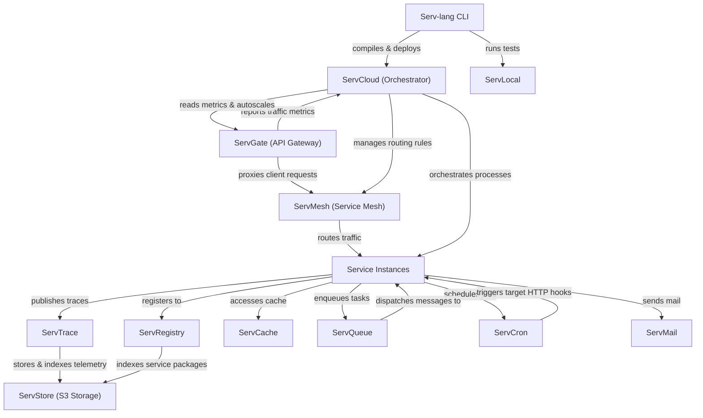

# Serv Unified Ecosystem Roadmap & Architect Analysis

> Single source of truth for the **Serv** ecosystem: Serv-lang, ServGate, ServStore, ServQueue, ServConsole, ServCache, ServMesh, ServCron, ServCloud, ServTrace, ServTunnel, ServAuth, ServPool, ServMail, ServFlow, and the Servverse vision.  

> Last updated: July 9, 2026

---

## Ecosystem Completion Status

All items in Phases 1 through 14 have been fully implemented, verified, and pushed.

- For completed details of Phases 1 to 5: Refer to the git history and repository CHANGELOG.

- For completed details of Phases 6 to 10: See [UNIFIED_ROADMAP_COMPLETED_6_10.md](file:///c:/Mine/try/serv/servverse-repo/UNIFIED_ROADMAP_COMPLETED_6_10.md).

- For completed details of Phases 11 to 15: See [UNIFIED_ROADMAP_COMPLETED_11_15.md](file:///c:/Mine/try/serv/servverse-repo/UNIFIED_ROADMAP_COMPLETED_11_15.md).

- For completed details of Phase 16-19: See [UNIFIED_ROADMAP_COMPLETED_16_20.md](file:///c:/Mine/try/serv/servverse-repo/UNIFIED_ROADMAP_COMPLETED_16_20.md).

- For completed details of Phase 31-35: See [UNIFIED_ROADMAP_COMPLETED_31_35.md](file:///f:/Don/servverse/servverse/UNIFIED_ROADMAP_COMPLETED_31_35.md).

### Completion Tracker

| Initiative Area | Total Items | Completed | Pending | Progress | Status Bar |

|-----------------|-------------|-----------|---------|----------|------------|

| **Phase 9: Scale & Enterprise Hardening** | 13 | 13 | 0 | **100%** | ████████████████████ |

| **Phase 10: Productization & Cloud PaaS** | 32 | 32 | 0 | **100%** | ████████████████████ |

| **Phase 11: Unified Dashboard & Console** | 33 | 33 | 0 | **100%** | ████████████████████ |

| **Phase 12: Dual-Licensing & EE Split** | 19 | 19 | 0 | **100%** | ████████████████████ |

| **Phase 13: Language & Runtime Evolution**| 18 | 18 | 0 | **100%** | ████████████████████ |

| **Phase 14: AI-Native Ecosystem** | 28 | 28 | 0 | **100%** | ████████████████████ |

| **Phase 16: Operational Hardening & Production Readiness** | 18 | 18 | 0 | **100%** | ████████████████████ |

| **Phase 17: Zero-Trust Clustering & Edge Serverless** | 8 | 8 | 0 | **100%** | ████████████████████ |

| **Phase 18: OSS-to-EE Boundary Alignment & Refactoring** | 6 | 6 | 0 | **100%** | ████████████████████ |

| **Phase 19: Component Maturity Alignment** | 7 | 7 | 0 | **100%** | ████████████████████ |

| **Phase 20: OSS-to-EE Refactoring & Enterprise Migrations** | 6 | 6 | 0 | **100%** | ████████████████████ |

| **Phase 21: Enterprise Ecosystem Scale & Next-Gen** | 6 | 6 | 0 | **100%** | ████████████████████ |

| **Phase 22: Quality, Credibility & Code Health** | 20 | 20 | 0 | **100%** | ████████████████████ |

| **Phase 23: Developer Adoption & Growth** | 14 | 11 | 3 | **79%** | ███████████████░░░░ |

| **Phase 24: Standalone Component Independence** | 20 | 16 | 4 | **80%** | ████████████████░░░░ |

| **Phase 25: Component Depth & Production Hardening** | 60 | 60 | 0 | **100%** | ████████████████████ |

| **Phase 26: Competitive Differentiation** | 107 | 107 | 0 | **100%** | ████████████████████ |

| **Phase 27: v1.0 Release Readiness** | 14 | 13 | 1 | **93%** | ██████████████████░░ |

| **Phase 28: Distribution & Installer Packaging** | 11 | 11 | 0 | **100%** |

| **Phase 29: LSP IntelliSense & Developer Tooling** | 16 | 16 | 0 | **100%** |
| **Phase 30: ServLock & ServSecret Hardening** | 10 | 10 | 0 | **100%** | ████████████████████ |
| **Phase 31: ServLock & ServSecret Ecosystem Integration** | 5 | 5 | 0 | **100%** | ████████████████████ |
| **Phase 32: ServLock & ServSecret Standalone & Hardening** | 8 | 8 | 0 | **100%** | ████████████████████ |
| **Phase 33: ServLock & ServSecret Advanced Capabilities** | 10 | 10 | 0 | **100%** | ████████████████████ |
| **Phase 34: ServLock & ServSecret Enterprise & UI** | 6 | 6 | 0 | **100%** | ████████████████████ |
| **Phase 35: Serv-lang Language Ergonomics** | 40 | 26 | 14 | **65%** | █████████████░░░░░░░ |
| **TOTAL ECOSYSTEM WORK** | **505** | **491** | **14** | **97%** | ███████████████████░ |

---

## Phase 15: Component Backlog & Future Enhancements (Completed)

All backlog and component enhancement items for Phase 15 have been fully completed, verified, and pushed.

- For completed details of Phase 15: See [UNIFIED_ROADMAP_COMPLETED_11_15.md](file:///c:/Mine/try/serv/servverse-repo/UNIFIED_ROADMAP_COMPLETED_11_15.md).

---

## Appendix A: Cross-Service Runtime Dependency Diagram

---

## Appendix B: Component Maturity Matrix

> Updated July 14, 2026 � based on actual code metrics (test counts, pkg structure, standalone flags, EE gating, main.go line counts).

| Component | Tests | Code Structure | Security | Observability | Standalone | EE Gated | Overall |

|-----------|-------|----------------|----------|---------------|-----------|----------|---------|

| **Serv-lang** | ?? 112 funcs | ?? compiler/, runtime/, lsp/, stdlib/ | ?? Null safety, type checking | ?? OTel codegen | ? N/A | ? N/A | **Production** |

| **ServStore** | ?? 93 funcs | ?? cmd/ + 11 packages | ?? SigV4 + TLS + OIDC + LDAP | ?? OTel + slog | ?? A+ Zero-config | ? Federation + cold tier | **Production** |

| **ServGate** | ?? 50 funcs | ?? 3 packages (proxy, wasm, otel) | ?? JWT + mTLS + ACME + policy | ?? OTel + access logs | ?? A- config.json | ? AI cache + LLM routing | **Production** |

| **ServConsole** | ?? 56 funcs | ?? 12 packages | ?? OIDC + RBAC + JWT | ?? OTel | ? Aggregator | ? SLO, cost, runbooks, exec | **Production** |

| **ServCache** | ?? 46 funcs | ?? 3 packages | ?? Token auth | ?? OTel | ?? A Standalone flag | ? Namespace isolation | **Production** |

| **ServFlow** | ?? 43 funcs | ?? 3 packages (engine, handlers, storage) | ?? JWT | ?? OTel | ?? A Standalone flag | ? Saga hooks | **Production** |

| **ServPool** | ?? 40 funcs | ?? 4 packages | ?? JWT | ?? OTel | ?? B+ docs only | ? N/A | **Production** |

| **ServMesh** | ?? 37 funcs | ?? 7 packages | ?? mTLS + JWT + auto-rotate | ?? OTel | ?? B+ needs services | ? N/A | **Production** |

| **ServTunnel** | ?? 37 funcs | ?? 6 packages | ?? TLS + token + rate limit | ?? OTel | ?? A- generic tunnel | ? Federation | **Production** |

| **ServQueue** | ?? 36 funcs | ?? 5 packages | ?? TLS + STOMP auth | ?? OTel + spans | ?? A Zero-config | ? Federation + semantic route | **Production** |

| **ServMail** | ?? 34 funcs | ?? 5 packages | ?? JWT | ?? OTel | ?? A Standalone flag | ? N/A | **Production** |

| **ServDocs** | ?? 34 funcs | ?? 3 packages (generator, openapi, parser) | ? N/A | ? N/A | ?? B+ .srv-specific | ? N/A | **Stable** |

| **ServCloud** | ?? 31 funcs | ?? 3 packages | ?? JWT | ?? OTel | ?? B Serv-specific | ? Autoscale | **Stable** |

| **ServShared** | ?? 30 funcs | ?? 4 packages (datafabric, middleware, outbox, policy) | ?? JWT + mTLS + tenant | ?? OTel init | ? Library | ? Tenant isolation | **Production** |

| **ServTrace** | ?? 17 funcs | ?? 2 packages | ?? Basic auth | ?? Self-traces | ?? A- OTLP collector | ? Cold tier, NL, anomaly | **Stable** |

| **ServAuth** | ?? 16 funcs | ?? 6 packages | ?? bcrypt + AES + MFA + OIDC | ?? OTel | ?? B No standalone flag | ? Stuffing detection | **Stable** |

| **ServCron** | ?? 13 funcs | ?? 3 packages | ?? JWT + Redis lease | ?? OTel | ?? A Standalone flag | ? N/A | **Stable** |

| **ServRegistry** | ?? 12 funcs | ?? 4 packages (registry, resolution, signing, web) | ?? JWT + crypto signing | ?? OTel | ?? B+ Standalone flag | ? N/A | **Stable** |

| **ServLock** | ?? 2 funcs | ?? 2 packages (handlers, storage) | ?? JWT | ?? Basic | ?? B+ Embedded | ? N/A | **Beta** |
| **ServSecret** | ?? 2 funcs | ?? 2 packages (handlers, storage) | ?? AES-GCM + JWT | ?? Basic | ?? B+ Standalone | ? N/A | **Beta** |

### Summary

| Rating | Count | Components |

|--------|-------|-----------|

| **Production** | 13 | Serv-lang, ServStore, ServGate, ServConsole, ServCache, ServFlow, ServPool, ServMesh, ServTunnel, ServQueue, ServMail, ServShared |

| **Stable** | 6 | ServDocs, ServCloud, ServTrace, ServAuth, ServCron, ServRegistry |

| **Beta** | 2 | ServLock, ServSecret |

**Legend:** ?? Strong | ?? Adequate | ?? Needs work | ? Not applicable | ? EE features gated

---

## Phase 16: Operational Hardening & Production Readiness (Completed)

All backlog tasks for Phase 16 have been fully completed, verified, and archived.

- For completed details of Phase 16: See [UNIFIED_ROADMAP_COMPLETED_16_20.md](file:///c:/Mine/try/serv/servverse-repo/UNIFIED_ROADMAP_COMPLETED_16_20.md).

---

## Phase 17: Zero-Trust Clustering & Edge Serverless Evolution (Completed)

All backlog tasks for Phase 17 have been fully completed, verified, and archived.

- For completed details of Phase 17: See [UNIFIED_ROADMAP_COMPLETED_16_20.md](file:///c:/Mine/try/serv/servverse-repo/UNIFIED_ROADMAP_COMPLETED_16_20.md).

---

## Phase 18: OSS-to-EE Boundary Alignment & Refactoring (Completed)

All backlog tasks for Phase 18 have been fully completed, verified, and archived.

- For completed details of Phase 18: See [UNIFIED_ROADMAP_COMPLETED_16_20.md](file:///c:/Mine/try/serv/servverse-repo/UNIFIED_ROADMAP_COMPLETED_16_20.md).

---

## Phase 19: Component Maturity Alignment (Completed)

All backlog tasks for Phase 19 have been fully completed, verified, and archived.

- For completed details of Phase 19: See [UNIFIED_ROADMAP_COMPLETED_16_20.md](file:///c:/Mine/try/serv/servverse-repo/UNIFIED_ROADMAP_COMPLETED_16_20.md).

---

## Phase 20: OSS-to-EE Refactoring & Enterprise Migrations (Completed)

All backlog tasks for Phase 20 have been fully completed, verified, and archived.

- For completed details of Phase 20: See [UNIFIED_ROADMAP_COMPLETED_16_20.md](file:///c:/Mine/try/serv/servverse-repo/UNIFIED_ROADMAP_COMPLETED_16_20.md).

## Phase 21: Enterprise Ecosystem Scale & Next-Gen Capabilities (Completed)

All backlog tasks for Phase 21 have been fully completed, verified, and archived.

- For completed details of Phase 21: See [UNIFIED_ROADMAP_COMPLETED_21_25.md](file:///c:/Mine/try/serv/servverse-repo/UNIFIED_ROADMAP_COMPLETED_21_25.md).

## Phase 22: Quality, Credibility & Code Health (Completed)

All backlog tasks for Phase 22 have been fully completed, verified, and archived.

- For completed details of Phase 22: See [UNIFIED_ROADMAP_COMPLETED_21_25.md](file:///c:/Mine/try/serv/servverse-repo/UNIFIED_ROADMAP_COMPLETED_21_25.md).

## Phase 23: Developer Adoption & Growth (Pending)

> **Context:** The platform is feature-complete but has zero external users. This phase focuses on removing friction, building community, and proving production-readiness.

- For completed details of Phase 23: See [UNIFIED_ROADMAP_COMPLETED_21_25.md](file:///F:/Don/servverse/servverse/UNIFIED_ROADMAP_COMPLETED_21_25.md).

### Pending Items

| # | Item | Component | Description | Status |
|---|------|-----------|-------------|--------|
| AG.4 | **10-minute demo video** | servverse-repo | Screen recording: install ? write service ? deploy ? observe in console. Hosted on YouTube + embedded in GitHub Pages | [ ] |
| AG.5 | **Discord/community server** | - | Developer community for questions, showcases, and contributors | [ ] |
| AG.12 | **Customer pilot program** | - | Find 2-3 teams to run in staging. Gather real feedback on DX, performance, gaps | [ ] |

## Phase 24: Standalone Component Independence (Completed)

All backlog tasks for Phase 24 have been fully completed, verified, and archived.

- For completed details of Phase 24: See [UNIFIED_ROADMAP_COMPLETED_21_25.md](file:///c:/Mine/try/serv/servverse-repo/UNIFIED_ROADMAP_COMPLETED_21_25.md).

---

## Phase 24.1: Standalone Hardening to A+ (Completed)

All backlog tasks for Phase 24.1 have been fully completed, verified, and archived.
- For completed details of Phase 24.1: See [UNIFIED_ROADMAP_COMPLETED_21_25.md](file:///F:/Don/servverse/servverse/UNIFIED_ROADMAP_COMPLETED_21_25.md).

---

## Phase 25: Component Depth & Production Hardening (Completed)

All backlog tasks for Phase 25 (D.1 - D.60) have been fully completed, verified, and archived.

- For completed details of Phase 25: See [UNIFIED_ROADMAP_COMPLETED_21_25.md](file:///c:/Mine/try/serv/servverse-repo/UNIFIED_ROADMAP_COMPLETED_21_25.md).

---

## Phase 26: Competitive Differentiation (Completed)

All backlog tasks for Phase 26 have been fully completed, verified, and archived.
- For completed details of Phase 26: See [UNIFIED_ROADMAP_COMPLETED_26_30.md](file:///F:/Don/servverse/servverse/UNIFIED_ROADMAP_COMPLETED_26_30.md).

## Phase 27: v1.0 Release Readiness (Pending)

> **Goal:** Close the consistency gaps identified in the API maturity audit. These are mechanical fixes (not design changes) required to confidently tag v1.0.0.

- For completed details of Phase 27: See [UNIFIED_ROADMAP_COMPLETED_26_30.md](file:///F:/Don/servverse/servverse/UNIFIED_ROADMAP_COMPLETED_26_30.md).

### Pending Items

| # | Item | Description | Status |
|---|------|-------------|--------|
| V1.9 | **API freeze period** | 4 weeks with zero breaking changes after all V1.1-V1.6 are done. Monitor for issues | [/] |

## Phase 28: Distribution & Installer Packaging (Completed)

All backlog tasks for Phase 28 have been fully completed, verified, and archived.

- For completed details of Phase 28: See [UNIFIED_ROADMAP_COMPLETED_26_30.md](file:///F:/Don/servverse/servverse/UNIFIED_ROADMAP_COMPLETED_26_30.md).

## Phase 29: LSP IntelliSense & Developer Tooling (Completed)

All backlog tasks for Phase 29 have been fully completed, verified, and archived.

- For completed details of Phase 29: See [UNIFIED_ROADMAP_COMPLETED_26_30.md](file:///F:/Don/servverse/servverse/UNIFIED_ROADMAP_COMPLETED_26_30.md).

## Phase 30: ServLock & ServSecret Hardening (Completed)

> **Goal:** Elevate both `ServLock` (Distributed Locking) and `ServSecret` (Secret & Credential Management) to full production readiness.

### ServLock Production Readiness

| # | Item | Description | Status |
|---|------|-------------|--------|
| SL.1 | **Multi-Backend Lease Storage** | Support etcd and Redis as backends for distributed lock state persistence instead of just memory | [x] |
| SL.2 | **Reentrant Lock Support** | Support nested lock acquisition by the same client session using lease identifiers | [x] |
| SL.3 | **Deadlock Detection Engine** | Implement graph-based cycle detection on lock wait queues to preemptively break deadlocks | [x] |
| SL.4 | **Fencing Token Verification** | Enforce fencing token checks on lock renewals and releases to avoid split-brain stale modifications | [x] |
| SL.5 | **Observability Metrics** | Export lock contention duration, active leases, and waiter queue sizes to Prometheus/OTel | [x] |

### ServSecret Production Readiness

| # | Item | Description | Status |
|---|------|-------------|--------|
| SS.1 | **Automatic Key Rotation** | Add support for periodically rotating the master encryption key and re-encrypting all secrets dynamically | [x] |
| SS.2 | **Secret Value Caching** | Implement in-memory cache for decrypted secrets with configurable TTL and eviction on change | [x] |
| SS.3 | **Audit Trail Log** | Keep a tamper-evident audit trail log recording who (which token/tenant) read, wrote, or deleted each secret | [x] |
| SS.4 | **Cloud Provider Adapters** | Support HashiCorp Vault, AWS Secrets Manager, and Doppler as backend providers for secret retrieval | [x] |
| SS.5 | **CLI Tooling Integration** | Extend `serv secret` CLI to handle listing, setting, and deleting secrets remotely from the command line | [x] |

## Phase 31: ServLock & ServSecret Ecosystem Integration (Pending)

> **Goal:** Integrate `ServLock` and `ServSecret` as first-class primitives throughout other core components in the Servverse ecosystem.

### Ecosystem Integration Backlog

| # | Item | Target Component | Description | Status |
|---|------|------------------|-------------|--------|
| EI.1 | **ServGate Secret Integration** | ServGate | Fetch SSL/TLS certificates and JWT verification keys dynamically from `ServSecret` instead of static local files | [x] |
| EI.2 | **ServFlow Distributed Locking** | ServFlow | Integrate `ServLock` into the task execution engine to prevent duplicate transaction runs in multi-instance clusters | [x] |
| EI.3 | **ServConsole Management Dashboard** | ServConsole | Add UI views to list active locks (via `ServLock` observability) and manage keys/secret rotations (via `ServSecret` APIs) | [x] |
| EI.4 | **Serv-lang Built-in Lock/Secret Operators** | Serv-lang | Introduce native runtime standard library operators (e.g., `secret("db.pass")` or `lock("resource") { ... }`) | [x] |
| EI.5 | **ServCron Scheduler Lock Gating** | ServCron | Use `ServLock` in the job execution cycle to prevent scheduler drift and duplicate scheduler execution | [x] |

## Phase 34: ServLock & ServSecret Enterprise & UI (Completed)

> **Goal:** Build advanced Enterprise Edition (EE) capabilities and full integration with ServConsole dashboard controls.

### ServLock & ServSecret Enterprise & UI Roadmap

| # | Item | Type | Description | Status |
|---|------|------|-------------|--------|
| EE.1 | **Multi-Tenant Cryptographic Isolation** | EE | Segment storage namespaces and encrypt each tenant vault with dedicated KMS/HSM keys | [x] |
| EE.2 | **Shamir's Secret Sharing Bootstrapping** | OSS/EE | Require multiple operator key shards to unseal the master key on startup | [x] |
| EE.3 | **ServConsole Locks Dashboard** | UI | Real-time monitoring UI in ServConsole for active locks, priority waiter lists, and SSE events | [x] |
| EE.4 | **ServConsole Vault Explorer** | UI | Field-masked secrets manager GUI for secret CRUD operations and rollback actions | [x] |
| EE.5 | **Automatic Dynamic Credential Rotation** | EE | Out-of-the-box cron rotation connectors for dynamic SQL/NoSQL logins | [x] |
| EE.6 | **Standalone CLI Administration Client** | OSS | Unified CLI `servlockctl` / `servsecretctl` for administration from terminals | [x] |

## Phase 35: Serv-lang Language Ergonomics (Proposed — Q4 2026)

> **Goal:** Reduce reliance on Python daemon wrappers and external utilities by introducing native built-in namespaces and language sugar that make common day-to-day operations ergonomic and expressive.

| # | Item | Effort | Component | Description | Status |
|---|------|--------|-----------|-------------|--------|
| LE.1 | **`exec` namespace — Native Shell/Script Execution** | Small | Serv-lang | Add a built-in `exec` namespace analogous to `http`/`json`/`log`: `exec.run("powershell -File ./deploy.ps1")`. Returns `{ stdout, stderr, exitCode }`. Eliminates Python daemon wrappers for script invocations. Compiler registers `exec` in `isBuiltinNamespace` and emits `runtime.ExecRun(...)`. | [x] |
| LE.2 | **`csv` built-in namespace** | Small | Serv-lang | Promote `stdlib/csv.srv` to a first-class compiler built-in: `csv.parse(content)` and `csv.stringify(rows, headers)`. Eliminates the need to `import` the standard library file and makes CSV handling as natural as `json.parse()`. | [x] |
| LE.3 | **`xml` namespace — Native XML Parsing** | Small | Serv-lang | Add a built-in `xml` namespace: `xml.parse(content)` returns a nested map; `xml.stringify(obj)` emits XML. Backed by Go's `encoding/xml`. Allows processing SOAP APIs, config files, and RSS feeds natively. | [x] |
| LE.4 | **`yaml` namespace — YAML Parsing & Emit** | Small | Serv-lang | Add a built-in `yaml` namespace: `yaml.parse(content)` and `yaml.stringify(obj)`. Enables reading Kubernetes manifests, serv.toml overrides, and CI configs without external tools. | [x] |
| LE.5 | **`file` namespace — Direct File I/O** | Small | Serv-lang | Add a built-in `file` namespace for local file system access without requiring a `store` declaration: `file.read("./config.json")`, `file.write("./output.csv", content)`, `file.exists("./cert.pem")`, `file.list("./uploads/")`. Backed by `os` and `os/exec`. | [x] |
| LE.6 | **`path` namespace — File Path Utilities** | Small | Serv-lang | Add a built-in `path` namespace wrapping `path/filepath`: `path.join("a", "b")`, `path.dirname("/tmp/foo.txt")`, `path.basename(...)`, `path.ext(...)`, `path.abs("./relative")`. Essential for script-like programs. | [x] |
| LE.7 | **`regex` namespace — Regular Expression Support** | Small | Serv-lang | Add a built-in `regex` namespace: `regex.match("^\\d+$", value)` → bool, `regex.find(pattern, str)` → string, `regex.replace(pattern, str, replacement)` → string. Backed by Go's `regexp` package. | [x] |
| LE.8 | **`math` namespace — Mathematical Functions** | Small | Serv-lang | Add a built-in `math` namespace: `math.floor(x)`, `math.ceil(x)`, `math.round(x)`, `math.abs(x)`, `math.pow(base, exp)`, `math.sqrt(x)`, `math.min(a, b)`, `math.max(a, b)`. Currently these require workarounds or Go package declarations. | [x] |
| LE.9 | **`encoding` namespace — Base64 & Hex** | Small | Serv-lang | Add a built-in `encoding` namespace: `encoding.base64.encode(str)`, `encoding.base64.decode(str)`, `encoding.hex.encode(bytes)`. Covers webhook signatures, token encoding, and binary-to-text use cases. | [x] |
| LE.10 | **`hash` namespace — Cryptographic Hashing** | Small | Serv-lang | Add a built-in `hash` namespace: `hash.md5(str)`, `hash.sha256(str)`, `hash.sha512(str)`, `hash.hmac(key, data, algo)`. Backed by Go's `crypto/*` packages. Useful for API signature validation and integrity checks. | [x] |
| LE.11 | **`uuid` namespace — Unique ID Generation** | Small | Serv-lang | Add a built-in `uuid` namespace: `uuid.v4()` → string, `uuid.v7()` → string (time-ordered). Eliminates the need to depend on external packages for common ID generation. | [x] |
| LE.12 | **`rand` namespace — Random Value Generation** | Small | Serv-lang | Add a built-in `rand` namespace: `rand.int(min, max)`, `rand.float()`, `rand.string(n)`, `rand.bool()`. Backed by `crypto/rand` for security-safe randomness. | [x] |
| LE.13 | **`url` namespace — URL Parsing & Encoding** | Small | Serv-lang | Add a built-in `url` namespace: `url.parse("https://example.com/path?q=1")` → `{ scheme, host, path, query }`, `url.encode(str)`, `url.decode(str)`. Backed by Go's `net/url`. | [x] |
| LE.14 | **`env` namespace — Typed Environment Variables** | Small | Serv-lang | Extend the current `env("VAR")` function to a full namespace: `env.get("KEY")`, `env.require("KEY")` (panics if missing), `env.int("PORT", 8080)`, `env.bool("DEBUG", false)`. Eliminates boilerplate nil checks on env lookups. | [x] |
| LE.15 | **Optional chaining (`?.`)** | Medium | Serv-lang | Add null-safe member access: `user?.address?.city`. If any intermediate value is `nil`, the whole expression short-circuits to `nil` instead of panicking. Compiler emits safe nil checks at each `?.` access point. | [x] |
| LE.16 | **Spread operator (`...`) for arrays and maps** | Medium | Serv-lang | Add spread syntax: `[...arr1, newItem, ...arr2]` for array merging and `{...baseConfig, timeout: 30}` for map merging. Emits `append()` and map copy loops in Go. | [x] |
| LE.17 | **`time` namespace — Full Date/Time Support** | Medium | Serv-lang | Overhaul the `time` built-in from its current 3-method stub (`now`, `unix`, `sleep`) into a comprehensive date/time namespace. Currently `time.now()` returns RFC3339, `time.unix()` returns epoch seconds, and there is **no** parsing, formatting, timezone, arithmetic, or component access. See LE.29–LE.38 for the full breakdown. | [x] |
| LE.18 | **Multiline string dedentation** | Small | Serv-lang | Strip common leading whitespace from indented raw string literals (backtick strings), similar to Python's `textwrap.dedent()`. Enables clean inline SQL and HTML templates without ugly formatting. | [x] |
| LE.19 | **`jwt` namespace — User-Accessible Token Signing** | Small | Serv-lang | Expose a first-class `jwt` namespace: `jwt.sign(payload, secret)` → token string, `jwt.verify(token, secret)` → payload map, `jwt.decode(token)` → payload (no verify). Currently JWT logic is buried inside the auth runtime and not accessible to user code. | [x] |
| LE.20 | **`compress` namespace — Gzip & Deflate** | Small | Serv-lang | Add a built-in `compress` namespace: `compress.gzip(data)` → bytes, `compress.ungzip(bytes)` → string, `compress.deflate(data)`, `compress.inflate(bytes)`. Backed by Go's `compress/gzip`. Useful for log archiving, API payload compression, and asset bundling. | [x] |
| LE.21 | **`semver` namespace — Semantic Version Parsing** | Small | Serv-lang | Add a built-in `semver` namespace: `semver.parse("1.2.3")` → `{ major, minor, patch }`, `semver.compare(v1, v2)` → int (-1, 0, 1), `semver.satisfies("^1.0.0", version)` → bool. Essential for dependency management and `serv.toml` compatibility checks. | [x] |
| LE.22 | **`duration` namespace — Human-Readable Time Spans** | Small | Serv-lang | Add a built-in `duration` namespace: `duration.parse("2h30m15s")` → seconds (int), `duration.format(9015)` → `"2h30m15s"`, `duration.since(timestamp)` → seconds elapsed. Complements the existing `every` and `timeout` duration literals in the language. | [x] |
| LE.23 | **`format` namespace — Human-Readable Value Formatting** | Small | Serv-lang | Add a built-in `format` namespace: `format.bytes(1048576)` → `"1 MB"`, `format.number(1_500_000)` → `"1.5M"`, `format.percent(0.856)` → `"85.6%"`, `format.plural(count, "item", "items")` → `"3 items"`. Eliminates manual formatting logic in dashboard and report code. | [x] |
| LE.24 | **`ip` namespace — IP Address Utilities** | Small | Serv-lang | Add a built-in `ip` namespace: `ip.parse("192.168.1.1")` → `{ version, octets }`, `ip.isPrivate(addr)` → bool, `ip.inCIDR(addr, "10.0.0.0/8")` → bool, `ip.version(addr)` → `"ipv4"` or `"ipv6"`. Useful for rate limiting, geo-fencing, and request validation. | [x] |
| LE.25 | **`dns` namespace — DNS Lookup Utilities** | Small | Serv-lang | Add a built-in `dns` namespace: `dns.lookup("example.com")` → IP string, `dns.txt("_dmarc.example.com")` → string, `dns.srv("_http._tcp.example.com")` → `{ host, port, priority }`. Useful for service discovery and email domain verification. | [x] |
| LE.26 | **`multipart` namespace — File Upload Parsing** | Small | Serv-lang | Add a built-in `multipart` namespace: `multipart.parse(req)` → `{ fields: {...}, files: [{ name, filename, size, content }] }`. Currently file upload handling requires raw body parsing. Backed by Go's `mime/multipart`. | [x] |
| LE.27 | **`diff` namespace — Structural Diff & Patch** | Small | Serv-lang | Add a built-in `diff` namespace: `diff.text(a, b)` → unified diff string, `diff.json(objA, objB)` → array of change operations (added/removed/changed). Backed by Go diff libraries. Useful for audit trails, config change detection, and API changelog generation. | [ ] |
| LE.28 | **`proto` namespace — Protocol Buffer Support** | Medium | Serv-lang | Add a built-in `proto` namespace: `proto.encode(obj, schema)` → bytes, `proto.decode(bytes, schema)` → map. Enables efficient binary serialization for gRPC services and high-throughput internal communication without requiring a Go package declaration. | [ ] |

### `time` Namespace Full Breakdown (LE.17 detail)

| # | Item | Effort | Component | Description | Status |
|---|------|--------|-----------|-------------|--------|
| LE.29 | **`time.parse(str, layout)`** | Small | Serv-lang | Parse a date/time string into an opaque time value: `time.parse("2026-07-17", "2006-01-02")` → time value, `time.parse("2026-07-17T22:00:00+05:30", time.RFC3339)`. Backed by Go's `time.Parse()`. Without this, comparing or manipulating stored timestamps is impossible. | [x] |
| LE.30 | **`time.format(t, layout)`** | Small | Serv-lang | Format a time value into a custom string: `time.format(t, "2006-01-02")` → `"2026-07-17"`, `time.format(t, "Jan 2, 2006 15:04")` → `"Jul 17, 2026 22:00"`. Currently `time.now()` is hardcoded to RFC3339 with no way to change the output format. | [x] |
| LE.31 | **`time.inZone(t, tz)` — Timezone Conversion** | Small | Serv-lang | Convert a time value to a named timezone: `time.inZone(t, "Asia/Kolkata")`, `time.inZone(t, "America/New_York")`, `time.inZone(t, "UTC")`. Backed by Go's `time.LoadLocation()` and IANA timezone database. Essential for any multi-region application. | [x] |
| LE.32 | **`time.utc(t)` and `time.local(t)`** | Small | Serv-lang | Convenience shorthands: `time.utc(t)` converts to UTC, `time.local(t)` converts to the server's local timezone. Complements `time.inZone()` for the common case. | [x] |
| LE.33 | **`time.add(t, duration)` — Time Arithmetic** | Small | Serv-lang | Add a duration to a time value: `time.add(t, "24h")` → tomorrow, `time.add(t, "-7d")` → 7 days ago, `time.add(t, "30m")` → 30 minutes later. Backed by Go's `time.Add()` and `time.ParseDuration()`. | [x] |
| LE.34 | **`time.sub(t1, t2)` — Time Difference** | Small | Serv-lang | Compute the difference between two time values in seconds: `time.sub(t2, t1)` → float64 seconds. Enables age calculations, expiry checks, and SLA monitoring without manual Unix arithmetic. | [x] |
| LE.35 | **`time.before(t1, t2)` and `time.after(t1, t2)`** | Small | Serv-lang | Boolean time comparison: `time.before(t1, t2)` → bool, `time.after(t1, t2)` → bool. Currently there is no way to compare two time strings without converting to Unix integers manually. | [x] |
| LE.36 | **`time.fromUnix(seconds)` — Unix to Time** | Small | Serv-lang | Convert a Unix epoch integer back to a formatted string: `time.fromUnix(1753000000)` → RFC3339 string, `time.fromUnix(ts, "2006-01-02")` → custom format. Inverse of `time.unix()`. | [x] |
| LE.37 | **`time.components(t)` — Date Part Extraction** | Small | Serv-lang | Destructure a time value into its parts: `time.components(t)` → `{ year, month, day, hour, minute, second, weekday, tz }`. Enables building date-aware logic (e.g., "is it a weekend?", "what month?") without string slicing. | [x] |
| LE.38 | **Predefined layout constants** | Small | Serv-lang | Expose common format constants in the compiler: `time.RFC3339`, `time.DATE` (`"2006-01-02"`), `time.DATETIME` (`"2006-01-02 15:04:05"`), `time.TIME` (`"15:04:05"`), `time.HTTP` (RFC1123Z for HTTP headers). Eliminates magic string layouts in user code. | [x] |

### Go Interop Escape Hatches

| # | Item | Effort | Component | Description | Status |
|---|------|--------|-----------|-------------|--------|
| LE.39 | **`@inline go` blocks — Raw Go Code Embedding** | Medium | Serv-lang | Add an `@inline go fn` declaration that embeds raw Go code directly inside a `.srv` file. The block is passed through as-is to the generated Go file, with the compiler only validating that it has a valid function signature. Enables one-off Go snippets without creating a full Go package: `@inline go fn sha256sum(input string) string { h := sha256.New(); ... return hex.EncodeToString(h.Sum(nil)) }`. The compiler auto-imports any `import` declarations declared at the top of the block. This is the maximum-flexibility escape hatch for cases the stdlib doesn't cover yet. | [x] |
| LE.40 | **`extern fn` → `go:` binding improvements** | Small | Serv-lang | Extend the existing `extern fn name() from "go:pkg:Func"` syntax to support: (1) multiple function bindings from the same package in one declaration block, (2) method receivers (`go:pkg:Type.Method`), (3) auto-inference of the package alias to avoid collisions. Currently each extern declaration requires a separate statement and the package alias is always the basename of the import path. | [ ] |

## Appendix C: Architectural Policy for OSS/EE Boundaries

All commercial enterprise features (**EE**) must have their core logic and implementations located exclusively inside the private `servverse-ee` repository. 

The open-source core repositories (such as `ServGate`, `ServStore`, etc.) must only expose clean interfaces, hooks, or config fields. The implementation of these hooks in the open-source code must use build-tagged placeholders (`//go:build !enterprise`), while the actual commercial code resides under the corresponding directories in `servverse-ee` and is built with `//go:build enterprise`.

