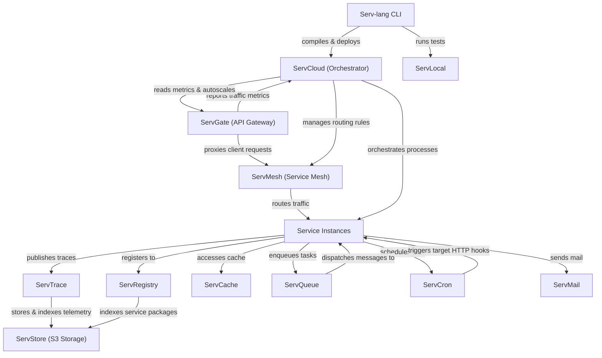

# Serv Unified Ecosystem Roadmap & Architect Analysis

> Single source of truth for the **Serv** ecosystem: Serv-lang, ServGate, ServStore, ServQueue, ServConsole, ServCache, ServMesh, ServCron, ServCloud, ServTrace, ServTunnel, ServAuth, ServPool, ServMail, ServFlow, and the Servverse vision.  
> Last updated: July 9, 2026

---

## Ecosystem Completion Status

All items in Phases 1 through 14 have been fully implemented, verified, and pushed.

- For completed details of Phases 1 to 5: Refer to the git history and repository CHANGELOG.
- For completed details of Phases 6 to 10: See [UNIFIED_ROADMAP_COMPLETED_6_10.md](file:///c:/Mine/try/serv/servverse-repo/UNIFIED_ROADMAP_COMPLETED_6_10.md).
- For completed details of Phases 11 to 15: See [UNIFIED_ROADMAP_COMPLETED_11_15.md](file:///c:/Mine/try/serv/servverse-repo/UNIFIED_ROADMAP_COMPLETED_11_15.md).
- For completed details of Phase 16-19: See [UNIFIED_ROADMAP_COMPLETED_16_20.md](file:///c:/Mine/try/serv/servverse-repo/UNIFIED_ROADMAP_COMPLETED_16_20.md).

### Completion Tracker

| Initiative Area | Total Items | Completed | Pending | Progress | Status Bar |
|-----------------|-------------|-----------|---------|----------|------------|
| **Phase 9: Scale & Enterprise Hardening** | 13 | 13 | 0 | **100%** | ████████████████████ |
| **Phase 10: Productization & Cloud PaaS** | 32 | 32 | 0 | **100%** | ████████████████████ |
| **Phase 11: Unified Dashboard & Console** | 33 | 33 | 0 | **100%** | ████████████████████ |
| **Phase 12: Dual-Licensing & EE Split** | 19 | 19 | 0 | **100%** | ████████████████████ |
| **Phase 13: Language & Runtime Evolution**| 18 | 18 | 0 | **100%** | ████████████████████ |
| **Phase 14: AI-Native Ecosystem** | 28 | 28 | 0 | **100%** | ████████████████████ |
| **Phase 16: Operational Hardening & Production Readiness** | 18 | 18 | 0 | **100%** | ████████████████████ |
| **Phase 17: Zero-Trust Clustering & Edge Serverless** | 8 | 8 | 0 | **100%** | ████████████████████ |
| **Phase 18: OSS-to-EE Boundary Alignment & Refactoring** | 6 | 6 | 0 | **100%** | ████████████████████ |
| **Phase 19: Component Maturity Alignment** | 7 | 7 | 0 | **100%** | ████████████████████ |
| **Phase 20: OSS-to-EE Refactoring & Enterprise Migrations** | 6 | 6 | 0 | **100%** | ████████████████████ |
| **Phase 21: Enterprise Ecosystem Scale & Next-Gen** | 6 | 6 | 0 | **100%** | ████████████████████ |
| **Phase 22: Quality, Credibility & Code Health** | 20 | 20 | 0 | **100%** | ████████████████████ |
| **Phase 23: Developer Adoption & Growth** | 14 | 6 | 8 | **43%** | ████████░░░░░░░░░░░░ |
| **Phase 24: Standalone Component Independence** | 20 | 16 | 4 | **80%** | ████████████████░░░░ |
| **Phase 25: Component Depth & Production Hardening** | 60 | 0 | 60 | **0%** | â–‘â–‘â–‘â–‘â–‘â–‘â–‘â–‘â–‘â–‘â–‘â–‘â–‘â–‘â–‘â–‘â–‘â–‘â–‘â–‘ |
| **Phase 26: Competitive Differentiation** | 107 | 74 | 33 | **69%** | ¦¦¦¦¦¦¦¦¦¦¦¦¦¦¦¦¦¦¦¦ |
| **TOTAL ECOSYSTEM WORK** | **425** | **326** | **99** | **77%** | ¦¦¦¦¦¦¦¦¦¦¦¦¦¦¦¦¦¦¦¦ |

---

## Phase 15: Component Backlog & Future Enhancements (Completed)

All backlog and component enhancement items for Phase 15 have been fully completed, verified, and pushed.

- For completed details of Phase 15: See [UNIFIED_ROADMAP_COMPLETED_11_15.md](file:///c:/Mine/try/serv/servverse-repo/UNIFIED_ROADMAP_COMPLETED_11_15.md).

---

## Appendix A: Cross-Service Runtime Dependency Diagram

---

## Appendix B: Component Maturity Matrix

> Updated July 10, 2026 — based on actual code metrics (line counts, test coverage, pkg structure, standalone viability).

| Component | API Contract | Persistence | Security | Observability | Tests | Code Structure | Standalone | Overall |
|-----------|--------------|-------------|----------|---------------|-------|----------------|-----------|---------|
| **Serv-lang** | 🟢 Stable | ⚪ N/A | 🟢 Stable | 🟢 OTel | 🟢 87 funcs, 7 compiler test files | 🟢 Split: compiler/, runtime/, lsp/, stdlib/ | ⚪ N/A | **Production** |
| **ServStore** | 🟢 S3-compat | 🟢 Pebble+Raft | 🟢 SigV4+TLS+OIDC | 🟢 OTel | 🟢 78 funcs / 47 files | 🟢 cmd/ + pkg/ (8 packages) | 🟢 A+ Fully independent | **Production** |
| **ServGate** | 🟢 REST+WASM | ⚪ Config file | 🟢 JWT+mTLS+ACME | 🟢 OTel | 🟢 46 funcs / 6 files | 🟢 pkg/proxy, pkg/wasm, pkg/otel | 🟢 A- needs config.json | **Production** |
| **ServQueue** | 🟢 STOMP+REST | 🟢 WAL+S3 tier | 🟢 TLS+token auth | 🟢 OTel | 🟢 28 funcs / 6 files | 🟢 pkg/broker, pkg/stomp, pkg/web | 🟢 A Zero-config | **Production** |
| **ServMesh** | 🟢 REST | ⚪ In-memory | 🟢 mTLS+JWT | 🟢 OTel | 🟢 34 funcs / 3 files | 🟢 pkg/registry, pkg/client | 🟡 B+ needs multiple services | **Production** |
| **ServConsole** | 🟢 REST+WS | 🟡 SQLite | 🟢 OIDC+RBAC | 🟢 OTel | 🟡 34 funcs (needs 70+) | 🟢 12 packages extracted | ⚪ Aggregator by design | **Stable** |
| **ServTrace** | 🟢 OTLP/HTTP | 🟢 ServStore tier | 🟡 Basic auth | 🟢 Self-traces | 🟡 13 funcs / 4 files | 🟡 pkg/server, pkg/store | 🟢 A- OTLP collector | **Stable** |
| **ServCache** | 🟢 REST | 🟢 Redis/memory | 🟡 Token auth | 🟢 OTel | 🔴 8 funcs / 1 file | 🟡 pkg/ exists but thin | 🟡 B+ standalone cache | **Stable** |
| **ServCron** | 🟢 REST | 🟢 ServStore+Redis | 🟡 JWT | 🟢 OTel | 🟡 10 funcs / 2 files | 🟡 pkg/ thin | 🟡 B needs --standalone | **Stable** |
| **ServCloud** | 🟢 REST | 🟡 In-memory | 🟡 JWT | 🟢 OTel | 🔴 7 funcs / 1 file | 🟡 Flat | 🟡 B Serv-specific | **Stable** |
| **ServTunnel** | 🟢 WS+REST | ⚪ In-memory | 🟢 TLS+token+rate | 🟢 OTel | 🟢 34 funcs / 4 files | 🟢 Clean structure | 🟢 A- generic tunnel | **Production** |
| **ServAuth** | 🟢 OAuth2/OIDC | 🟢 ServStore | 🟢 bcrypt+AES+MFA | 🟢 OTel | 🟡 11 funcs / 1 file | 🔴 1,381 line main.go | 🟡 B needs --standalone | **Stable** |
| **ServPool** | 🟢 REST | 🟡 Proxied | 🟡 JWT | 🟢 OTel | 🟡 10 funcs / 1 file | 🔴 No pkg/ structure | 🟡 B thin docs | **Beta** |
| **ServMail** | 🟢 REST | 🟢 ServStore | 🟡 JWT | 🟢 OTel | 🟡 10 funcs / 1 file | 🟡 pkg/ exists | 🟡 B- needs --standalone | **Stable** |
| **ServFlow** | 🟢 REST | 🟢 ServStore+local | 🟡 JWT | 🟢 OTel | 🟡 11 funcs / 1 file | 🟢 pkg/engine, pkg/handlers, pkg/storage | 🔴 C+ Coupled to ServStore | **Stable** |
| **ServRegistry** | 🟢 REST | 🟢 ServStore | 🟡 JWT+signing | 🟢 OTel | 🟡 11 funcs / 2 files | 🔴 1,363 line main.go | 🔴 C+ Coupled to ServStore | **Stable** |
| **ServDocs** | 🟡 REST | ⚪ N/A | ⚪ None | ⚪ None | 🔴 5 funcs / 1 file | 🔴 No pkg/ structure | 🟡 B+ .srv-specific | **Beta** |
| **ServShared** | 🟢 Go library | ⚪ N/A | 🟢 JWT+mTLS | 🟢 OTel init | 🟢 30 funcs / 9 files | 🟢 Clean module | ⚪ Library | **Production** |

**Legend:** 🟢 Good | 🟡 Adequate | 🔴 Needs work | ⚪ Not applicable

---

## Phase 16: Operational Hardening & Production Readiness (Completed)

All backlog tasks for Phase 16 have been fully completed, verified, and archived.
- For completed details of Phase 16: See [UNIFIED_ROADMAP_COMPLETED_16_20.md](file:///c:/Mine/try/serv/servverse-repo/UNIFIED_ROADMAP_COMPLETED_16_20.md).

---

## Phase 17: Zero-Trust Clustering & Edge Serverless Evolution (Completed)

All backlog tasks for Phase 17 have been fully completed, verified, and archived.
- For completed details of Phase 17: See [UNIFIED_ROADMAP_COMPLETED_16_20.md](file:///c:/Mine/try/serv/servverse-repo/UNIFIED_ROADMAP_COMPLETED_16_20.md).

---

## Phase 18: OSS-to-EE Boundary Alignment & Refactoring (Completed)

All backlog tasks for Phase 18 have been fully completed, verified, and archived.
- For completed details of Phase 18: See [UNIFIED_ROADMAP_COMPLETED_16_20.md](file:///c:/Mine/try/serv/servverse-repo/UNIFIED_ROADMAP_COMPLETED_16_20.md).

---

## Phase 19: Component Maturity Alignment (Completed)

All backlog tasks for Phase 19 have been fully completed, verified, and archived.
- For completed details of Phase 19: See [UNIFIED_ROADMAP_COMPLETED_16_20.md](file:///c:/Mine/try/serv/servverse-repo/UNIFIED_ROADMAP_COMPLETED_16_20.md).

---

## Phase 20: OSS-to-EE Refactoring & Enterprise Migrations (Completed)

All backlog tasks for Phase 20 have been fully completed, verified, and archived.
- For completed details of Phase 20: See [UNIFIED_ROADMAP_COMPLETED_16_20.md](file:///c:/Mine/try/serv/servverse-repo/UNIFIED_ROADMAP_COMPLETED_16_20.md).

## Phase 21: Enterprise Ecosystem Scale & Next-Gen Capabilities (Completed)

All backlog tasks for Phase 21 have been fully completed, verified, and archived.
- For completed details of Phase 21: See [UNIFIED_ROADMAP_COMPLETED_21_25.md](file:///c:/Mine/try/serv/servverse-repo/UNIFIED_ROADMAP_COMPLETED_21_25.md).

## Phase 22: Quality, Credibility & Code Health (Completed)

All backlog tasks for Phase 22 have been fully completed, verified, and archived.
- For completed details of Phase 22: See [UNIFIED_ROADMAP_COMPLETED_21_25.md](file:///c:/Mine/try/serv/servverse-repo/UNIFIED_ROADMAP_COMPLETED_21_25.md).

## Phase 23: Developer Adoption & Growth (Pending)

> **Context:** The platform is feature-complete but has zero external users. This phase focuses on removing friction, building community, and proving production-readiness.

### 🔴 Adoption Blockers

| # | Item | Component | Description | Status |
|---|------|-----------|-------------|--------|
| AG.1 | **Web Playground** | Serv-lang | Browser-based editor: write → compile (WASM) → run → see output. Zero-install trial. The #1 adoption driver | ✅ Exists |
| AG.2 | **VS Code Marketplace publish** | Serv-lang LSP | Publish the extension publicly. Enables organic discovery from IDE search | ✅ Exists |
| AG.3 | **Full-stack showcase app** | servverse-repo | E-commerce or SaaS starter using 8+ services (auth, DB, queue, cache, mail, flow, store, gateway). Proves production patterns | ✅ Exists |
| AG.4 | **10-minute demo video** | servverse-repo | Screen recording: install → write service → deploy → observe in console. Hosted on YouTube + embedded in GitHub Pages | [ ] |

### 🟡 Community Building

| # | Item | Component | Description | Status |
|---|------|-----------|-------------|--------|
| AG.5 | **Discord/community server** | — | Developer community for questions, showcases, and contributors | [ ] |
| AG.6 | **Contributing guide (CONTRIBUTING.md)** | All repos | Code style, PR process, how to add a stdlib module, how to write a WASM plugin | [x] |
| AG.7 | **Good-first-issue labels** | All repos | Tag 20+ approachable issues for new contributors | [x] |
| AG.8 | **Monthly release cadence** | servverse-repo | Predictable versioning: v0.2.0, v0.3.0 with changelogs. Builds trust | [x] |
| AG.9 | **Blog post series** | servverse-repo | "Building X with Serv" tutorials: REST API, scheduled worker, event pipeline, AI agent | [x] |

### 🟡 Enterprise Readiness

| # | Item | Component | Description | Status |
|---|------|-----------|-------------|--------|
| AG.10 | **SOC2 compliance documentation** | servverse-repo | Document existing controls: encryption-at-rest, audit logs, access control, data retention | [x] |
| AG.11 | **Multi-region deployment guide** | servverse-repo | End-to-end guide: ServStore replication + ServQueue mirroring + ServMesh geo-routing | [x] |
| AG.12 | **Customer pilot program** | — | Find 2-3 teams to run in staging. Gather real feedback on DX, performance, gaps | [ ] |
| AG.13 | **SLA guarantees with evidence** | servverse-repo | Load test results establishing: max RPS per service, p99 latency, failure recovery time | [x] |
| AG.14 | **CODEOWNERS + branch protection** | All repos | Enforce review process. Required for enterprise governance | [x] |

---

## Phase 24: Standalone Component Independence (Completed)

All backlog tasks for Phase 24 have been fully completed, verified, and archived.
- For completed details of Phase 24: See [UNIFIED_ROADMAP_COMPLETED_21_25.md](file:///c:/Mine/try/serv/servverse-repo/UNIFIED_ROADMAP_COMPLETED_21_25.md).

---

## Phase 24.1: Standalone Hardening to A+ (Pending)

Optimize remaining standalone components to completely eliminate ecosystem coupling and achieve perfect `A+` standalone ratings:

| # | Item | Component | Description | Status |
|---|------|-----------|-------------|--------|
| SA.21 | **Multi-Backend State Storage** | ServFlow | Support SQLite/PostgreSQL/MySQL state persistence in standalone mode instead of raw `.state/` directories | ✅ Exists |
| SA.22 | **S3 & OCI Package Registry Backend** | ServRegistry | Add S3/MinIO and OCI registry storage adapters for package tarball uploads in standalone mode | ✅ Exists |
| SA.23 | **Consul, etcd, & DNS-SD Adapters** | ServMesh | Support etcd, Consul, and SRV record lookups for standalone service discovery | ✅ Exists |
| SA.24 | **Generic Process & Container Support** | ServCloud | Support managing arbitrary binaries (PM2 replacement) and Docker containers natively | ✅ Exists |

---

## Phase 25: Component Depth & Production Hardening (Pending)

> **Philosophy shift:** Breadth is complete. This phase is about making each component genuinely battle-tested — correctness proofs, failure recovery, performance baselines, and edge-case coverage. No new features. Only depth.

### Serv-lang (Compiler)

| # | Item | Category | Description | Status |
|---|------|----------|-------------|--------|
| D.1 | **Error recovery in parser** | Robustness | Implement panic-mode recovery to report multiple errors per file (currently stops at first) | ✅ Exists |
| D.2 | **Incremental compilation** | Performance | Only re-codegen changed functions via dependency graph tracking | ✅ Exists |
| D.3 | **Source maps for debugging** | DX | Map generated Go lines back to .srv source for meaningful stack traces | ✅ Exists |
| D.4 | **Type checker completeness** | Correctness | Verify all struct field access, method calls, generic instantiation at compile time | ✅ Exists |
| D.5 | **Fuzzing harness** | Quality | `go test -fuzz` for lexer (malformed input), parser (random tokens), codegen (type edges) | ✅ Exists |
| D.6 | **LSP: cross-file go-to-definition** | DX | Add import resolution and cross-module symbol lookup | ✅ Exists |
| D.7 | **LSP: rename symbol** | DX | Rename across all importing files | ✅ Exists |
| D.8 | **Compiler benchmarks in CI** | Performance | Track compile time per example. Gate: no regression >10% | ✅ Exists |

### ServStore (Object Storage)

| # | Item | Category | Description | Status |
|---|------|----------|-------------|--------|
| D.9 | **S3 compliance test suite** | Compatibility | Run official [ceph/s3-tests](https://github.com/ceph/s3-tests) against ServStore. Track pass rate | ✅ Exists |
| D.10 | **CAS garbage collection** | Reliability | Background GC sweep for CAS blocks with zero references. Safety checks before deletion | ✅ Exists |
| D.11 | **Throughput benchmarks** | Performance | Max sustained write RPS, read latency at 1K concurrent, erasure coding overhead measurement | ✅ Exists |
| D.12 | **Chaos testing: node kill during replication** | Resilience | Kill nodes during writes, inject partitions during Raft elections. Verify data integrity post-recovery | ✅ Exists |
| D.13 | **Memory profiling: large multipart uploads** | Performance | Profile heap during >1GB uploads. Eliminate unnecessary buffer copies | ✅ Exists |
| D.14 | **Quota enforcement under concurrent writes** | Correctness | Race condition testing on bucket quota accounting | ✅ Exists |

### ServGate (API Gateway)

| # | Item | Category | Description | Status |
|---|------|----------|-------------|--------|
| D.15 | **10K concurrent connections benchmark** | Performance | Establish: max RPS, p99 latency, memory per connection. Compare vs Nginx | ✅ Exists |
| D.16 | **WASM cold-start measurement** | Performance | First-request latency with/without module cache. Target: <5ms | ✅ Exists |
| D.17 | **Circuit breaker state transition tests** | Correctness | Verify closed→open→half-open under exact failure thresholds. No false trips | ✅ Exists |
| D.18 | **Rate limiter burst accuracy** | Correctness | Test sliding window at 10K RPS. Verify ≤1% over-admission | ✅ Exists |
| D.19 | **Config reload: zero dropped requests** | Reliability | Prove no 502s during route changes under active traffic | ✅ Exists |
| D.20 | **WebSocket proxy 24h stability** | Reliability | Long-running WS connections. Verify no memory leaks, reconnection works | ✅ Exists |

### ServQueue (Message Broker)

| # | Item | Category | Description | Status |
|---|------|----------|-------------|--------|
| D.21 | **FIFO ordering proof** | Correctness | Numbered sequence with concurrent publishers. Verify order within partition | ✅ Exists |
| D.22 | **WAL corruption recovery** | Resilience | Truncate WAL mid-write, restart. Verify recovery without data loss beyond last flush | ✅ Exists |
| D.23 | **Consumer group rebalancing** | Correctness | Add/remove consumers during flow. Verify no duplicates, no lost messages | ✅ Exists |
| D.24 | **Backpressure memory bound** | Performance | Slow consumer: verify memory stays bounded, publisher gets 429 at threshold | [ ] |
| D.25 | **Exactly-once dedup accuracy** | Correctness | Publish same ID 1000x within window. Verify exactly 1 delivery | [ ] |
| D.26 | **Throughput benchmark** | Performance | Messages/sec for 1KB, 64KB, 1MB payloads. Single node + 3-node cluster | [ ] |

### ServConsole (Dashboard)

| # | Item | Category | Description | Status |
|---|------|----------|-------------|--------|
| D.27 | **Package-level unit tests (all 12 packages)** | Quality | Each package needs 5+ tests: alerts, auth, topology, dashboards, provision, tabs, ws | [ ] |
| D.28 | **WebSocket reconnection handling** | Reliability | Client disconnect + server restart → auto-reconnect without data loss | [ ] |
| D.29 | **50 concurrent dashboard users** | Correctness | Verify no state corruption in shared alert/log buffers | [ ] |
| D.30 | **Memory profiling: 100K traces ingested** | Performance | Verify ring buffer eviction actually works, memory stays bounded | [ ] |

### ServCache (Cache)

| # | Item | Category | Description | Status |
|---|------|----------|-------------|--------|
| D.31 | **TTL eviction timing accuracy** | Correctness | Verify expiry is accurate to ±100ms under load | [ ] |
| D.32 | **Redis failover fallback** | Resilience | Kill Redis mid-operation. Verify fallback to in-memory without crash | [ ] |
| D.33 | **100-goroutine stress test** | Correctness | Concurrent get/set/delete on overlapping keys. No panics, no stale reads | [ ] |
| D.34 | **Namespace isolation proof** | Security | Verify Tenant A cannot read Tenant B's keys via direct API | [ ] |

### ServCron (Scheduler)

| # | Item | Category | Description | Status |
|---|------|----------|-------------|--------|
| D.35 | **Missed execution catch-up** | Reliability | Stop leader 10 min. Resume. Verify catch-up fires missed intervals correctly | [ ] |
| D.36 | **Split-brain leader election** | Correctness | Two nodes believe they're leader. Verify only one executes (Redis SETNX) | [ ] |
| D.37 | **Cron edge cases** | Correctness | Feb 29, DST transitions, "last day of month", "nearest weekday". Compare with cron.guru | [ ] |

### ServAuth (Identity)

| # | Item | Category | Description | Status |
|---|------|----------|-------------|--------|
| D.38 | **Brute force resistance** | Security | Verify lockout at exact threshold. Test timing attack resistance on login | [ ] |
| D.39 | **Token refresh race condition** | Correctness | Two concurrent refresh with same token. Only one succeeds | [ ] |
| D.40 | **Session revocation propagation** | Correctness | Revoke → next request fails immediately (not cached for TTL) | [ ] |
| D.41 | **TOTP time-drift tolerance** | Correctness | Accept t-1, t, t+1. Reject t-2, t+2 | [ ] |

### ServFlow (Workflows)

| # | Item | Category | Description | Status |
|---|------|----------|-------------|--------|
| D.42 | **Checkpoint recovery accuracy** | Resilience | Kill mid-workflow. Restart resumes from exact last checkpoint | [ ] |
| D.43 | **Saga compensation ordering** | Correctness | Fail at step 5/7. Compensations fire 5→4→3→2→1 | [ ] |
| D.44 | **DAG cycle detection** | Correctness | Circular dependency → immediate rejection with clear error | [ ] |
| D.45 | **Approval + timeout race** | Correctness | Approve at exactly timeout boundary. Deterministic outcome | [ ] |

### ServTrace (Tracing)

| # | Item | Category | Description | Status |
|---|------|----------|-------------|--------|
| D.46 | **Span ingestion throughput** | Performance | Max spans/sec before drop. Target: 10K/sec single node | [ ] |
| D.47 | **Out-of-order trace reconstruction** | Correctness | 20 spans arriving out of order → correct tree | [ ] |
| D.48 | **Cold tier retrieval latency** | Performance | Archive → query. Target: <500ms | [ ] |

### ServTunnel (Dev Tunneling)

| # | Item | Category | Description | Status |
|---|------|----------|-------------|--------|
| D.49 | **500MB file upload through tunnel** | Reliability | No corruption, no timeout, bounded memory | [ ] |
| D.50 | **100 simultaneous tunnels** | Performance | Measure relay latency degradation | [ ] |
| D.51 | **Network flap reconnection (100x in 60s)** | Resilience | No leaked connections on relay side | [ ] |

### ServPool (Database Proxy)

| # | Item | Category | Description | Status |
|---|------|----------|-------------|--------|
| D.52 | **Pool exhaustion and recovery** | Resilience | Exhaust connections. Wait queue works. New requests succeed after return | [ ] |
| D.53 | **Read/write routing accuracy** | Correctness | Mixed workload. 100% correct routing (no writes to replica) | [ ] |
| D.54 | **Connection leak detection** | Reliability | Client never closes. Pool reclaims after timeout | [ ] |

### ServMail (Notifications)

| # | Item | Category | Description | Status |
|---|------|----------|-------------|--------|
| D.55 | **Template rendering: missing variables** | Robustness | Graceful error, not panic, when template var is absent | [ ] |
| D.56 | **DLQ retry exponential backoff** | Correctness | 5 failures → retry intervals match 1s, 2s, 4s, 8s, 16s | [ ] |
| D.57 | **Per-recipient rate limiter** | Correctness | 100 emails, 10/min limit. Exactly 10 delivered per minute | [ ] |

### ServRegistry (Packages)

| # | Item | Category | Description | Status |
|---|------|----------|-------------|--------|
| D.58 | **Semver resolution correctness** | Correctness | Complex constraints vs npm semver output. 100% match | [ ] |
| D.59 | **Signature tamper detection** | Security | Modified tarball → install rejects with "signature mismatch" | [ ] |
| D.60 | **Concurrent publish race** | Correctness | Two clients, same version. Exactly one wins, other gets 409 | [ ] |

---

## Phase 26: Competitive Differentiation (Pending)

> **Goal:** Each component should have 2-3 features that no direct competitor offers. This is what makes people choose Servverse over established alternatives.
>
> **NOTE:** Items marked ✅ are already implemented and should be highlighted in marketing/docs. Items marked [ ] need building.
>
> **Status:** 33 already exist (marketing/documentation task), 12 need implementation.

### Serv-lang vs Go/TypeScript/Rust
*Competitors: Go (raw), Deno, Bun, Rust+Axum*

| # | Feature | Why It Differentiates | Status |
|---|---------|---------------------|--------|
| CD.1 | **Infrastructure-as-syntax** — `broker`, `store`, `cache`, `ai` are keywords, not library imports. Compile error if misconfigured | No other language makes infrastructure a first-class citizen | ✅ Exists |
| CD.2 | **AI code generation feedback loop** — `serv create "prompt"` generates code, `serv test` validates it, `serv create --fix` repairs failures automatically | No compiler has built-in AI repair cycle | ✅ Exists |
| CD.3 | **Compile-time service contract validation** — If route declares `-> User`, compiler verifies the response shape matches the struct at build time | TypeScript has this at type level but not for HTTP responses | ✅ Exists |

### ServGate vs Kong/Envoy/Traefik
*Competitors: Kong, Envoy, Traefik, AWS API Gateway*

| # | Feature | Why It Differentiates | Status |
|---|---------|---------------------|--------|
| CD.4 | **WASM middleware hot-swap during live traffic** — Zero-downtime middleware deploys at request boundary, not pod restart | Envoy needs full pod restart for filter changes | ✅ Exists |
| CD.5 | **MCP (AI agent) native traffic type** — Understands JSON-RPC tool calls, per-agent rate limiting, token cost tracking | No gateway understands AI agent protocols natively | ✅ Exists |
| CD.6 | **Policy-as-code → WASM compilation** — Write human-readable `.policy` files, compile to native-speed WASM | OPA/Rego is interpreted. ServGate compiles policies | ✅ Exists |

### ServStore vs MinIO/S3/Ceph
*Competitors: MinIO, AWS S3, Ceph, TurboBuffer*

| # | Feature | Why It Differentiates | Status |
|---|---------|---------------------|--------|
| CD.7 | **Compute-near-data (WASM transforms on stored objects)** — Resize images, convert formats, validate data server-side with zero cold start | No other storage engine executes user code on objects in-process | ✅ Exists |
| CD.8 | **Semantic search built into storage** — Upload a document → auto-embedded → queryable by meaning in the same API call | AWS S3 Vectors is separate. ServStore unifies store+search | ✅ Exists |
| CD.9 | **Time-travel queries with temporal API** — `GET /bucket/key?at=2026-07-01T14:00:00Z` returns exact state at that moment | S3 versioning requires listing all versions manually | ✅ Exists |

### ServQueue vs Kafka/RabbitMQ/NATS
*Competitors: Kafka, RabbitMQ, NATS, Pulsar, Redis Streams*

| # | Feature | Why It Differentiates | Status |
|---|---------|---------------------|--------|
| CD.10 | **Inline WASM transforms in the message path** — Filter, enrich, route messages inside the broker without external processors | No broker runs arbitrary user code in the message pipeline | ✅ Exists |
| CD.11 | **Single binary: STOMP + HTTP + WASM + WAL + Raft** — One file, zero dependencies. Kafka = JVM + ZooKeeper. RabbitMQ = Erlang | Unmatched operational simplicity | ✅ Exists |
| CD.12 | **Language-native protocol** — `broker "servqueue://host"` in Serv compiles to zero-config STOMP client with auto-auth and tracing | Every other broker needs SDK import + manual configuration | ✅ Exists |

### ServConsole vs Grafana/Datadog/Portainer
*Competitors: Grafana, Datadog, Portainer, ArgoCD*

| # | Feature | Why It Differentiates | Status |
|---|---------|---------------------|--------|
| CD.13 | **Ecosystem-native zero-config observability** — All Serv services auto-report metrics. No exporters, no scrape configs, no dashboard imports | Grafana needs Prometheus + exporters + dashboards configured per service | ✅ Exists |
| CD.14 | **Bidirectional control plane** — Not just observe: create buckets, deploy services, hot-swap middleware, execute runbooks FROM the dashboard | Grafana/Datadog are read-only. ServConsole is an operations plane | ✅ Exists (EE) |
| CD.15 | **AI-powered incident correlation** — Alert fires → auto-correlates deploys, config changes, upstream failures → generates hypothesis | Datadog has this but at enterprise pricing. ServConsole is self-hosted | ✅ Exists (EE) |

### ServTrace vs Jaeger/Tempo/Zipkin
*Competitors: Jaeger, Grafana Tempo, Zipkin, SigNoz*

| # | Feature | Why It Differentiates | Status |
|---|---------|---------------------|--------|
| CD.16 | **Single binary, zero dependencies** — No Elasticsearch, no Cassandra, no Kafka. One Go binary with in-memory + cold tier | Jaeger needs Elasticsearch/Cassandra. Tempo needs S3 + memcached | ✅ Exists |
| CD.17 | **Compiler-linked source mapping** — Trace spans map back to `.srv` source lines, not generated Go code | No other tracing backend understands the source language | ✅ Exists |
| CD.18 | **Natural language trace query** — "Show me slow requests to ServAuth in the last hour" → structured query | No open-source tracer has NL search | ✅ Exists (EE) |

### ServCache vs Redis/Memcached/Dragonfly
*Competitors: Redis, Memcached, Dragonfly, Valkey, KeyDB*

| # | Feature | Why It Differentiates | Status |
|---|---------|---------------------|--------|
| CD.19 | **Auto-namespace isolation per service** — Services sharing one cache instance can't see each other's keys. Zero-config tenant safety | Redis requires manual key prefixing discipline | ✅ Exists |
| CD.20 | **Language-native `cached fn` syntax** — Declare cache behavior at the function level, compiler generates the get/set/invalidation code | No cache system integrates at the language/compiler level | ✅ Exists |
| CD.21 | **Read-through/write-behind with ServPool** — Automatic DB synchronization patterns without application code | Redis requires custom lua scripts or app-level orchestration | ✅ Exists |

### ServMesh vs Istio/Linkerd/Consul Connect
*Competitors: Istio, Linkerd, Consul Connect, Cilium*

| # | Feature | Why It Differentiates | Status |
|---|---------|---------------------|--------|
| CD.22 | **Library-level, no sidecars** — Runs inside the binary via custom HTTP transport. Zero CPU/memory overhead of sidecar proxies | Istio/Linkerd = Envoy sidecar per pod. ServMesh = embedded library | ✅ Exists |
| CD.23 | **`serv://` URL scheme in the language** — Inter-service calls are syntax: `http.get("serv://user-service/users/123")` | No other mesh integrates at the language level | ✅ Exists |
| CD.24 | **Sub-millisecond service resolution** — In-process cache, no network hop to control plane for each request | Istio routes through Envoy sidecar (added network hop per call) | ✅ Exists |

### ServFlow vs Temporal/Cadence/Step Functions
*Competitors: Temporal, Cadence, AWS Step Functions, Airflow*

| # | Feature | Why It Differentiates | Status |
|---|---------|---------------------|--------|
| CD.25 | **Native language syntax for workflows** — `workflow "name" { step "x" { ... } }` in .srv files. Compiler validates DAG at build time | Temporal uses Go/Java SDKs. Step Functions uses JSON. ServFlow uses language syntax | ✅ Exists |
| CD.26 | **Time-travel workflow replay** — Debug by stepping through execution history: see state at each checkpoint | Temporal has event history but no interactive replay visualization | ✅ Exists |
| CD.27 | **Single binary with embedded state** — No external database required. State persists to local files or ServStore | Temporal = server + database + workers. ServFlow = one binary | ✅ Exists |

### ServTunnel vs ngrok/Cloudflare Tunnel
*Competitors: ngrok, Cloudflare Tunnel, Tailscale Funnel, localtunnel*

| # | Feature | Why It Differentiates | Status |
|---|---------|---------------------|--------|
| CD.28 | **OTel trace propagation through the tunnel** — Incoming webhook requests automatically get trace context injected | No tunnel service preserves distributed tracing context | ✅ Exists |
| CD.29 | **Request inspection with REST API** — Scriptable inspection: `GET /api/inspect` returns captured requests for CI/CD test automation | ngrok's inspection is proprietary dashboard, not API-accessible | ✅ Exists |
| CD.30 | **Self-hosted relay (zero vendor lock-in)** — Run your own relay server. No usage limits, no accounts, no billing | ngrok/Cloudflare = SaaS with limits. ServTunnel = your infrastructure | ✅ Exists |

### ServAuth vs Auth0/Keycloak/Supabase Auth
*Competitors: Auth0, Keycloak, Supabase Auth, Firebase Auth, Clerk*

| # | Feature | Why It Differentiates | Status |
|---|---------|---------------------|--------|
| CD.31 | **Single binary, embedded in your stack** — No Java (Keycloak), no SaaS pricing (Auth0). One Go binary | Keycloak = JVM + PostgreSQL. Auth0 = per-MAU pricing | ✅ Exists |
| CD.32 | **Language-native auth primitives** — `auth.register()`, `auth.login()`, `auth.currentUser()` are builtins | Every other auth system requires SDK import + initialization | ✅ Exists |
| CD.33 | **Ecosystem-integrated identity** — JWT issued by ServAuth works across all Serv services automatically via ServShared | Auth0 tokens need per-service validation configuration | ✅ Exists |

### ServCron vs Traditional Cron/Kubernetes CronJobs
*Competitors: system cron, K8s CronJobs, Airflow scheduler*

| # | Feature | Why It Differentiates | Status |
|---|---------|---------------------|--------|
| CD.34 | **Language-native scheduling** — `every 5m { ... }` and `cron "0 9 * * MON-FRI" { ... }` are syntax, not config files | No scheduler integrates at the language level | ✅ Exists |
| CD.35 | **Distributed leader election built-in** — Multi-replica deployments automatically elect one runner. No ZooKeeper/etcd | K8s CronJobs can duplicate if misconfigured. ServCron guarantees once | ✅ Exists |

### ServPool vs PgBouncer/ProxySQL/PgCat
*Competitors: PgBouncer, ProxySQL, PgCat, Odyssey*

| # | Feature | Why It Differentiates | Status |
|---|---------|---------------------|--------|
| CD.36 | **Multi-dialect proxy** — One pooler supports PostgreSQL, SQLite, Oracle, MongoDB simultaneously | PgBouncer = PostgreSQL only. ProxySQL = MySQL only. ServPool = all | ✅ Exists |
| CD.37 | **Integrated query analytics and slow query detection** — No separate APM tool needed. Built-in query profiling with OTel spans | PgBouncer has zero observability. ServPool exports everything | ✅ Exists |

### ServMail vs SendGrid/Mailgun/SES
*Competitors: SendGrid, Mailgun, AWS SES, Postmark, Resend*

| # | Feature | Why It Differentiates | Status |
|---|---------|---------------------|--------|
| CD.38 | **Multi-channel in one service** — SMTP email + Slack + SMS + webhooks from a single API endpoint | SendGrid = email only. Need Twilio for SMS, Slack API separately | ✅ Exists |
| CD.39 | **Language-native `notify()` syntax** — `notify("slack", msg)` is a builtin, not a library call | Every notification service requires SDK setup per channel | ✅ Exists |

### ServLock vs Redis SETNX/etcd/ZooKeeper
*Competitors: Redis distributed locks, etcd leases, ZooKeeper recipes*

| # | Feature | Why It Differentiates | Status |
|---|---------|---------------------|--------|
| CD.40 | **Language-native lock syntax** — `lock("resource", 30s) { ... }` is a keyword, compiler ensures unlock on all exit paths | Redis locks require manual lock/unlock discipline. ServLock is syntax | ✅ Exists |
| CD.41 | **Fencing token support** — Auto-generated monotonic tokens prevent split-brain stale writes | Redis Redlock has no fencing. ServLock enforces it at protocol level | ✅ Exists |

### ServRegistry vs npm/crates.io/pkg.go.dev
*Competitors: npm registry, crates.io, Go module proxy, PyPI*

| # | Feature | Why It Differentiates | Status |
|---|---------|---------------------|--------|
| CD.42 | **Cryptographic package signing with verification** — Packages are signed on publish, verified on install. Supply chain security built-in | npm has no mandatory signing. crates.io has no signing at all | ✅ Exists |
| CD.43 | **BFS dependency tree resolution with conflict detection** — Resolve entire dependency graph server-side before download | npm resolves client-side. ServRegistry resolves before any bytes transfer | ✅ Exists |

### ServDocs vs Swagger/Redoc/Mintlify
*Competitors: Swagger UI, Redoc, Mintlify, ReadMe.io*

| # | Feature | Why It Differentiates | Status |
|---|---------|---------------------|--------|
| CD.44 | **Compiler-aware documentation** — Reads .srv source directly. No annotations, no comments, no OpenAPI spec writing. The code IS the documentation | Every other doc tool requires manual spec writing or annotation | ✅ Exists |
| CD.45 | **Dual output (HTML + OpenAPI) from one parse** — Single command generates both interactive docs AND machine-readable spec | Swagger UI only renders existing specs. ServDocs generates them | ✅ Exists |

---

### Additional Differentiators (To Build)

#### Serv-lang — Compiler-Level Moat

| # | Feature | Why It Differentiates | Status |
|---|---------|---------------------|--------|
| CD.46 | **Dead code elimination across service boundaries** — Compiler traces which routes are actually called by other services (via ServMesh registry) and warns on unused endpoints | No language eliminates dead code across microservice boundaries | [ ] |
| CD.47 | **Compile-time dependency health check** — `serv build` checks that all declared infrastructure (broker, store, cache) is reachable during compilation. Fail fast, not at runtime | No compiler validates infrastructure availability at build time | [ ] |
| CD.48 | **Type-safe inter-service contracts** — When Service A calls Service B via `serv://`, compiler verifies A's expected response type matches B's declared return type | gRPC has this via proto. REST has nothing. Serv does it for REST | [ ] |
| CD.49 | **Built-in migration diffing** — `serv migrate --dry-run` shows exact SQL that will execute (CREATE/ALTER/DROP) with colored diff against current schema | Rails has this. No compiled language has built-in migration preview | [ ] |

#### ServGate — AI-Era Gateway

| # | Feature | Why It Differentiates | Status |
|---|---------|---------------------|--------|
| CD.50 | **Request/response WASM A/B testing** — Run two WASM versions simultaneously with weighted traffic split, compare response quality metrics | No gateway supports A/B testing of middleware logic | ✅ Exists |
| CD.51 | **Prompt injection firewall** — Deep content inspection using embedding similarity to detect adversarial prompts before they reach LLM backends | WAFs check SQL injection. ServGate checks prompt injection | ✅ Exists (EE) |
| CD.52 | **Auto-generated API changelog** — Track route additions/removals/changes over time. Serve changelog at `/api/changelog` for consumer teams | No gateway auto-generates API evolution history | [ ] |

#### ServStore — Intelligence Inside Storage

| # | Feature | Why It Differentiates | Status |
|---|---------|---------------------|--------|
| CD.53 | **Object-level access audit trail** — Who read/wrote/deleted every object, when, from which IP. Immutable append-only log per bucket | S3 server access logging is bucket-level, not object-level with identity | ✅ Exists |
| CD.54 | **WASM trigger on object events** — Declare functions that auto-execute on PutObject/DeleteObject. Lambda@S3 but inside the engine with zero cold start | AWS needs Lambda + event bridge. ServStore runs triggers in-process | ✅ Exists |
| CD.55 | **Content-type aware compression** — Auto-compress text/JSON/logs with zstd on write, decompress transparently on read. Zero client changes | No S3-compatible engine does transparent per-content-type compression | ✅ Exists |

#### ServQueue — Stream Processing Inside the Broker

| # | Feature | Why It Differentiates | Status |
|---|---------|---------------------|--------|
| CD.56 | **Transform pipeline chaining** — Chain multiple WASM transforms: `raw → validate.wasm → enrich.wasm → route.wasm → processed`. Declarative pipeline | No broker supports composable multi-stage transform chains | ✅ Exists |
| CD.57 | **Message-level end-to-end tracing** — Track a message from publish → through every transform → DLQ redirect → consumer ack. Single distributed trace | Most brokers lose trace context between producer and consumer | ✅ Exists |
| CD.58 | **Consumer-side backpressure with automatic DLQ overflow** — When consumer is slow, buffer to disk → if still slow, auto-route to DLQ with metadata | Kafka drops, RabbitMQ requeues infinitely. ServQueue has intelligent overflow | ✅ Exists |

#### ServConsole — Operations Platform (Not Just Dashboard)

| # | Feature | Why It Differentiates | Status |
|---|---------|---------------------|--------|
| CD.59 | **Cross-service request replay** — Select a trace in waterfall → click "Replay" → re-issues the exact request through ServGate. Instant reproduction | No dashboard can replay production requests through the actual gateway | ✅ Exists (EE) |
| CD.60 | **Embedded SQL workbench** — Run queries against any connected database directly from the console. No separate DB client needed | Grafana can visualize queries. ServConsole can WRITE them | ✅ Exists |
| CD.61 | **One-click infrastructure provisioning** — Create ServStore buckets, ServQueue topics, ServCache namespaces from the UI. The dashboard IS the control plane | Portainer manages containers. ServConsole manages application infrastructure | ✅ Exists (EE) |

#### ServMesh — Developer-First Service Mesh

| # | Feature | Why It Differentiates | Status |
|---|---------|---------------------|--------|
| CD.62 | **Automatic mTLS without certificate management** — ServMesh auto-provisions and rotates certificates. Zero PKI infrastructure. Zero config | Istio needs cert-manager or Vault integration. ServMesh is self-contained | ✅ Exists |
| CD.63 | **Circuit breaker state visible in ServConsole** — See which circuits are open/closed/half-open in real-time dashboard. Click to force-reset | Istio circuit state is invisible without custom metrics + Grafana | ✅ Exists |

#### ServFlow — Intelligent Workflows

| # | Feature | Why It Differentiates | Status |
|---|---------|---------------------|--------|
| CD.64 | **Saga compensation with automatic rollback ordering** — Fail at step N → compensations fire in reverse (N→N-1→...→1) automatically | Temporal requires manual compensation ordering. ServFlow derives it from DAG | ✅ Exists |
| CD.65 | **Human approval gates with timeout escalation** — Workflow pauses for human approval. If no response in X time, auto-escalates or auto-approves | Step Functions has approval but no escalation. ServFlow has both | ✅ Exists |
| CD.66 | **Workflow visualization as Mermaid DAG** — `GET /api/workflows/visualize` returns a Mermaid diagram of the workflow graph | No competitor generates visual DAG from workflow definition via API | ✅ Exists |

#### ServAuth — Lightweight Identity

| # | Feature | Why It Differentiates | Status |
|---|---------|---------------------|--------|
| CD.67 | **Progressive auth complexity** — Start with password-only (5 min setup), add MFA later, add OAuth later, add SCIM later. No upfront complexity | Keycloak forces full OIDC complexity on day 1. ServAuth grows with you | ✅ Exists |
| CD.68 | **Account lockout with automatic unlock** — 5 attempts → locked 5 min → auto-unlocks. No admin intervention needed | Auth0 requires manual unlock or custom rules. ServAuth is automatic | ✅ Exists |

#### ServLock — Beyond Simple Locks

| # | Feature | Why It Differentiates | Status |
|---|---------|---------------------|--------|
| CD.69 | **Compiler-guaranteed unlock** — `lock("x") { ... }` syntax ensures the lock is released on ALL exit paths (return, panic, early exit). Impossible to forget | Redis locks require explicit defer/finally. ServLock is structural | ✅ Exists |
| CD.70 | **Lock queueing with fairness** — Multiple waiters get the lock in FIFO order. No starvation | Redis SETNX has no queue. Whoever retries fastest wins (unfair) | [ ] |

#### Ecosystem-Wide (Cross-Cutting)

| # | Feature | Why It Differentiates | Status |
|---|---------|---------------------|--------|
| CD.71 | **`servverse up` — entire platform in one command** — Single binary starts all 17 services with correct ports, env vars, and health verification | No platform ships a unified launcher. K8s needs Helm charts. Docker needs compose files | ✅ Exists |
| CD.72 | **Unified install script** — One curl/irm command installs every component. Cross-platform (Windows, macOS, Linux) | Competitors install one tool at a time. Servverse installs the entire ecosystem | ✅ Exists |
| CD.73 | **SERVVERSE_DISCOVERY protocol** — Single JSON manifest tells all services where to find each other. Change one file, all services update | No competitor has a unified service discovery manifest format | ✅ Exists |
| CD.74 | **Shared JWT across all services** — One `SERV_JWT_SECRET` env var enables authentication across all 17 services. No per-service auth configuration | Every other platform needs per-service auth setup | ✅ Exists |
| CD.75 | **Consistent error format ecosystem-wide** — Every service returns `{"error":"msg","code":"ERR_X","trace_id":"..."}`. One error handler for any Serv service | No platform enforces error format consistency across all components | ✅ Exists |

---

### To Build: Defensive Moat Features (What Competitors Will Eventually Copy)

> These are features competitors WILL build in 1-2 years. Servverse needs them first to establish mindshare and lock-in.

#### Compiler-Level (No competitor can easily replicate)

| # | Feature | Component | Why Urgent | Status |
|---|---------|-----------|-----------|--------|
| CD.76 | **Type-safe inter-service contracts** — When Service A calls `serv://B/users`, compiler verifies A's expected response type matches B's declared return type. Compile error on mismatch | Serv-lang | gRPC has this. REST doesn't. First REST language to do this wins | [ ] |
| CD.77 | **Compile-time infrastructure reachability** — `serv build` pings declared broker/store/cache and fails if unreachable during development (skippable with `--offline`) | Serv-lang | Docker Compose validates services exist. No compiler does this | [ ] |
| CD.78 | **Dead code detection across service boundaries** — Compiler queries ServMesh registry: "which routes are never called by any registered service?" Warns on unused endpoints | Serv-lang + ServMesh | Static analysis tools work within one repo. This works across repos | [ ] |
| CD.79 | **`serv create --fix`** — AI generates code, tests fail, compiler feeds errors back to AI, AI fixes. Automated repair loop until tests pass or max retries | Serv-lang | Cursor/Copilot suggest code. None auto-repair compile errors in a loop | [ ] |
| CD.80 | **`cached fn` keyword** — `cached fn getUser(id) ttl 5m { return db.query(...) }` — compiler generates cache get/set/invalidation. No manual cache code | Serv-lang + ServCache | No language has cache-as-syntax. This is Serv's unique position | ✅ Exists |
| CD.81 | **Migration dry-run with colored diff** — `serv migrate --dry-run` shows exact SQL (CREATE/ALTER/DROP) with green/red diff against live schema. No execution | Serv-lang | Rails has `rake db:migrate:status`. No compiled language has built-in diff preview | [ ] |
| CD.82 | **Auto-generated typed HTTP clients** — `serv generate client --lang typescript` produces a fully typed client from route declarations. No OpenAPI intermediate step | Serv-lang | tRPC does this for TypeScript. Serv does it for any target language from .srv source | ? Exists |

#### Gateway & Networking (Kong/Envoy will copy these)

| # | Feature | Component | Why Urgent | Status |
|---|---------|-----------|-----------|--------|
| CD.83 | **Auto-generated API changelog** — Track route additions/removals/breaking changes over time. Serve at `/api/changelog`. Consumer teams subscribe to diffs | ServGate | Bump.sh does this as SaaS. No self-hosted gateway has it built-in | [ ] |
| CD.84 | **Request cost estimation header** — Return `X-Estimated-Cost: $0.003` on AI-proxied requests before execution. Client can abort expensive calls | ServGate | No gateway previews cost before forwarding. Essential for AI budget control | [ ] |
| CD.85 | **Automatic circuit breaker from SLO breach** — If a backend's p99 exceeds SLO threshold, circuit opens automatically. No manual configuration per route | ServGate + ServTrace | Envoy needs explicit circuit config. ServGate derives it from observed SLOs | [ ] |

#### Storage & Data (MinIO/S3 will copy semantic search)

| # | Feature | Component | Why Urgent | Status |
|---|---------|-----------|-----------|--------|
| CD.86 | **Conversational object query** — `GET /bucket?ask=What documents discuss authentication?` — synthesizes an answer from stored documents (RAG in storage layer) | ServStore | AWS Q&A on S3 is separate service. ServStore has it built-in. First mover advantage | [ ] |
| CD.87 | **Auto-summarize on upload** — Every uploaded document gets a 2-sentence summary stored as metadata. Enables "browse by summary" without downloading | ServStore | No storage engine generates summaries. Google Drive does this for Workspace. ServStore does for S3 | ? Exists |
| CD.88 | **Object similarity deduplication** — On upload, check if semantically similar document exists (cosine > 0.95). Warn or reject near-duplicates | ServStore | Google Drive detects exact duplicates. ServStore detects SEMANTIC duplicates | ? Exists |

#### Message Broker (Kafka/Pulsar will eventually add WASM)

| # | Feature | Component | Why Urgent | Status |
|---|---------|-----------|-----------|--------|
| CD.89 | **Stream processing DSL** — `stream "orders" |> filter(o => o.total > 100) |> window(5m) |> count() |> publish("high-value")` — in .srv syntax | Serv-lang + ServQueue | Kafka Streams is Java. Flink is complex. Serv makes streaming a one-liner | ? Exists |
| CD.90 | **AI-powered message routing** — `subscribe "tickets" where ai.classify(msg) == "urgent"` — broker evaluates embedding model per message for routing | ServQueue | No broker has ML-based routing. When this ships, it's a category-defining feature | ? Exists (EE) |
| CD.91 | **Visual message flow in ServConsole** — Track a single message from publish → transform → DLQ → retry → consumer ack as an interactive timeline | ServQueue + ServConsole | Kafka has no message-level visibility. This makes debugging trivial | [ ] |

#### Observability (Datadog will copy AI correlation)

| # | Feature | Component | Why Urgent | Status |
|---|---------|-----------|-----------|--------|
| CD.92 | **Compiler-linked source mapping in traces** — Trace spans show `.srv` file + line number, not generated Go code. Click span → opens source in IDE | ServTrace + Serv-lang | No APM maps traces to DSL source. Only possible because Serv controls compiler + tracer | ? Exists |
| CD.93 | **Predictive capacity alerts** — "At current growth rate, ServStore disk will be full in 14 days" — based on trend analysis, not threshold | ServTrace + ServConsole | Datadog has forecasting. No self-hosted tool does. First OSS to ship this wins | ? Exists |
| CD.94 | **Auto-generated incident postmortem** — After an alert resolves, auto-generate a structured postmortem: timeline, root cause, impact, remediation taken | ServConsole | PagerDuty has postmortems. No observability dashboard auto-generates them from trace data | [ ] |

#### Workflows & Scheduling (Temporal will eventually simplify)

| # | Feature | Component | Why Urgent | Status |
|---|---------|-----------|-----------|--------|
| CD.95 | **AI decision steps** — `step "classify" { ai.classify(input, ["approve", "review", "reject"]) }` — AI-powered branching without external service | ServFlow + Serv-lang | Temporal has no AI primitives. Step Functions needs Lambda. ServFlow has it inline | [ ] |
| CD.96 | **Workflow generation from natural language** — "Create a workflow: validate order → charge payment → ship → send confirmation" → generates DAG definition | ServFlow + Serv-lang | No workflow engine generates workflow from description. This is the AI-era killer feature | [ ] |
| CD.97 | **Cron job smart scheduling** — Analyze historical execution: duration, resource usage, conflicts. Auto-suggest non-overlapping windows | ServCron | Airflow has SLA. No scheduler auto-optimizes schedule based on observed patterns | [ ] |

#### Identity & Security (Auth0 will copy progressive auth)

| # | Feature | Component | Why Urgent | Status |
|---|---------|-----------|-----------|--------|
| CD.98 | **Passwordless magic link + passkey** — One-click login via email magic link or WebAuthn passkey. No password stored | ServAuth | Auth0/Clerk have this. ServAuth needs it to compete in the modern auth space | [ ] |
| CD.99 | **Adaptive risk scoring per login** — Score: new device(+3) + unusual time(+2) + different country(+5) = high risk → step-up to MFA automatically | ServAuth | Auth0 has "Attack Protection". Self-hosted auth systems don't. ServAuth should | [ ] |
| CD.100 | **SCIM 2.0 provisioning** — Enterprise user/group sync from Okta, Azure AD, Google Workspace. Auto-create/disable accounts | ServAuth | Required for enterprise sales. Keycloak has it. Single-binary auth systems don't | [ ] |

#### Developer Experience (Vercel will copy one-command deploy)

| # | Feature | Component | Why Urgent | Status |
|---|---------|-----------|-----------|--------|
| CD.101 | **Web Playground** — Write Serv code in browser → compile via WASM → run → see output. Zero install | Serv-lang | Go, Rust, Zig all have playgrounds. Serv needs one for adoption | [ ] |
| CD.102 | **`serv bench <file.srv>`** — Auto-generates load tests from route declarations, runs them, reports p99/throughput | Serv-lang | No compiler auto-generates performance tests from source code | [ ] |
| CD.103 | **Branch-based preview deployments** — Push a branch → ServCloud auto-deploys to unique URL → share with team for review | ServCloud | Vercel/Netlify pioneered this. Backend frameworks don't have it. ServCloud should | [ ] |
| CD.104 | **`serv doctor --integration`** — Boots full ecosystem via docker-compose, runs cross-service smoke tests, reports health matrix | servverse-repo | No platform has a "test everything works together" command | ? Exists |

#### Cache & Lock (Redis will remain dominant — need clear differentiation)

| # | Feature | Component | Why Urgent | Status |
|---|---------|-----------|-----------|--------|
| CD.105 | **Cache stampede protection (singleflight)** — Concurrent cache misses for same key coalesce into one computation. No thundering herd | ServCache | Redis doesn't prevent stampede. Application code must. ServCache does it at server level | [ ] |
| CD.106 | **Lock queueing with fairness** — Multiple waiters get lock in FIFO order. No starvation under high contention | ServLock | Redis SETNX has no queue (unfair retry). etcd leases have ordering. ServLock should too | [ ] |
| CD.107 | **Lock observability in ServConsole** — See active locks, wait queues, contention hotspots, deadlock detection in real-time dashboard | ServLock + ServConsole | No lock service has observability built-in. Debug distributed locks visually | [ ] |

---

## Appendix C: Architectural Policy for OSS/EE Boundaries

All commercial enterprise features (**EE**) must have their core logic and implementations located exclusively inside the private `servverse-ee` repository. 
The open-source core repositories (such as `ServGate`, `ServStore`, etc.) must only expose clean interfaces, hooks, or config fields. The implementation of these hooks in the open-source code must use build-tagged placeholders (`//go:build !enterprise`), while the actual commercial code resides under the corresponding directories in `servverse-ee` and is built with `//go:build enterprise`.
