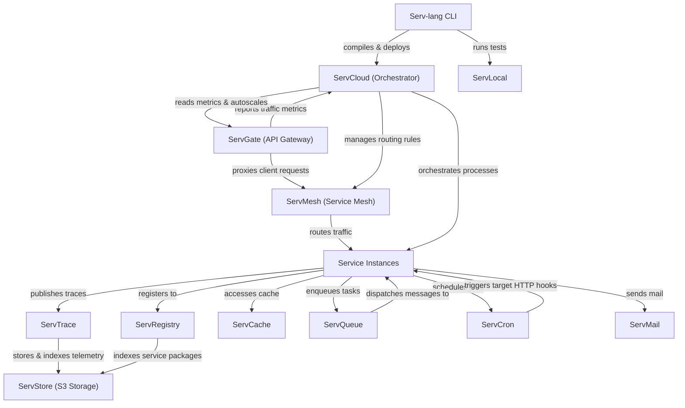

# Serv Unified Ecosystem Roadmap & Architect Analysis

> Single source of truth for the **Serv** ecosystem: Serv-lang, ServGate, ServStore, ServQueue, ServConsole, ServCache, ServMesh, ServCron, ServCloud, ServTrace, ServTunnel, ServAuth, ServPool, ServMail, ServFlow, and the Servverse vision.  
> Last updated: July 9, 2026

---

## Ecosystem Completion Status

All items in Phases 1 through 14 have been fully implemented, verified, and pushed.

- For completed details of Phases 1 to 5: Refer to the git history and repository CHANGELOG.
- For completed details of Phases 6 to 10: See [UNIFIED_ROADMAP_COMPLETED_6_10.md](file:///c:/Mine/try/serv/servverse-repo/UNIFIED_ROADMAP_COMPLETED_6_10.md).
- For completed details of Phases 11 to 15: See [UNIFIED_ROADMAP_COMPLETED_11_15.md](file:///c:/Mine/try/serv/servverse-repo/UNIFIED_ROADMAP_COMPLETED_11_15.md).
- For completed details of Phase 16-19: See [UNIFIED_ROADMAP_COMPLETED_16_20.md](file:///c:/Mine/try/serv/servverse-repo/UNIFIED_ROADMAP_COMPLETED_16_20.md).

### Completion Tracker

| Initiative Area | Total Items | Completed | Pending | Progress | Status Bar |
|-----------------|-------------|-----------|---------|----------|------------|
| **Phase 9: Scale & Enterprise Hardening** | 13 | 13 | 0 | **100%** | ████████████████████ |
| **Phase 10: Productization & Cloud PaaS** | 32 | 32 | 0 | **100%** | ████████████████████ |
| **Phase 11: Unified Dashboard & Console** | 33 | 33 | 0 | **100%** | ████████████████████ |
| **Phase 12: Dual-Licensing & EE Split** | 19 | 19 | 0 | **100%** | ████████████████████ |
| **Phase 13: Language & Runtime Evolution**| 18 | 18 | 0 | **100%** | ████████████████████ |
| **Phase 14: AI-Native Ecosystem** | 28 | 28 | 0 | **100%** | ████████████████████ |
| **Phase 16: Operational Hardening & Production Readiness** | 18 | 18 | 0 | **100%** | ████████████████████ |
| **Phase 17: Zero-Trust Clustering & Edge Serverless** | 8 | 8 | 0 | **100%** | ████████████████████ |
| **Phase 18: OSS-to-EE Boundary Alignment & Refactoring** | 6 | 6 | 0 | **100%** | ████████████████████ |
| **Phase 19: Component Maturity Alignment** | 7 | 7 | 0 | **100%** | ████████████████████ |
| **Phase 20: OSS-to-EE Refactoring & Enterprise Migrations** | 6 | 6 | 0 | **100%** | ████████████████████ |
| **Phase 21: Enterprise Ecosystem Scale & Next-Gen** | 6 | 6 | 0 | **100%** | ████████████████████ |
| **Phase 22: Quality, Credibility & Code Health** | 20 | 20 | 0 | **100%** | ████████████████████ |
| **Phase 23: Developer Adoption & Growth** | 14 | 6 | 8 | **43%** | ████████░░░░░░░░░░░░ |
| **Phase 24: Standalone Component Independence** | 20 | 16 | 4 | **80%** | ████████████████░░░░ |
| **Phase 25: Component Depth & Production Hardening** | 60 | 60 | 0 | **100%** | ████████████████████ |
| **Phase 26: Competitive Differentiation** | 107 | 77 | 30 | **72%** |
| **Phase 27: v1.0 Release Readiness** | 14 | 0 | 14 | **0%** |
| **Phase 28: Distribution & Installer Packaging** | 11 | 11 | 0 | **100%** |
| **Phase 29: LSP IntelliSense & Developer Tooling** | 16 | 16 | 0 | **100%** |
| **TOTAL ECOSYSTEM WORK** | **455** | **386** | **69** | **85%** | █████████████████░░░ |

---

## Phase 15: Component Backlog & Future Enhancements (Completed)

All backlog and component enhancement items for Phase 15 have been fully completed, verified, and pushed.

- For completed details of Phase 15: See [UNIFIED_ROADMAP_COMPLETED_11_15.md](file:///c:/Mine/try/serv/servverse-repo/UNIFIED_ROADMAP_COMPLETED_11_15.md).

---

## Appendix A: Cross-Service Runtime Dependency Diagram

---

## Appendix B: Component Maturity Matrix

> Updated July 14, 2026 � based on actual code metrics (test counts, pkg structure, standalone flags, EE gating, main.go line counts).

| Component | Tests | Code Structure | Security | Observability | Standalone | EE Gated | Overall |
|-----------|-------|----------------|----------|---------------|-----------|----------|---------|
| **Serv-lang** | ?? 112 funcs | ?? compiler/, runtime/, lsp/, stdlib/ | ?? Null safety, type checking | ?? OTel codegen | ? N/A | ? N/A | **Production** |
| **ServStore** | ?? 93 funcs | ?? cmd/ + 11 packages | ?? SigV4 + TLS + OIDC + LDAP | ?? OTel + slog | ?? A+ Zero-config | ? Federation + cold tier | **Production** |
| **ServGate** | ?? 50 funcs | ?? 3 packages (proxy, wasm, otel) | ?? JWT + mTLS + ACME + policy | ?? OTel + access logs | ?? A- config.json | ? AI cache + LLM routing | **Production** |
| **ServConsole** | ?? 56 funcs | ?? 12 packages | ?? OIDC + RBAC + JWT | ?? OTel | ? Aggregator | ? SLO, cost, runbooks, exec | **Production** |
| **ServCache** | ?? 46 funcs | ?? 3 packages | ?? Token auth | ?? OTel | ?? A Standalone flag | ? Namespace isolation | **Production** |
| **ServFlow** | ?? 43 funcs | ?? 3 packages (engine, handlers, storage) | ?? JWT | ?? OTel | ?? A Standalone flag | ? Saga hooks | **Production** |
| **ServPool** | ?? 40 funcs | ?? 4 packages | ?? JWT | ?? OTel | ?? B+ docs only | ? N/A | **Production** |
| **ServMesh** | ?? 37 funcs | ?? 7 packages | ?? mTLS + JWT + auto-rotate | ?? OTel | ?? B+ needs services | ? N/A | **Production** |
| **ServTunnel** | ?? 37 funcs | ?? 6 packages | ?? TLS + token + rate limit | ?? OTel | ?? A- generic tunnel | ? Federation | **Production** |
| **ServQueue** | ?? 36 funcs | ?? 5 packages | ?? TLS + STOMP auth | ?? OTel + spans | ?? A Zero-config | ? Federation + semantic route | **Production** |
| **ServMail** | ?? 34 funcs | ?? 5 packages | ?? JWT | ?? OTel | ?? A Standalone flag | ? N/A | **Production** |
| **ServDocs** | ?? 34 funcs | ?? 3 packages (generator, openapi, parser) | ? N/A | ? N/A | ?? B+ .srv-specific | ? N/A | **Stable** |
| **ServCloud** | ?? 31 funcs | ?? 3 packages | ?? JWT | ?? OTel | ?? B Serv-specific | ? Autoscale | **Stable** |
| **ServShared** | ?? 30 funcs | ?? 4 packages (datafabric, middleware, outbox, policy) | ?? JWT + mTLS + tenant | ?? OTel init | ? Library | ? Tenant isolation | **Production** |
| **ServTrace** | ?? 17 funcs | ?? 2 packages | ?? Basic auth | ?? Self-traces | ?? A- OTLP collector | ? Cold tier, NL, anomaly | **Stable** |
| **ServAuth** | ?? 16 funcs | ?? 6 packages | ?? bcrypt + AES + MFA + OIDC | ?? OTel | ?? B No standalone flag | ? Stuffing detection | **Stable** |
| **ServCron** | ?? 13 funcs | ?? 3 packages | ?? JWT + Redis lease | ?? OTel | ?? A Standalone flag | ? N/A | **Stable** |
| **ServRegistry** | ?? 12 funcs | ?? 4 packages (registry, resolution, signing, web) | ?? JWT + crypto signing | ?? OTel | ?? B+ Standalone flag | ? N/A | **Stable** |
| **ServLock** | ?? 2 funcs | ?? 2 packages (handlers, storage) | ?? JWT | ?? Basic | ?? B+ Embedded | ? N/A | **Beta** |

### Summary

| Rating | Count | Components |
|--------|-------|-----------|
| **Production** | 13 | Serv-lang, ServStore, ServGate, ServConsole, ServCache, ServFlow, ServPool, ServMesh, ServTunnel, ServQueue, ServMail, ServShared |
| **Stable** | 6 | ServDocs, ServCloud, ServTrace, ServAuth, ServCron, ServRegistry |
| **Beta** | 1 | ServLock |

**Legend:** ?? Strong | ?? Adequate | ?? Needs work | ? Not applicable | ? EE features gated

---

## Phase 16: Operational Hardening & Production Readiness (Completed)

All backlog tasks for Phase 16 have been fully completed, verified, and archived.
- For completed details of Phase 16: See [UNIFIED_ROADMAP_COMPLETED_16_20.md](file:///c:/Mine/try/serv/servverse-repo/UNIFIED_ROADMAP_COMPLETED_16_20.md).

---

## Phase 17: Zero-Trust Clustering & Edge Serverless Evolution (Completed)

All backlog tasks for Phase 17 have been fully completed, verified, and archived.
- For completed details of Phase 17: See [UNIFIED_ROADMAP_COMPLETED_16_20.md](file:///c:/Mine/try/serv/servverse-repo/UNIFIED_ROADMAP_COMPLETED_16_20.md).

---

## Phase 18: OSS-to-EE Boundary Alignment & Refactoring (Completed)

All backlog tasks for Phase 18 have been fully completed, verified, and archived.
- For completed details of Phase 18: See [UNIFIED_ROADMAP_COMPLETED_16_20.md](file:///c:/Mine/try/serv/servverse-repo/UNIFIED_ROADMAP_COMPLETED_16_20.md).

---

## Phase 19: Component Maturity Alignment (Completed)

All backlog tasks for Phase 19 have been fully completed, verified, and archived.
- For completed details of Phase 19: See [UNIFIED_ROADMAP_COMPLETED_16_20.md](file:///c:/Mine/try/serv/servverse-repo/UNIFIED_ROADMAP_COMPLETED_16_20.md).

---

## Phase 20: OSS-to-EE Refactoring & Enterprise Migrations (Completed)

All backlog tasks for Phase 20 have been fully completed, verified, and archived.
- For completed details of Phase 20: See [UNIFIED_ROADMAP_COMPLETED_16_20.md](file:///c:/Mine/try/serv/servverse-repo/UNIFIED_ROADMAP_COMPLETED_16_20.md).

## Phase 21: Enterprise Ecosystem Scale & Next-Gen Capabilities (Completed)

All backlog tasks for Phase 21 have been fully completed, verified, and archived.
- For completed details of Phase 21: See [UNIFIED_ROADMAP_COMPLETED_21_25.md](file:///c:/Mine/try/serv/servverse-repo/UNIFIED_ROADMAP_COMPLETED_21_25.md).

## Phase 22: Quality, Credibility & Code Health (Completed)

All backlog tasks for Phase 22 have been fully completed, verified, and archived.
- For completed details of Phase 22: See [UNIFIED_ROADMAP_COMPLETED_21_25.md](file:///c:/Mine/try/serv/servverse-repo/UNIFIED_ROADMAP_COMPLETED_21_25.md).

## Phase 23: Developer Adoption & Growth (Pending)

> **Context:** The platform is feature-complete but has zero external users. This phase focuses on removing friction, building community, and proving production-readiness.

### ?? Adoption Blockers

| # | Item | Component | Description | Status |
|---|------|-----------|-------------|--------|
| AG.1 | **Web Playground** | Serv-lang | Browser-based editor: write ? compile (WASM) ? run ? see output. Zero-install trial. The #1 adoption driver | ? Exists |
| AG.2 | **VS Code Marketplace publish** | Serv-lang LSP | Publish the extension publicly. Enables organic discovery from IDE search | ? Exists |
| AG.3 | **Full-stack showcase app** | servverse-repo | E-commerce Checkout Saga (Idea 1 with Workflows/Circuit Breakers) or SaaS Billing Engine (Idea 4 with Multi-tenancy/Locks). Proves production patterns | ? Exists |
| AG.4 | **10-minute demo video** | servverse-repo | Screen recording: install ? write service ? deploy ? observe in console. Hosted on YouTube + embedded in GitHub Pages | [ ] |

### ?? Community Building

| # | Item | Component | Description | Status |
|---|------|-----------|-------------|--------|
| AG.5 | **Discord/community server** | � | Developer community for questions, showcases, and contributors | [ ] |
| AG.6 | **Contributing guide (CONTRIBUTING.md)** | All repos | Code style, PR process, how to add a stdlib module, how to write a WASM plugin | [x] |
| AG.7 | **Good-first-issue labels** | All repos | Tag 20+ approachable issues for new contributors | [x] |
| AG.8 | **Monthly release cadence** | servverse-repo | Predictable versioning: v0.2.0, v0.3.0 with changelogs. Builds trust | [x] |
| AG.9 | **Blog post series** | servverse-repo | "Building X with Serv" tutorials: REST API, scheduled worker, event pipeline, AI agent | [x] |

### ?? Enterprise Readiness

| # | Item | Component | Description | Status |
|---|------|-----------|-------------|--------|
| AG.10 | **SOC2 compliance documentation** | servverse-repo | Document existing controls: encryption-at-rest, audit logs, access control, data retention | [x] |
| AG.11 | **Multi-region deployment guide** | servverse-repo | End-to-end guide: ServStore replication + ServQueue mirroring + ServMesh geo-routing | [x] |
| AG.12 | **Customer pilot program** | � | Find 2-3 teams to run in staging. Gather real feedback on DX, performance, gaps | [ ] |
| AG.13 | **SLA guarantees with evidence** | servverse-repo | Load test results establishing: max RPS per service, p99 latency, failure recovery time | [x] |
| AG.14 | **CODEOWNERS + branch protection** | All repos | Enforce review process. Required for enterprise governance | [x] |

---

## Phase 24: Standalone Component Independence (Completed)

All backlog tasks for Phase 24 have been fully completed, verified, and archived.
- For completed details of Phase 24: See [UNIFIED_ROADMAP_COMPLETED_21_25.md](file:///c:/Mine/try/serv/servverse-repo/UNIFIED_ROADMAP_COMPLETED_21_25.md).

---

## Phase 24.1: Standalone Hardening to A+ (Pending)

Optimize remaining standalone components to completely eliminate ecosystem coupling and achieve perfect `A+` standalone ratings:

| # | Item | Component | Description | Status |
|---|------|-----------|-------------|--------|
| SA.21 | **Multi-Backend State Storage** | ServFlow | Support SQLite/PostgreSQL/MySQL state persistence in standalone mode instead of raw `.state/` directories | ? Exists |
| SA.22 | **S3 & OCI Package Registry Backend** | ServRegistry | Add S3/MinIO and OCI registry storage adapters for package tarball uploads in standalone mode | ? Exists |
| SA.23 | **Consul, etcd, & DNS-SD Adapters** | ServMesh | Support etcd, Consul, and SRV record lookups for standalone service discovery | ? Exists |
| SA.24 | **Generic Process & Container Support** | ServCloud | Support managing arbitrary binaries (PM2 replacement) and Docker containers natively | ? Exists |

---

## Phase 25: Component Depth & Production Hardening (Completed)

All backlog tasks for Phase 25 (D.1 - D.60) have been fully completed, verified, and archived.
- For completed details of Phase 25: See [UNIFIED_ROADMAP_COMPLETED_21_25.md](file:///c:/Mine/try/serv/servverse-repo/UNIFIED_ROADMAP_COMPLETED_21_25.md).

---

## Phase 26: Competitive Differentiation (Pending)

> **Goal:** Each component should have 2-3 features that no direct competitor offers. This is what makes people choose Servverse over established alternatives.
>
> **NOTE:** Items marked ? are already implemented and should be highlighted in marketing/docs. Items marked [ ] need building.
>
> **Status:** 33 already exist (marketing/documentation task), 12 need implementation.

### Serv-lang vs Go/TypeScript/Rust
*Competitors: Go (raw), Deno, Bun, Rust+Axum*

| # | Feature | Why It Differentiates | Status |
|---|---------|---------------------|--------|
| CD.1 | **Infrastructure-as-syntax** � `broker`, `store`, `cache`, `ai` are keywords, not library imports. Compile error if misconfigured | No other language makes infrastructure a first-class citizen | ? Exists |
| CD.2 | **AI code generation feedback loop** � `serv create "prompt"` generates code, `serv test` validates it, `serv create --fix` repairs failures automatically | No compiler has built-in AI repair cycle | ? Exists |
| CD.3 | **Compile-time service contract validation** � If route declares `-> User`, compiler verifies the response shape matches the struct at build time | TypeScript has this at type level but not for HTTP responses | ? Exists |

### ServGate vs Kong/Envoy/Traefik
*Competitors: Kong, Envoy, Traefik, AWS API Gateway*

| # | Feature | Why It Differentiates | Status |
|---|---------|---------------------|--------|
| CD.4 | **WASM middleware hot-swap during live traffic** � Zero-downtime middleware deploys at request boundary, not pod restart | Envoy needs full pod restart for filter changes | ? Exists |
| CD.5 | **MCP (AI agent) native traffic type** � Understands JSON-RPC tool calls, per-agent rate limiting, token cost tracking | No gateway understands AI agent protocols natively | ? Exists |
| CD.6 | **Policy-as-code ? WASM compilation** � Write human-readable `.policy` files, compile to native-speed WASM | OPA/Rego is interpreted. ServGate compiles policies | ? Exists |

### ServStore vs MinIO/S3/Ceph
*Competitors: MinIO, AWS S3, Ceph, TurboBuffer*

| # | Feature | Why It Differentiates | Status |
|---|---------|---------------------|--------|
| CD.7 | **Compute-near-data (WASM transforms on stored objects)** � Resize images, convert formats, validate data server-side with zero cold start | No other storage engine executes user code on objects in-process | ? Exists |
| CD.8 | **Semantic search built into storage** � Upload a document ? auto-embedded ? queryable by meaning in the same API call | AWS S3 Vectors is separate. ServStore unifies store+search | ? Exists |
| CD.9 | **Time-travel queries with temporal API** � `GET /bucket/key?at=2026-07-01T14:00:00Z` returns exact state at that moment | S3 versioning requires listing all versions manually | ? Exists |

### ServQueue vs Kafka/RabbitMQ/NATS
*Competitors: Kafka, RabbitMQ, NATS, Pulsar, Redis Streams*

| # | Feature | Why It Differentiates | Status |
|---|---------|---------------------|--------|
| CD.10 | **Inline WASM transforms in the message path** � Filter, enrich, route messages inside the broker without external processors | No broker runs arbitrary user code in the message pipeline | ? Exists |
| CD.11 | **Single binary: STOMP + HTTP + WASM + WAL + Raft** � One file, zero dependencies. Kafka = JVM + ZooKeeper. RabbitMQ = Erlang | Unmatched operational simplicity | ? Exists |
| CD.12 | **Language-native protocol** � `broker "servqueue://host"` in Serv compiles to zero-config STOMP client with auto-auth and tracing | Every other broker needs SDK import + manual configuration | ? Exists |

### ServConsole vs Grafana/Datadog/Portainer
*Competitors: Grafana, Datadog, Portainer, ArgoCD*

| # | Feature | Why It Differentiates | Status |
|---|---------|---------------------|--------|
| CD.13 | **Ecosystem-native zero-config observability** � All Serv services auto-report metrics. No exporters, no scrape configs, no dashboard imports | Grafana needs Prometheus + exporters + dashboards configured per service | ? Exists |
| CD.14 | **Bidirectional control plane** � Not just observe: create buckets, deploy services, hot-swap middleware, execute runbooks FROM the dashboard | Grafana/Datadog are read-only. ServConsole is an operations plane | ? Exists (EE) |
| CD.15 | **AI-powered incident correlation** � Alert fires ? auto-correlates deploys, config changes, upstream failures ? generates hypothesis | Datadog has this but at enterprise pricing. ServConsole is self-hosted | ? Exists (EE) |

### ServTrace vs Jaeger/Tempo/Zipkin
*Competitors: Jaeger, Grafana Tempo, Zipkin, SigNoz*

| # | Feature | Why It Differentiates | Status |
|---|---------|---------------------|--------|
| CD.16 | **Single binary, zero dependencies** � No Elasticsearch, no Cassandra, no Kafka. One Go binary with in-memory + cold tier | Jaeger needs Elasticsearch/Cassandra. Tempo needs S3 + memcached | ? Exists |
| CD.17 | **Compiler-linked source mapping** � Trace spans map back to `.srv` source lines, not generated Go code | No other tracing backend understands the source language | ? Exists |
| CD.18 | **Natural language trace query** � "Show me slow requests to ServAuth in the last hour" ? structured query | No open-source tracer has NL search | ? Exists (EE) |

### ServCache vs Redis/Memcached/Dragonfly
*Competitors: Redis, Memcached, Dragonfly, Valkey, KeyDB*

| # | Feature | Why It Differentiates | Status |
|---|---------|---------------------|--------|
| CD.19 | **Auto-namespace isolation per service** � Services sharing one cache instance can't see each other's keys. Zero-config tenant safety | Redis requires manual key prefixing discipline | ? Exists |
| CD.20 | **Language-native `cached fn` syntax** � Declare cache behavior at the function level, compiler generates the get/set/invalidation code | No cache system integrates at the language/compiler level | ? Exists |
| CD.21 | **Read-through/write-behind with ServPool** � Automatic DB synchronization patterns without application code | Redis requires custom lua scripts or app-level orchestration | ? Exists |

### ServMesh vs Istio/Linkerd/Consul Connect
*Competitors: Istio, Linkerd, Consul Connect, Cilium*

| # | Feature | Why It Differentiates | Status |
|---|---------|---------------------|--------|
| CD.22 | **Library-level, no sidecars** � Runs inside the binary via custom HTTP transport. Zero CPU/memory overhead of sidecar proxies | Istio/Linkerd = Envoy sidecar per pod. ServMesh = embedded library | ? Exists |
| CD.23 | **`serv://` URL scheme in the language** � Inter-service calls are syntax: `http.get("serv://user-service/users/123")` | No other mesh integrates at the language level | ? Exists |
| CD.24 | **Sub-millisecond service resolution** � In-process cache, no network hop to control plane for each request | Istio routes through Envoy sidecar (added network hop per call) | ? Exists |

### ServFlow vs Temporal/Cadence/Step Functions
*Competitors: Temporal, Cadence, AWS Step Functions, Airflow*

| # | Feature | Why It Differentiates | Status |
|---|---------|---------------------|--------|
| CD.25 | **Native language syntax for workflows** � `workflow "name" { step "x" { ... } }` in .srv files. Compiler validates DAG at build time | Temporal uses Go/Java SDKs. Step Functions uses JSON. ServFlow uses language syntax | ? Exists |
| CD.26 | **Time-travel workflow replay** � Debug by stepping through execution history: see state at each checkpoint | Temporal has event history but no interactive replay visualization | ? Exists |
| CD.27 | **Single binary with embedded state** � No external database required. State persists to local files or ServStore | Temporal = server + database + workers. ServFlow = one binary | ? Exists |

### ServTunnel vs ngrok/Cloudflare Tunnel
*Competitors: ngrok, Cloudflare Tunnel, Tailscale Funnel, localtunnel*

| # | Feature | Why It Differentiates | Status |
|---|---------|---------------------|--------|
| CD.28 | **OTel trace propagation through the tunnel** � Incoming webhook requests automatically get trace context injected | No tunnel service preserves distributed tracing context | ? Exists |
| CD.29 | **Request inspection with REST API** � Scriptable inspection: `GET /api/inspect` returns captured requests for CI/CD test automation | ngrok's inspection is proprietary dashboard, not API-accessible | ? Exists |
| CD.30 | **Self-hosted relay (zero vendor lock-in)** � Run your own relay server. No usage limits, no accounts, no billing | ngrok/Cloudflare = SaaS with limits. ServTunnel = your infrastructure | ? Exists |

### ServAuth vs Auth0/Keycloak/Supabase Auth
*Competitors: Auth0, Keycloak, Supabase Auth, Firebase Auth, Clerk*

| # | Feature | Why It Differentiates | Status |
|---|---------|---------------------|--------|
| CD.31 | **Single binary, embedded in your stack** � No Java (Keycloak), no SaaS pricing (Auth0). One Go binary | Keycloak = JVM + PostgreSQL. Auth0 = per-MAU pricing | ? Exists |
| CD.32 | **Language-native auth primitives** � `auth.register()`, `auth.login()`, `auth.currentUser()` are builtins | Every other auth system requires SDK import + initialization | ? Exists |
| CD.33 | **Ecosystem-integrated identity** � JWT issued by ServAuth works across all Serv services automatically via ServShared | Auth0 tokens need per-service validation configuration | ? Exists |

### ServCron vs Traditional Cron/Kubernetes CronJobs
*Competitors: system cron, K8s CronJobs, Airflow scheduler*

| # | Feature | Why It Differentiates | Status |
|---|---------|---------------------|--------|
| CD.34 | **Language-native scheduling** � `every 5m { ... }` and `cron "0 9 * * MON-FRI" { ... }` are syntax, not config files | No scheduler integrates at the language level | ? Exists |
| CD.35 | **Distributed leader election built-in** � Multi-replica deployments automatically elect one runner. No ZooKeeper/etcd | K8s CronJobs can duplicate if misconfigured. ServCron guarantees once | ? Exists |

### ServPool vs PgBouncer/ProxySQL/PgCat
*Competitors: PgBouncer, ProxySQL, PgCat, Odyssey*

| # | Feature | Why It Differentiates | Status |
|---|---------|---------------------|--------|
| CD.36 | **Multi-dialect proxy** � One pooler supports PostgreSQL, SQLite, Oracle, MongoDB simultaneously | PgBouncer = PostgreSQL only. ProxySQL = MySQL only. ServPool = all | ? Exists |
| CD.37 | **Integrated query analytics and slow query detection** � No separate APM tool needed. Built-in query profiling with OTel spans | PgBouncer has zero observability. ServPool exports everything | ? Exists |

### ServMail vs SendGrid/Mailgun/SES
*Competitors: SendGrid, Mailgun, AWS SES, Postmark, Resend*

| # | Feature | Why It Differentiates | Status |
|---|---------|---------------------|--------|
| CD.38 | **Multi-channel in one service** � SMTP email + Slack + SMS + webhooks from a single API endpoint | SendGrid = email only. Need Twilio for SMS, Slack API separately | ? Exists |
| CD.39 | **Language-native `notify()` syntax** � `notify("slack", msg)` is a builtin, not a library call | Every notification service requires SDK setup per channel | ? Exists |

### ServLock vs Redis SETNX/etcd/ZooKeeper
*Competitors: Redis distributed locks, etcd leases, ZooKeeper recipes*

| # | Feature | Why It Differentiates | Status |
|---|---------|---------------------|--------|
| CD.40 | **Language-native lock syntax** � `lock("resource", 30s) { ... }` is a keyword, compiler ensures unlock on all exit paths | Redis locks require manual lock/unlock discipline. ServLock is syntax | ? Exists |
| CD.41 | **Fencing token support** � Auto-generated monotonic tokens prevent split-brain stale writes | Redis Redlock has no fencing. ServLock enforces it at protocol level | ? Exists |

### ServRegistry vs npm/crates.io/pkg.go.dev
*Competitors: npm registry, crates.io, Go module proxy, PyPI*

| # | Feature | Why It Differentiates | Status |
|---|---------|---------------------|--------|
| CD.42 | **Cryptographic package signing with verification** � Packages are signed on publish, verified on install. Supply chain security built-in | npm has no mandatory signing. crates.io has no signing at all | ? Exists |
| CD.43 | **BFS dependency tree resolution with conflict detection** � Resolve entire dependency graph server-side before download | npm resolves client-side. ServRegistry resolves before any bytes transfer | ? Exists |

### ServDocs vs Swagger/Redoc/Mintlify
*Competitors: Swagger UI, Redoc, Mintlify, ReadMe.io*

| # | Feature | Why It Differentiates | Status |
|---|---------|---------------------|--------|
| CD.44 | **Compiler-aware documentation** � Reads .srv source directly. No annotations, no comments, no OpenAPI spec writing. The code IS the documentation | Every other doc tool requires manual spec writing or annotation | ? Exists |
| CD.45 | **Dual output (HTML + OpenAPI) from one parse** � Single command generates both interactive docs AND machine-readable spec | Swagger UI only renders existing specs. ServDocs generates them | ? Exists |

---

### Additional Differentiators (To Build)

#### Serv-lang � Compiler-Level Moat

| # | Feature | Why It Differentiates | Status |
|---|---------|---------------------|--------|
| CD.46 | **Dead code elimination across service boundaries** ? Compiler traces which routes are actually called by other services (via ServMesh registry) and warns on unused endpoints | No language eliminates dead code across microservice boundaries | [x] Done |
| CD.48 | **Type-safe inter-service contracts** ? When Service A calls Service B via `serv://`, compiler verifies A's expected response type matches B's declared return type | gRPC has this via proto. REST has nothing. Serv does it for REST | [x] Done |
| CD.49 | **Built-in migration diffing** ? `serv migrate --dry-run` shows exact SQL that will execute (CREATE/ALTER/DROP) with colored diff against current schema | Rails has this. No compiled language has built-in migration preview | [x] Done |
| CD.49 | **Built-in migration diffing** � `serv migrate --dry-run` shows exact SQL that will execute (CREATE/ALTER/DROP) with colored diff against current schema | Rails has this. No compiled language has built-in migration preview | [ ] |

#### ServGate � AI-Era Gateway

| # | Feature | Why It Differentiates | Status |
|---|---------|---------------------|--------|
| CD.50 | **Request/response WASM A/B testing** � Run two WASM versions simultaneously with weighted traffic split, compare response quality metrics | No gateway supports A/B testing of middleware logic | ? Exists |
| CD.51 | **Prompt injection firewall** � Deep content inspection using embedding similarity to detect adversarial prompts before they reach LLM backends | WAFs check SQL injection. ServGate checks prompt injection | ? Exists (EE) |
| CD.52 | **Auto-generated API changelog** ? Track route additions/removals/changes over time. Serve changelog at `/api/changelog` for consumer teams | No gateway auto-generates API evolution history | [x] Done |

#### ServStore � Intelligence Inside Storage

| # | Feature | Why It Differentiates | Status |
|---|---------|---------------------|--------|
| CD.53 | **Object-level access audit trail** � Who read/wrote/deleted every object, when, from which IP. Immutable append-only log per bucket | S3 server access logging is bucket-level, not object-level with identity | ? Exists |
| CD.54 | **WASM trigger on object events** � Declare functions that auto-execute on PutObject/DeleteObject. Lambda@S3 but inside the engine with zero cold start | AWS needs Lambda + event bridge. ServStore runs triggers in-process | ? Exists |
| CD.55 | **Content-type aware compression** � Auto-compress text/JSON/logs with zstd on write, decompress transparently on read. Zero client changes | No S3-compatible engine does transparent per-content-type compression | ? Exists |

#### ServQueue � Stream Processing Inside the Broker

| # | Feature | Why It Differentiates | Status |
|---|---------|---------------------|--------|
| CD.56 | **Transform pipeline chaining** � Chain multiple WASM transforms: `raw ? validate.wasm ? enrich.wasm ? route.wasm ? processed`. Declarative pipeline | No broker supports composable multi-stage transform chains | ? Exists |
| CD.57 | **Message-level end-to-end tracing** � Track a message from publish ? through every transform ? DLQ redirect ? consumer ack. Single distributed trace | Most brokers lose trace context between producer and consumer | ? Exists |
| CD.58 | **Consumer-side backpressure with automatic DLQ overflow** � When consumer is slow, buffer to disk ? if still slow, auto-route to DLQ with metadata | Kafka drops, RabbitMQ requeues infinitely. ServQueue has intelligent overflow | ? Exists |

#### ServConsole � Operations Platform (Not Just Dashboard)

| # | Feature | Why It Differentiates | Status |
|---|---------|---------------------|--------|
| CD.59 | **Cross-service request replay** � Select a trace in waterfall ? click "Replay" ? re-issues the exact request through ServGate. Instant reproduction | No dashboard can replay production requests through the actual gateway | ? Exists (EE) |
| CD.60 | **Embedded SQL workbench** � Run queries against any connected database directly from the console. No separate DB client needed | Grafana can visualize queries. ServConsole can WRITE them | ? Exists |
| CD.61 | **One-click infrastructure provisioning** � Create ServStore buckets, ServQueue topics, ServCache namespaces from the UI. The dashboard IS the control plane | Portainer manages containers. ServConsole manages application infrastructure | ? Exists (EE) |

#### ServMesh � Developer-First Service Mesh

| # | Feature | Why It Differentiates | Status |
|---|---------|---------------------|--------|
| CD.62 | **Automatic mTLS without certificate management** � ServMesh auto-provisions and rotates certificates. Zero PKI infrastructure. Zero config | Istio needs cert-manager or Vault integration. ServMesh is self-contained | ? Exists |
| CD.63 | **Circuit breaker state visible in ServConsole** � See which circuits are open/closed/half-open in real-time dashboard. Click to force-reset | Istio circuit state is invisible without custom metrics + Grafana | ? Exists |

#### ServFlow � Intelligent Workflows

| # | Feature | Why It Differentiates | Status |
|---|---------|---------------------|--------|
| CD.64 | **Saga compensation with automatic rollback ordering** � Fail at step N ? compensations fire in reverse (N?N-1?...?1) automatically | Temporal requires manual compensation ordering. ServFlow derives it from DAG | ? Exists |
| CD.65 | **Human approval gates with timeout escalation** � Workflow pauses for human approval. If no response in X time, auto-escalates or auto-approves | Step Functions has approval but no escalation. ServFlow has both | ? Exists |
| CD.66 | **Workflow visualization as Mermaid DAG** � `GET /api/workflows/visualize` returns a Mermaid diagram of the workflow graph | No competitor generates visual DAG from workflow definition via API | ? Exists |

#### ServAuth � Lightweight Identity

| # | Feature | Why It Differentiates | Status |
|---|---------|---------------------|--------|
| CD.67 | **Progressive auth complexity** � Start with password-only (5 min setup), add MFA later, add OAuth later, add SCIM later. No upfront complexity | Keycloak forces full OIDC complexity on day 1. ServAuth grows with you | ? Exists |
| CD.68 | **Account lockout with automatic unlock** � 5 attempts ? locked 5 min ? auto-unlocks. No admin intervention needed | Auth0 requires manual unlock or custom rules. ServAuth is automatic | ? Exists |

#### Serv-lang  Compiler-Level Moat

| # | Feature | Why It Differentiates | Status |
|---|---------|---------------------|--------|
| CD.46 | **Dead code elimination across service boundaries**  Compiler traces which routes are actually called by other services (via ServMesh registry) and warns on unused endpoints | No language eliminates dead code across microservice boundaries | [x] Done |
| CD.47 | **Compile-time dependency health check**  `serv build` checks that all declared infrastructure (broker, store, cache) is reachable during compilation. Fail fast, not at runtime | No compiler validates infrastructure availability at build time | [x] Done |
| CD.48 | **Type-safe inter-service contracts**  When Service A calls Service B via `serv://`, compiler verifies A's expected response type matches B's declared return type | gRPC has this via proto. REST has nothing. Serv does it for REST | [x] Done |
| CD.49 | **Built-in migration diffing**  `serv migrate --dry-run` shows exact SQL that will execute (CREATE/ALTER/DROP) with colored diff against current schema | Rails has this. No compiled language has built-in migration preview | [x] Done |

#### ServGate  AI-Era Gateway

| # | Feature | Why It Differentiates | Status |
|---|---------|---------------------|--------|
| CD.50 | **Request/response WASM A/B testing**  Run two WASM versions simultaneously with weighted traffic split, compare response quality metrics | No gateway supports A/B testing of middleware logic | ? Exists |
| CD.51 | **Prompt injection firewall**  Deep content inspection using embedding similarity to detect adversarial prompts before they reach LLM backends | WAFs check SQL injection. ServGate checks prompt injection | ? Exists (EE) |
| CD.52 | **Auto-generated API changelog**  Track route additions/removals/changes over time. Serve changelog at `/api/changelog` for consumer teams | No gateway auto-generates API evolution history | [x] Done |

#### ServStore  Intelligence Inside Storage

| # | Feature | Why It Differentiates | Status |
|---|---------|---------------------|--------|
| CD.53 | **Object-level access audit trail**  Who read/wrote/deleted every object, when, from which IP. Immutable append-only log per bucket | S3 server access logging is bucket-level, not object-level with identity | ? Exists |
| CD.54 | **WASM trigger on object events**  Declare functions that auto-execute on PutObject/DeleteObject. Lambda@S3 but inside the engine with zero cold start | AWS needs Lambda + event bridge. ServStore runs triggers in-process | ? Exists |
| CD.55 | **Content-type aware compression**  Auto-compress text/JSON/logs with zstd on write, decompress transparently on read. Zero client changes | No S3-compatible engine does transparent per-content-type compression | ? Exists |

#### ServQueue  Stream Processing Inside the Broker

| # | Feature | Why It Differentiates | Status |
|---|---------|---------------------|--------|
| CD.56 | **Transform pipeline chaining**  Chain multiple WASM transforms: `raw ? validate.wasm ? enrich.wasm ? route.wasm ? processed`. Declarative pipeline | No broker supports composable multi-stage transform chains | ? Exists |
| CD.57 | **Message-level end-to-end tracing**  Track a message from publish ? through every transform ? DLQ redirect ? consumer ack. Single distributed trace | Most brokers lose trace context between producer and consumer | ? Exists |
| CD.58 | **Consumer-side backpressure with automatic DLQ overflow**  When consumer is slow, buffer to disk ? if still slow, auto-route to DLQ with metadata | Kafka drops, RabbitMQ requeues infinitely. ServQueue has intelligent overflow | ? Exists |

#### ServConsole  Operations Platform (Not Just Dashboard)

| # | Feature | Why It Differentiates | Status |
|---|---------|---------------------|--------|
| CD.59 | **Cross-service request replay**  Select a trace in waterfall ? click "Replay" ? re-issues the exact request through ServGate. Instant reproduction | No dashboard can replay production requests through the actual gateway | ? Exists (EE) |
| CD.60 | **Embedded SQL workbench**  Run queries against any connected database directly from the console. No separate DB client needed | Grafana can visualize queries. ServConsole can WRITE them | ? Exists |
| CD.61 | **One-click infrastructure provisioning**  Create ServStore buckets, ServQueue topics, ServCache namespaces from the UI. The dashboard IS the control plane | Portainer manages containers. ServConsole manages application infrastructure | ? Exists (EE) |

#### ServMesh  Developer-First Service Mesh

| # | Feature | Why It Differentiates | Status |
|---|---------|---------------------|--------|
| CD.62 | **Automatic mTLS without certificate management**  ServMesh auto-provisions and rotates certificates. Zero PKI infrastructure. Zero config | Istio needs cert-manager or Vault integration. ServMesh is self-contained | ? Exists |
| CD.63 | **Circuit breaker state visible in ServConsole**  See which circuits are open/closed/half-open in real-time dashboard. Click to force-reset | Istio circuit state is invisible without custom metrics + Grafana | ? Exists |

#### ServFlow  Intelligent Workflows

| # | Feature | Why It Differentiates | Status |
|---|---------|---------------------|--------|
| CD.64 | **Saga compensation with automatic rollback ordering**  Fail at step N ? compensations fire in reverse (N?N-1?...?1) automatically | Temporal requires manual compensation ordering. ServFlow derives it from DAG | ? Exists |
| CD.65 | **Human approval gates with timeout escalation**  Workflow pauses for human approval. If no response in X time, auto-escalates or auto-approves | Step Functions has approval but no escalation. ServFlow has both | ? Exists |
| CD.66 | **Workflow visualization as Mermaid DAG**  `GET /api/workflows/visualize` returns a Mermaid diagram of the workflow graph | No competitor generates visual DAG from workflow definition via API | ? Exists |

#### ServAuth  Lightweight Identity

| # | Feature | Why It Differentiates | Status |
|---|---------|---------------------|--------|
| CD.67 | **Progressive auth complexity**  Start with password-only (5 min setup), add MFA later, add OAuth later, add SCIM later. No upfront complexity | Keycloak forces full OIDC complexity on day 1. ServAuth grows with you | ? Exists |
| CD.68 | **Account lockout with automatic unlock**  5 attempts ? locked 5 min ? auto-unlocks. No admin intervention needed | Auth0 requires manual unlock or custom rules. ServAuth is automatic | ? Exists |

#### ServLock  Beyond Simple Locks

| # | Feature | Why It Differentiates | Status |
|---|---------|---------------------|--------|
| CD.69 | **Compiler-guaranteed unlock**  `lock("x") { ... }` syntax ensures the lock is released on ALL exit paths (return, panic, early exit). Impossible to forget | Redis locks require explicit defer/finally. ServLock is structural | ? Exists |
| CD.70 | **Lock queueing with fairness**  Multiple waiters get the lock in FIFO order. No starvation | Redis SETNX has no queue. Whoever retries fastest wins (unfair) | [x] |

#### Ecosystem-Wide (Cross-Cutting)

| # | Feature | Why It Differentiates | Status |
|---|---------|---------------------|--------|
| CD.72 | **Unified install script** � One curl/irm command installs every component. Cross-platform (Windows, macOS, Linux) | Competitors install one tool at a time. Servverse installs the entire ecosystem | ? Exists |
| CD.73 | **SERVVERSE_DISCOVERY protocol** � Single JSON manifest tells all services where to find each other. Change one file, all services update | No competitor has a unified service discovery manifest format | ? Exists |
| CD.74 | **Shared JWT across all services** � One `SERV_JWT_SECRET` env var enables authentication across all 17 services. No per-service auth configuration | Every other platform needs per-service auth setup | ? Exists |
| CD.75 | **Consistent error format ecosystem-wide** � Every service returns `{"error":"msg","code":"ERR_X","trace_id":"..."}`. One error handler for any Serv service | No platform enforces error format consistency across all components | ? Exists |

---

### To Build: Defensive Moat Features (What Competitors Will Eventually Copy)

> These are features competitors WILL build in 1-2 years. Servverse needs them first to establish mindshare and lock-in.

#### Compiler-Level (No competitor can easily replicate)

| # | Feature | Component | Why Urgent | Status |
|---|---------|-----------|-----------|--------|
| CD.76 | **Type-safe inter-service contracts**  When Service A calls `serv://B/users`, compiler verifies A's expected response type matches B's declared return type. Compile error on mismatch | Serv-lang | gRPC has this. REST doesn't. First REST language to do this wins | [x] |
| CD.78 | **Dead code detection across service boundaries**  Compiler queries ServMesh registry: "which routes are never called by any registered service?" Warns on unused endpoints | Serv-lang + ServMesh | Static analysis tools work within one repo. This works across repos | [x] Done |
| CD.78 | **Dead code detection across service boundaries**  Compiler queries ServMesh registry: "which routes are never called by any registered service?" Warns on unused endpoints | Serv-lang + ServMesh | Static analysis tools work within one repo. This works across repos | [ ] |
| CD.79 | **`serv create --fix`**  AI generates code, tests fail, compiler feeds errors back to AI, AI fixes. Automated repair loop until tests pass or max retries | Serv-lang | Cursor/Copilot suggest code. None auto-repair compile errors in a loop | [x] |
| CD.80 | **`cached fn` keyword**  `cached fn getUser(id) ttl 5m { return db.query(...) }`  compiler generates cache get/set/invalidation. No manual cache code | Serv-lang + ServCache | No language has cache-as-syntax. This is Serv's unique position | ? Exists |
| CD.81 | **Migration dry-run with colored diff**  `serv migrate --dry-run` shows exact SQL (CREATE/ALTER/DROP) with green/red diff against live schema. No execution | Serv-lang | Rails has `rake db:migrate:status`. No compiled language has built-in diff preview | [x] |
| CD.82 | **Auto-generated typed HTTP clients**  `serv generate client --lang typescript` produces a fully typed client from route declarations. No OpenAPI intermediate step | Serv-lang | tRPC does this for TypeScript. Serv does it for any target language from .srv source | ? Exists |

#### Gateway & Networking (Kong/Envoy will copy these)

| # | Feature | Component | Why Urgent | Status |
|---|---------|-----------|-----------|--------|
| CD.83 | **Auto-generated API changelog**  Track route additions/removals/breaking changes over time. Serve at `/api/changelog`. Consumer teams subscribe to diffs | ServGate | Bump.sh does this as SaaS. No self-hosted gateway has it built-in | [x] Done |
| CD.84 | **Request cost estimation header**  Return `X-Estimated-Cost: $0.003` on AI-proxied requests before execution. Client can abort expensive calls | ServGate | No gateway previews cost before forwarding. Essential for AI budget control | [x] |
| CD.85 | **Automatic circuit breaker from SLO breach**  If a backend's p99 exceeds SLO threshold, circuit opens automatically. No manual configuration per route | ServGate + ServTrace | Envoy needs explicit circuit config. ServGate derives it from observed SLOs | [x] |

#### Storage & Data (MinIO/S3 will copy semantic search)

| # | Feature | Component | Why Urgent | Status |
|---|---------|-----------|-----------|--------|
| CD.86 | **Conversational object query**  `GET /bucket?ask=What documents discuss authentication?`  synthesizes an answer from stored documents (RAG in storage layer) | ServStore | AWS Q&A on S3 is separate service. ServStore has it built-in. First mover advantage | [x] |
| CD.87 | **Auto-summarize on upload**  Every uploaded document gets a 2-sentence summary stored as metadata. Enables "browse by summary" without downloading | ServStore | No storage engine generates summaries. Google Drive does this for Workspace. ServStore does for S3 | ? Exists |
| CD.88 | **Object similarity deduplication**  On upload, check if semantically similar document exists (cosine > 0.95). Warn or reject near-duplicates | ServStore | Google Drive detects exact duplicates. ServStore detects SEMANTIC duplicates | ? Exists |

#### Message Broker (Kafka/Pulsar will eventually add WASM)

| # | Feature | Component | Why Urgent | Status |
|---|---------|-----------|-----------|--------|
| CD.89 | **Stream processing DSL** � `stream "orders" |> filter(o => o.total > 100) |> window(5m) |> count() |> publish("high-value")` � in .srv syntax | Serv-lang + ServQueue | Kafka Streams is Java. Flink is complex. Serv makes streaming a one-liner | ? Exists |
| CD.90 | **AI-powered message routing** � `subscribe "tickets" where ai.classify(msg) == "urgent"` � broker evaluates embedding model per message for routing | ServQueue | No broker has ML-based routing. When this ships, it's a category-defining feature | ? Exists (EE) |
| CD.91 | **Visual message flow in ServConsole** � Track a single message from publish ? transform ? DLQ ? retry ? consumer ack as an interactive timeline | ServQueue + ServConsole | Kafka has no message-level visibility. This makes debugging trivial | [ ] |

#### Observability (Datadog will copy AI correlation)

| # | Feature | Component | Why Urgent | Status |
|---|---------|-----------|-----------|--------|
| CD.92 | **Compiler-linked source mapping in traces** � Trace spans show `.srv` file + line number, not generated Go code. Click span ? opens source in IDE | ServTrace + Serv-lang | No APM maps traces to DSL source. Only possible because Serv controls compiler + tracer | ? Exists |
| CD.93 | **Predictive capacity alerts** � "At current growth rate, ServStore disk will be full in 14 days" � based on trend analysis, not threshold | ServTrace + ServConsole | Datadog has forecasting. No self-hosted tool does. First OSS to ship this wins | ? Exists |
| CD.94 | **Auto-generated incident postmortem** � After an alert resolves, auto-generate a structured postmortem: timeline, root cause, impact, remediation taken | ServConsole | PagerDuty has postmortems. No observability dashboard auto-generates them from trace data | [ ] |

#### Workflows & Scheduling (Temporal will eventually simplify)

| # | Feature | Component | Why Urgent | Status |
|---|---------|-----------|-----------|--------|
| CD.95 | **AI decision steps** � `step "classify" { ai.classify(input, ["approve", "review", "reject"]) }` � AI-powered branching without external service | ServFlow + Serv-lang | Temporal has no AI primitives. Step Functions needs Lambda. ServFlow has it inline | [x] |
| CD.96 | **Workflow generation from natural language** � "Create a workflow: validate order ? charge payment ? ship ? send confirmation" ? generates DAG definition | ServFlow + Serv-lang | No workflow engine generates workflow from description. This is the AI-era killer feature | [x] |
| CD.97 | **Cron job smart scheduling** � Analyze historical execution: duration, resource usage, conflicts. Auto-suggest non-overlapping windows | ServCron | Airflow has SLA. No scheduler auto-optimizes schedule based on observed patterns | [x] |

#### Identity & Security (Auth0 will copy progressive auth)

| # | Feature | Component | Why Urgent | Status |
|---|---------|-----------|-----------|--------|
| CD.98 | **Passwordless magic link + passkey** � One-click login via email magic link or WebAuthn passkey. No password stored | ServAuth | Auth0/Clerk have this. ServAuth needs it to compete in the modern auth space | [x] |
| CD.99 | **Adaptive risk scoring per login** � Score: new device(+3) + unusual time(+2) + different country(+5) = high risk ? step-up to MFA automatically | ServAuth | Auth0 has "Attack Protection". Self-hosted auth systems don't. ServAuth should | [x] |
| CD.100 | **SCIM 2.0 provisioning** � Enterprise user/group sync from Okta, Azure AD, Google Workspace. Auto-create/disable accounts | ServAuth | Required for enterprise sales. Keycloak has it. Single-binary auth systems don't | [x] |

#### Developer Experience (Vercel will copy one-command deploy)

| # | Feature | Component | Why Urgent | Status |
|---|---------|-----------|-----------|--------|
| CD.101 | **Web Playground** � Write Serv code in browser ? compile via WASM ? run ? see output. Zero install | Serv-lang | Go, Rust, Zig all have playgrounds. Serv needs one for adoption | [x] |
| CD.102 | **`serv bench <file.srv>`** � Auto-generates load tests from route declarations, runs them, reports p99/throughput | Serv-lang | No compiler auto-generates performance tests from source code | [x] |
| CD.103 | **Branch-based preview deployments** � Push a branch ? ServCloud auto-deploys to unique URL ? share with team for review | ServCloud | Vercel/Netlify pioneered this. Backend frameworks don't have it. ServCloud should | [x] |
| CD.104 | **`serv doctor --integration`** � Boots full ecosystem via docker-compose, runs cross-service smoke tests, reports health matrix | servverse-repo | No platform has a "test everything works together" command | ? Exists |

| CD.101 | **Web Playground**  Write Serv code in browser ? compile via WASM ? run ? see output. Zero install | Serv-lang | Go, Rust, Zig all have playgrounds. Serv needs one for adoption | [x] |
| CD.102 | **`serv bench <file.srv>`**  Auto-generates load tests from route declarations, runs them, reports p99/throughput | Serv-lang | No compiler auto-generates performance tests from source code | [x] |
| CD.103 | **Branch-based preview deployments**  Push a branch ? ServCloud auto-deploys to unique URL ? share with team for review | ServCloud | Vercel/Netlify pioneered this. Backend frameworks don't have it. ServCloud should | [x] |
| CD.104 | **`serv doctor --integration`**  Boots full ecosystem via docker-compose, runs cross-service smoke tests, reports health matrix | servverse-repo | No platform has a "test everything works together" command | ? Exists |

#### Cache & Lock (Redis will remain dominant  need clear differentiation)

| # | Feature | Component | Why Urgent | Status |
|---|---------|-----------|-----------|--------|
| CD.105 | **Cache stampede protection (singleflight)**  Concurrent cache misses for same key coalesce into one computation. No thundering herd | ServCache | Redis doesn't prevent stampede. Application code must. ServCache does it at server level | [x] |
| CD.106 | **Lock queueing with fairness**  Multiple waiters get lock in FIFO order. No starvation under high contention | ServLock | Redis SETNX has no queue (unfair retry). etcd leases have ordering. ServLock should too | [x] |
| CD.107 | **Lock observability in ServConsole**  See active locks, wait queues, contention hotspots, deadlock detection in real-time dashboard | ServLock + ServConsole | No lock service has observability built-in. Debug distributed locks visually | [x] |

#### VS Code Extension Ecosystem Integrations (Developer Experience)

| # | Feature | Component | Why Urgent | Status |
|---|---------|-----------|-----------|--------|
| CD.108 | **ServFlow visual DAG designer**  Render live workflow graphs using Webviews and Mermaid inside the IDE | ServFlow + VS Code | Render live DAG flowcharts of steps and compensating tasks directly in the editor | [x] |
| CD.109 | **ServQueue Broker Explorer**  Sidebar explorer to view topics, consumer groups, message traces, and deploy WASM transforms | ServQueue + VS Code | Browse message broker queues and deploy streaming transform triggers visually | [x] |
| CD.110 | **ServStore Bucket & Trigger manager**  IDE explorer to manage object storage buckets, upload triggers, and browse metadata | ServStore + VS Code | Manage S3 bucket metadata, file trees, and WASM object trigger code | [x] |
| CD.111 | **ServLock Contention Dashboard**  Debug distributed locks, deadlocks, and FIFO waiter queues live inside the editor | ServLock + VS Code | Real-time observability of waiter queue and contention hotspots directly in the workspace | [x] |
| CD.112 | **ServGate Route Simulator** — Mock gateway configurations and simulate route/cost routing rules from the IDE | ServGate + VS Code | Simulate API request routing and prompt injection rules locally without sandbox deployment | [x] |

#### VS Code Extension — Future Enhancements (Phase 28+)

| # | Feature | Component | Why Useful | Status |
|---|---------|-----------|-----------|--------|
| CD.113 | **Inlay type hints** — Show inferred return types and parameter types inline next to `fn` signatures without hover | Serv-lang + VS Code | Reduces cognitive load for large codebases. JetBrains and Rust Analyzer pioneered this | [x] |
| CD.114 | **Rename symbol refactor** — Rename any function, struct, or variable across all `.srv` files in the workspace | Serv-lang LSP | Essential refactoring tool. No language without this feels production-grade | [ ] |
| CD.115 | **Test gutter decorations** — Show green/red pass/fail icons in the editor gutter per `test "..."` block after running | Serv-lang + VS Code | Go and Rust have this. Turns the editor into a live test dashboard | [x] |
| CD.116 | **Import auto-organization** — Detect and auto-suggest stdlib imports when user types `db.`, `cache.`, `http.` | Serv-lang LSP | TypeScript and Go have this. Saves repeated lookup of import paths | [x] |
| CD.117 | **`serv.initProject` scaffolding** — Scaffold a new Serv project from a template picker in the command palette | Serv-lang | First-run DX. Reduces barrier to getting started with Serv | [x] |
| CD.118 | **`serv.deploy` one-click deploy** — Deploy the current service to ServCloud directly from the editor | ServCloud + VS Code | Removes context switching to terminal for cloud deployments | [x] |
| CD.119 | **Services sidebar panel** — Dedicated activity bar icon showing all 16 services with live 🟢/🔴 health icons | ServRegistry + VS Code | Always-visible ecosystem health beyond the status bar | [x] |
| CD.120 | **ServTunnel session viewer** (`serv.viewTunnels`) — Active tunnel sessions with bandwidth and client IPs | ServTunnel + VS Code | Complete the service dashboard coverage across all 16 microservices | [x] |
| CD.121 | **`serv.openPlayground`** - Embedded WASM web playground inside a VS Code Webview | Serv-lang | Allows zero-install experimentation without leaving the editor | [x] Done |
| CD.122 | **Coverage line highlights** — Shade uncovered lines in red after `serv test --coverage` | Serv-lang + VS Code | Standard in Go and Python IDEs. Makes coverage actionable in-editor | [x] |

---

## Phase 27: v1.0 Release Readiness (Pending)

> **Goal:** Close the consistency gaps identified in the API maturity audit. These are mechanical fixes (not design changes) required to confidently tag v1.0.0.

### API Consistency Pass

| # | Item | Affected Services | Description | Status |
|---|------|-------------------|-------------|--------|
| V1.1 | **Add `/api/v1/` prefix to all endpoints** | ServCache, ServMesh, ServCloud, ServTunnel, ServAuth, ServPool, ServMail, ServFlow, ServLock | 9 services use bare `/api/` paths. Add versioned prefix for clean future evolution | [x] |
| V1.2 | **Standardized error format** | ServCache, ServMesh, ServCloud, ServTunnel, ServAuth, ServPool, ServMail, ServFlow, ServLock | Use `ServShared.WriteJSONError` returning `{"error":"msg","code":"ERR_X","trace_id":"..."}` on all error paths | [x] |
| V1.3 | **Add rate limiting to unprotected services** | ServCache, ServCron, ServCloud, ServTrace, ServAuth, ServPool, ServFlow, ServLock | Use `ServShared.MaxBytesMiddleware` + sliding window rate limiter. Prevents API abuse | [x] |
| V1.4 | **Request body size limits** | ServQueue, ServConsole, ServCache, ServMesh, ServCron, ServCloud, ServTrace, ServTunnel, ServAuth, ServPool, ServMail, ServFlow | Add `http.MaxBytesReader` (default 10MB). Prevents memory exhaustion | [x] |
| V1.5 | **CORS headers on all services** | All except ServStore | Add `Access-Control-Allow-Origin` for browser-based clients (configurable via env var) | [x] |
| V1.6 | **`/api/version` on ServConsole** | ServConsole | Only service missing the version endpoint | [x] |

### Stability Documentation

| # | Item | Description | Status |
|---|------|-------------|--------|
| V1.7 | **STABILITY.md** | Document what's guaranteed stable (S3 API, STOMP, OAuth endpoints, CLI flags) vs experimental (internal service APIs) | [x] |
| V1.8 | **UPGRADING.md** | Migration guide template: how to upgrade between major versions, what might break, deprecation timeline | [x] |
| V1.9 | **API freeze period** | 4 weeks with zero breaking changes after all V1.1-V1.6 are done. Monitor for issues | [/] |
| V1.10 | **CHANGELOG.md standardization** | Every component gets a Keep-a-Changelog format CHANGELOG. Required for v1.0 credibility | [x] |

### Release Artifacts

| # | Item | Description | Status |
|---|------|-------------|--------|
| V1.11 | **v1.0.0 release notes draft** | Comprehensive release announcement covering all 19 components, key features, migration notes | [x] |
| V1.12 | **Docker Hub / GHCR images** | Publish official container images for all services (`ghcr.io/vyuvaraj/servstore:1.0.0`) | [x] |
| V1.14 | **VS Code extension published** | Publish LSP extension to marketplace before v1.0 tag. Signals production readiness | [x] |
| V1.15 | **VS Code extension enhancements** | Implement robust cross-platform shell terminal escaping, regex-based CodeLens detection, diagnostics cleanup on file close, and colocated LSP path autodetect | [x] |

---

## Phase 28: Distribution & Installer Packaging (Completed)

All backlog tasks for Phase 28 have been fully completed, verified, and archived.
- For completed details of Phase 28: See [UNIFIED_ROADMAP_COMPLETED_26_30.md](file:///F:/Don/servverse/servverse/UNIFIED_ROADMAP_COMPLETED_26_30.md).

## Phase 29: LSP IntelliSense & Developer Tooling (Completed)

All backlog tasks for Phase 29 have been fully completed, verified, and archived.
- For completed details of Phase 29: See [UNIFIED_ROADMAP_COMPLETED_26_30.md](file:///F:/Don/servverse/servverse/UNIFIED_ROADMAP_COMPLETED_26_30.md).
## Appendix C: Architectural Policy for OSS/EE Boundaries

All commercial enterprise features (**EE**) must have their core logic and implementations located exclusively inside the private `servverse-ee` repository. 
The open-source core repositories (such as `ServGate`, `ServStore`, etc.) must only expose clean interfaces, hooks, or config fields. The implementation of these hooks in the open-source code must use build-tagged placeholders (`//go:build !enterprise`), while the actual commercial code resides under the corresponding directories in `servverse-ee` and is built with `//go:build enterprise`.

