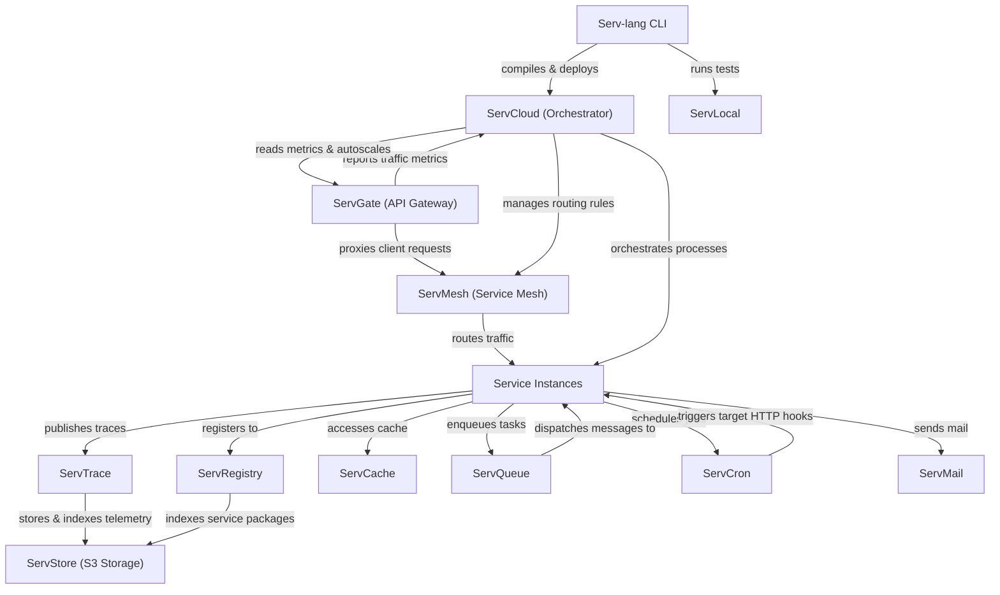

# Serv Unified Ecosystem Roadmap & Architect Analysis

> Single source of truth for the **Serv** ecosystem: Serv-lang, ServGate, ServStore, ServQueue, ServConsole, ServCache, ServMesh, ServCron, ServCloud, ServTrace, ServTunnel, ServAuth, ServPool, ServMail, ServFlow, and the Servverse vision.  

> Last updated: July 9, 2026

---

## Ecosystem Completion Status

All items in Phases 1 through 14 have been fully implemented, verified, and pushed.

- For completed details of Phases 1 to 5: Refer to the git history and repository CHANGELOG.

- For completed details of Phases 6 to 10: See [UNIFIED_ROADMAP_COMPLETED_6_10.md](file:///c:/Mine/try/serv/servverse-repo/UNIFIED_ROADMAP_COMPLETED_6_10.md).

- For completed details of Phases 11 to 15: See [UNIFIED_ROADMAP_COMPLETED_11_15.md](file:///c:/Mine/try/serv/servverse-repo/UNIFIED_ROADMAP_COMPLETED_11_15.md).

- For completed details of Phase 16-19: See [UNIFIED_ROADMAP_COMPLETED_16_20.md](file:///c:/Mine/try/serv/servverse-repo/UNIFIED_ROADMAP_COMPLETED_16_20.md).

### Completion Tracker

| Initiative Area | Total Items | Completed | Pending | Progress | Status Bar |

|-----------------|-------------|-----------|---------|----------|------------|

| **Phase 9: Scale & Enterprise Hardening** | 13 | 13 | 0 | **100%** | ████████████████████ |

| **Phase 10: Productization & Cloud PaaS** | 32 | 32 | 0 | **100%** | ████████████████████ |

| **Phase 11: Unified Dashboard & Console** | 33 | 33 | 0 | **100%** | ████████████████████ |

| **Phase 12: Dual-Licensing & EE Split** | 19 | 19 | 0 | **100%** | ████████████████████ |

| **Phase 13: Language & Runtime Evolution**| 18 | 18 | 0 | **100%** | ████████████████████ |

| **Phase 14: AI-Native Ecosystem** | 28 | 28 | 0 | **100%** | ████████████████████ |

| **Phase 16: Operational Hardening & Production Readiness** | 18 | 18 | 0 | **100%** | ████████████████████ |

| **Phase 17: Zero-Trust Clustering & Edge Serverless** | 8 | 8 | 0 | **100%** | ████████████████████ |

| **Phase 18: OSS-to-EE Boundary Alignment & Refactoring** | 6 | 6 | 0 | **100%** | ████████████████████ |

| **Phase 19: Component Maturity Alignment** | 7 | 7 | 0 | **100%** | ████████████████████ |

| **Phase 20: OSS-to-EE Refactoring & Enterprise Migrations** | 6 | 6 | 0 | **100%** | ████████████████████ |

| **Phase 21: Enterprise Ecosystem Scale & Next-Gen** | 6 | 6 | 0 | **100%** | ████████████████████ |

| **Phase 22: Quality, Credibility & Code Health** | 20 | 20 | 0 | **100%** | ████████████████████ |

| **Phase 23: Developer Adoption & Growth** | 14 | 11 | 3 | **79%** | ███████████████░░░░ |

| **Phase 24: Standalone Component Independence** | 20 | 16 | 4 | **80%** | ████████████████░░░░ |

| **Phase 25: Component Depth & Production Hardening** | 60 | 60 | 0 | **100%** | ████████████████████ |

| **Phase 26: Competitive Differentiation** | 107 | 107 | 0 | **100%** | ████████████████████ |

| **Phase 27: v1.0 Release Readiness** | 14 | 13 | 1 | **93%** | ██████████████████░░ |

| **Phase 28: Distribution & Installer Packaging** | 11 | 11 | 0 | **100%** |

| **Phase 29: LSP IntelliSense & Developer Tooling** | 16 | 16 | 0 | **100%** |
| **Phase 30: ServLock & ServSecret Hardening** | 10 | 10 | 0 | **100%** | ████████████████████ |
| **Phase 31: ServLock & ServSecret Ecosystem Integration** | 5 | 0 | 5 | **0%** | ░░░░░░░░░░░░░░░░░░░░ |
| **Phase 32: ServLock & ServSecret Standalone & Hardening** | 8 | 0 | 8 | **0%** | ░░░░░░░░░░░░░░░░░░░░ |

| **TOTAL ECOSYSTEM WORK** | **465** | **459** | **6** | **99%** | ███████████████████░ |

---

## Phase 15: Component Backlog & Future Enhancements (Completed)

All backlog and component enhancement items for Phase 15 have been fully completed, verified, and pushed.

- For completed details of Phase 15: See [UNIFIED_ROADMAP_COMPLETED_11_15.md](file:///c:/Mine/try/serv/servverse-repo/UNIFIED_ROADMAP_COMPLETED_11_15.md).

---

## Appendix A: Cross-Service Runtime Dependency Diagram

---

## Appendix B: Component Maturity Matrix

> Updated July 14, 2026 � based on actual code metrics (test counts, pkg structure, standalone flags, EE gating, main.go line counts).

| Component | Tests | Code Structure | Security | Observability | Standalone | EE Gated | Overall |

|-----------|-------|----------------|----------|---------------|-----------|----------|---------|

| **Serv-lang** | ?? 112 funcs | ?? compiler/, runtime/, lsp/, stdlib/ | ?? Null safety, type checking | ?? OTel codegen | ? N/A | ? N/A | **Production** |

| **ServStore** | ?? 93 funcs | ?? cmd/ + 11 packages | ?? SigV4 + TLS + OIDC + LDAP | ?? OTel + slog | ?? A+ Zero-config | ? Federation + cold tier | **Production** |

| **ServGate** | ?? 50 funcs | ?? 3 packages (proxy, wasm, otel) | ?? JWT + mTLS + ACME + policy | ?? OTel + access logs | ?? A- config.json | ? AI cache + LLM routing | **Production** |

| **ServConsole** | ?? 56 funcs | ?? 12 packages | ?? OIDC + RBAC + JWT | ?? OTel | ? Aggregator | ? SLO, cost, runbooks, exec | **Production** |

| **ServCache** | ?? 46 funcs | ?? 3 packages | ?? Token auth | ?? OTel | ?? A Standalone flag | ? Namespace isolation | **Production** |

| **ServFlow** | ?? 43 funcs | ?? 3 packages (engine, handlers, storage) | ?? JWT | ?? OTel | ?? A Standalone flag | ? Saga hooks | **Production** |

| **ServPool** | ?? 40 funcs | ?? 4 packages | ?? JWT | ?? OTel | ?? B+ docs only | ? N/A | **Production** |

| **ServMesh** | ?? 37 funcs | ?? 7 packages | ?? mTLS + JWT + auto-rotate | ?? OTel | ?? B+ needs services | ? N/A | **Production** |

| **ServTunnel** | ?? 37 funcs | ?? 6 packages | ?? TLS + token + rate limit | ?? OTel | ?? A- generic tunnel | ? Federation | **Production** |

| **ServQueue** | ?? 36 funcs | ?? 5 packages | ?? TLS + STOMP auth | ?? OTel + spans | ?? A Zero-config | ? Federation + semantic route | **Production** |

| **ServMail** | ?? 34 funcs | ?? 5 packages | ?? JWT | ?? OTel | ?? A Standalone flag | ? N/A | **Production** |

| **ServDocs** | ?? 34 funcs | ?? 3 packages (generator, openapi, parser) | ? N/A | ? N/A | ?? B+ .srv-specific | ? N/A | **Stable** |

| **ServCloud** | ?? 31 funcs | ?? 3 packages | ?? JWT | ?? OTel | ?? B Serv-specific | ? Autoscale | **Stable** |

| **ServShared** | ?? 30 funcs | ?? 4 packages (datafabric, middleware, outbox, policy) | ?? JWT + mTLS + tenant | ?? OTel init | ? Library | ? Tenant isolation | **Production** |

| **ServTrace** | ?? 17 funcs | ?? 2 packages | ?? Basic auth | ?? Self-traces | ?? A- OTLP collector | ? Cold tier, NL, anomaly | **Stable** |

| **ServAuth** | ?? 16 funcs | ?? 6 packages | ?? bcrypt + AES + MFA + OIDC | ?? OTel | ?? B No standalone flag | ? Stuffing detection | **Stable** |

| **ServCron** | ?? 13 funcs | ?? 3 packages | ?? JWT + Redis lease | ?? OTel | ?? A Standalone flag | ? N/A | **Stable** |

| **ServRegistry** | ?? 12 funcs | ?? 4 packages (registry, resolution, signing, web) | ?? JWT + crypto signing | ?? OTel | ?? B+ Standalone flag | ? N/A | **Stable** |

| **ServLock** | ?? 2 funcs | ?? 2 packages (handlers, storage) | ?? JWT | ?? Basic | ?? B+ Embedded | ? N/A | **Beta** |
| **ServSecret** | ?? 2 funcs | ?? 2 packages (handlers, storage) | ?? AES-GCM + JWT | ?? Basic | ?? B+ Standalone | ? N/A | **Beta** |

### Summary

| Rating | Count | Components |

|--------|-------|-----------|

| **Production** | 13 | Serv-lang, ServStore, ServGate, ServConsole, ServCache, ServFlow, ServPool, ServMesh, ServTunnel, ServQueue, ServMail, ServShared |

| **Stable** | 6 | ServDocs, ServCloud, ServTrace, ServAuth, ServCron, ServRegistry |

| **Beta** | 2 | ServLock, ServSecret |

**Legend:** ?? Strong | ?? Adequate | ?? Needs work | ? Not applicable | ? EE features gated

---

## Phase 16: Operational Hardening & Production Readiness (Completed)

All backlog tasks for Phase 16 have been fully completed, verified, and archived.

- For completed details of Phase 16: See [UNIFIED_ROADMAP_COMPLETED_16_20.md](file:///c:/Mine/try/serv/servverse-repo/UNIFIED_ROADMAP_COMPLETED_16_20.md).

---

## Phase 17: Zero-Trust Clustering & Edge Serverless Evolution (Completed)

All backlog tasks for Phase 17 have been fully completed, verified, and archived.

- For completed details of Phase 17: See [UNIFIED_ROADMAP_COMPLETED_16_20.md](file:///c:/Mine/try/serv/servverse-repo/UNIFIED_ROADMAP_COMPLETED_16_20.md).

---

## Phase 18: OSS-to-EE Boundary Alignment & Refactoring (Completed)

All backlog tasks for Phase 18 have been fully completed, verified, and archived.

- For completed details of Phase 18: See [UNIFIED_ROADMAP_COMPLETED_16_20.md](file:///c:/Mine/try/serv/servverse-repo/UNIFIED_ROADMAP_COMPLETED_16_20.md).

---

## Phase 19: Component Maturity Alignment (Completed)

All backlog tasks for Phase 19 have been fully completed, verified, and archived.

- For completed details of Phase 19: See [UNIFIED_ROADMAP_COMPLETED_16_20.md](file:///c:/Mine/try/serv/servverse-repo/UNIFIED_ROADMAP_COMPLETED_16_20.md).

---

## Phase 20: OSS-to-EE Refactoring & Enterprise Migrations (Completed)

All backlog tasks for Phase 20 have been fully completed, verified, and archived.

- For completed details of Phase 20: See [UNIFIED_ROADMAP_COMPLETED_16_20.md](file:///c:/Mine/try/serv/servverse-repo/UNIFIED_ROADMAP_COMPLETED_16_20.md).

## Phase 21: Enterprise Ecosystem Scale & Next-Gen Capabilities (Completed)

All backlog tasks for Phase 21 have been fully completed, verified, and archived.

- For completed details of Phase 21: See [UNIFIED_ROADMAP_COMPLETED_21_25.md](file:///c:/Mine/try/serv/servverse-repo/UNIFIED_ROADMAP_COMPLETED_21_25.md).

## Phase 22: Quality, Credibility & Code Health (Completed)

All backlog tasks for Phase 22 have been fully completed, verified, and archived.

- For completed details of Phase 22: See [UNIFIED_ROADMAP_COMPLETED_21_25.md](file:///c:/Mine/try/serv/servverse-repo/UNIFIED_ROADMAP_COMPLETED_21_25.md).

## Phase 23: Developer Adoption & Growth (Pending)

> **Context:** The platform is feature-complete but has zero external users. This phase focuses on removing friction, building community, and proving production-readiness.

- For completed details of Phase 23: See [UNIFIED_ROADMAP_COMPLETED_21_25.md](file:///F:/Don/servverse/servverse/UNIFIED_ROADMAP_COMPLETED_21_25.md).

### Pending Items

| # | Item | Component | Description | Status |
|---|------|-----------|-------------|--------|
| AG.4 | **10-minute demo video** | servverse-repo | Screen recording: install ? write service ? deploy ? observe in console. Hosted on YouTube + embedded in GitHub Pages | [ ] |
| AG.5 | **Discord/community server** | - | Developer community for questions, showcases, and contributors | [ ] |
| AG.12 | **Customer pilot program** | - | Find 2-3 teams to run in staging. Gather real feedback on DX, performance, gaps | [ ] |

## Phase 24: Standalone Component Independence (Completed)

All backlog tasks for Phase 24 have been fully completed, verified, and archived.

- For completed details of Phase 24: See [UNIFIED_ROADMAP_COMPLETED_21_25.md](file:///c:/Mine/try/serv/servverse-repo/UNIFIED_ROADMAP_COMPLETED_21_25.md).

---

## Phase 24.1: Standalone Hardening to A+ (Completed)

All backlog tasks for Phase 24.1 have been fully completed, verified, and archived.
- For completed details of Phase 24.1: See [UNIFIED_ROADMAP_COMPLETED_21_25.md](file:///F:/Don/servverse/servverse/UNIFIED_ROADMAP_COMPLETED_21_25.md).

---

## Phase 25: Component Depth & Production Hardening (Completed)

All backlog tasks for Phase 25 (D.1 - D.60) have been fully completed, verified, and archived.

- For completed details of Phase 25: See [UNIFIED_ROADMAP_COMPLETED_21_25.md](file:///c:/Mine/try/serv/servverse-repo/UNIFIED_ROADMAP_COMPLETED_21_25.md).

---

## Phase 26: Competitive Differentiation (Completed)

All backlog tasks for Phase 26 have been fully completed, verified, and archived.
- For completed details of Phase 26: See [UNIFIED_ROADMAP_COMPLETED_26_30.md](file:///F:/Don/servverse/servverse/UNIFIED_ROADMAP_COMPLETED_26_30.md).

## Phase 27: v1.0 Release Readiness (Pending)

> **Goal:** Close the consistency gaps identified in the API maturity audit. These are mechanical fixes (not design changes) required to confidently tag v1.0.0.

- For completed details of Phase 27: See [UNIFIED_ROADMAP_COMPLETED_26_30.md](file:///F:/Don/servverse/servverse/UNIFIED_ROADMAP_COMPLETED_26_30.md).

### Pending Items

| # | Item | Description | Status |
|---|------|-------------|--------|
| V1.9 | **API freeze period** | 4 weeks with zero breaking changes after all V1.1-V1.6 are done. Monitor for issues | [/] |

## Phase 28: Distribution & Installer Packaging (Completed)

All backlog tasks for Phase 28 have been fully completed, verified, and archived.

- For completed details of Phase 28: See [UNIFIED_ROADMAP_COMPLETED_26_30.md](file:///F:/Don/servverse/servverse/UNIFIED_ROADMAP_COMPLETED_26_30.md).

## Phase 29: LSP IntelliSense & Developer Tooling (Completed)

All backlog tasks for Phase 29 have been fully completed, verified, and archived.

- For completed details of Phase 29: See [UNIFIED_ROADMAP_COMPLETED_26_30.md](file:///F:/Don/servverse/servverse/UNIFIED_ROADMAP_COMPLETED_26_30.md).

## Phase 30: ServLock & ServSecret Hardening (Completed)

> **Goal:** Elevate both `ServLock` (Distributed Locking) and `ServSecret` (Secret & Credential Management) to full production readiness.

### ServLock Production Readiness

| # | Item | Description | Status |
|---|------|-------------|--------|
| SL.1 | **Multi-Backend Lease Storage** | Support etcd and Redis as backends for distributed lock state persistence instead of just memory | [x] |
| SL.2 | **Reentrant Lock Support** | Support nested lock acquisition by the same client session using lease identifiers | [x] |
| SL.3 | **Deadlock Detection Engine** | Implement graph-based cycle detection on lock wait queues to preemptively break deadlocks | [x] |
| SL.4 | **Fencing Token Verification** | Enforce fencing token checks on lock renewals and releases to avoid split-brain stale modifications | [x] |
| SL.5 | **Observability Metrics** | Export lock contention duration, active leases, and waiter queue sizes to Prometheus/OTel | [x] |

### ServSecret Production Readiness

| # | Item | Description | Status |
|---|------|-------------|--------|
| SS.1 | **Automatic Key Rotation** | Add support for periodically rotating the master encryption key and re-encrypting all secrets dynamically | [x] |
| SS.2 | **Secret Value Caching** | Implement in-memory cache for decrypted secrets with configurable TTL and eviction on change | [x] |
| SS.3 | **Audit Trail Log** | Keep a tamper-evident audit trail log recording who (which token/tenant) read, wrote, or deleted each secret | [x] |
| SS.4 | **Cloud Provider Adapters** | Support HashiCorp Vault, AWS Secrets Manager, and Doppler as backend providers for secret retrieval | [x] |
| SS.5 | **CLI Tooling Integration** | Extend `serv secret` CLI to handle listing, setting, and deleting secrets remotely from the command line | [x] |

## Phase 31: ServLock & ServSecret Ecosystem Integration (Pending)

> **Goal:** Integrate `ServLock` and `ServSecret` as first-class primitives throughout other core components in the Servverse ecosystem.

### Ecosystem Integration Backlog

| # | Item | Target Component | Description | Status |
|---|------|------------------|-------------|--------|
| EI.1 | **ServGate Secret Integration** | ServGate | Fetch SSL/TLS certificates and JWT verification keys dynamically from `ServSecret` instead of static local files | [ ] |
| EI.2 | **ServFlow Distributed Locking** | ServFlow | Integrate `ServLock` into the task execution engine to prevent duplicate transaction runs in multi-instance clusters | [ ] |
| EI.3 | **ServConsole Management Dashboard** | ServConsole | Add UI views to list active locks (via `ServLock` observability) and manage keys/secret rotations (via `ServSecret` APIs) | [ ] |
| EI.4 | **Serv-lang Built-in Lock/Secret Operators** | Serv-lang | Introduce native runtime standard library operators (e.g., `secret("db.pass")` or `lock("resource") { ... }`) | [ ] |
| EI.5 | **ServCron Scheduler Lock Gating** | ServCron | Use `ServLock` in the job execution cycle to prevent scheduler drift and duplicate scheduler execution | [ ] |

## Phase 32: ServLock & ServSecret Standalone & Hardening (Pending)

> **Goal:** Support zero-dependency standalone execution modes for both components and implement enterprise-grade security and transport hardening.

### ServLock Standalone & Hardening

| # | Item | Description | Status |
|---|------|-------------|--------|
| SL.6 | **Zero-Dependency Standalone Mode** | Support loading standalone server configuration from `servlock.yaml` (ports, backends) without requiring mesh/shared auth | [ ] |
| SL.7 | **API Key Authentication** | Implement API Key token header authorization for standalone clients to access the locking APIs securely | [ ] |
| SL.8 | **Lease Event Pub/Sub** | Implement SSE (Server-Sent Events) or WebSocket channels for lock release notifications to eliminate polling | [ ] |
| SL.9 | **TLS & mTLS Transport Hardening** | Support native TLS and mutual TLS server configs inside the binary for secure client connection tunnels | [ ] |

### ServSecret Standalone & Hardening

| # | Item | Description | Status |
|---|------|-------------|--------|
| SS.6 | **Zero-Dependency Standalone Mode** | Support loading config from `servsecret.yaml` (storage path, encryption schemes, cache rules, auth keys) | [ ] |
| SS.7 | **Automated Backup & Recovery** | Configure automated scheduled encrypted backups of the secrets database to local storage or S3/MinIO objects | [ ] |
| SS.8 | **Dynamic Environment Injector** | Create helper command `servsecret env run --cmd "app"` to fetch secrets and inject them directly to child processes | [ ] |
| SS.9 | **Key Rotation Schedules** | Support background rotation of the master key on a configurable period (e.g. 90 days) with backup keys retention | [ ] |

## Appendix C: Architectural Policy for OSS/EE Boundaries

All commercial enterprise features (**EE**) must have their core logic and implementations located exclusively inside the private `servverse-ee` repository. 

The open-source core repositories (such as `ServGate`, `ServStore`, etc.) must only expose clean interfaces, hooks, or config fields. The implementation of these hooks in the open-source code must use build-tagged placeholders (`//go:build !enterprise`), while the actual commercial code resides under the corresponding directories in `servverse-ee` and is built with `//go:build enterprise`.

