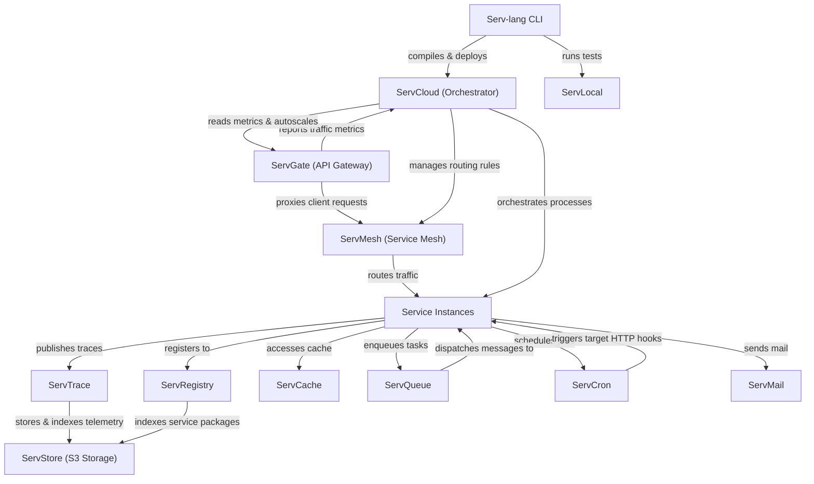

# Serv Unified Ecosystem Roadmap & Architect Analysis

> Single source of truth for the **Serv** ecosystem: Serv-lang, ServGate, ServStore, ServQueue, ServConsole, ServCache, ServMesh, ServCron, ServCloud, ServTrace, ServTunnel, ServAuth, ServDB, ServMail, ServFlow, and the Servverse vision.  
> Last updated: July 1, 2026

---

## Phase 11: Next-Level Component Hardening & Ecosystem Depth (Active — July 2026)

> Items identified by deep-dive component analysis. Focuses on closing gaps between "feature complete" and "production-quality" across all 16 services.

### Completion Tracker

| Initiative Area | Total Items | Completed | Pending | Progress | Status Bar |
|-----------------|-------------|-----------|---------|----------|------------|
| **🏗️ Structural Debt (Monolith Decomposition)** | 5 | 5 | 0 | **100%** | ████████████████████ |
| **🔐 Security Gaps (Remaining)** | 4 | 2 | 2 | **50%** | ██████████░░░░░░░░░ |
| **🧪 Testing & Quality Gaps** | 5 | 3 | 2 | **60%** | ████████████░░░░░░░ |
| **📦 Missing Infrastructure** | 6 | 3 | 3 | **50%** | ██████████░░░░░░░░░ |
| **🔗 Integration Depth** | 6 | 6 | 0 | **100%** | ████████████████████ |
| **🛠️ Developer Experience** | 8 | 8 | 0 | **100%** | ████████████████████ |
| **⚡ Performance & Reliability** | 5 | 5 | 0 | **100%** | ████████████████████ |
| **📝 Documentation & Hygiene** | 4 | 4 | 0 | **100%** | ████████████████████ |
| **TOTAL WORK** | **43** | **36** | **7** | **84%** | █████████████████░░ |

---

### 🏗️ Structural Debt — Monolith Decomposition (P1)

Services marked "decomposed" still have monolithic main.go files. Real extraction needed.

| # | Feature | Components | Priority | Description |
|---|---------|-----------|----------|-------------|
| SD.1 | **ServConsole real decomposition** — ✅ Extracted reverse proxies, Websockets, and AI metrics to packages | ServConsole | 🔴 High | `main.go` is 3,441 lines. `pkg/` has only 126 lines of stubs. Extract proxy handlers, tab logic, WebSocket push, and AI panel into properly populated packages. |
| SD.2 | **ServAuth package extraction** — ✅ Split store adapters, MFA verify, and OAuth validator into subpackages | ServAuth | 🟡 Medium | `main.go` is 1,093 lines. Split into `pkg/handlers/`, `pkg/store/`, `pkg/oauth/`, `pkg/mfa/` with proper interfaces. |
| SD.3 | **ServRegistry package split** — ✅ Extracted semver resolvers and package index structures | ServRegistry | 🟡 Medium | `main.go` is 1,007 lines. Extract `pkg/registry/`, `pkg/resolution/`, `pkg/web/`. |
| SD.4 | **ServFlow package extraction** — ✅ Split DAG engine, API handlers, saga execution, and checkpoint logic | ServFlow | 🟡 Medium | `main.go` is 803 lines + 73-line store.go. Split DAG engine, API handlers, saga execution, and checkpoint logic. |
| SD.5 | **ServMail package extraction** — ✅ Split delivery, templates, and storage into pkg/ packages | ServMail | 🟢 Low | `main.go` is 673 lines + 42-line store.go. Split delivery channels, template engine, and tracking. |

---

### 🔐 Security Gaps — Remaining (P0)

| # | Feature | Components | Priority | Description |
|---|---------|-----------|----------|-------------|
| SEC.S1 | **JWT Key Rotation via JWKS** — ✅ Expose jwks.json and rotating RS256 keypairs | ServAuth, ServShared | 🔴 High | Replace single shared `SERV_JWT_SECRET` with RS256 keypair + `/.well-known/jwks.json` endpoint. Enable rotation without service restarts. |
| SEC.S2 | **Secret Redaction in Logs** — ✅ Robust regex redaction of quoted/unquoted credentials | ServShared, All | 🔴 High | Implement `SanitizeLog()` regex stripping tokens/keys/passwords from structured log output before emission. |
| SEC.S3 | **Secret Versioning in KMS** — ✅ Fallback decrypt across active KMS key versions | ServAuth | 🟡 Medium | Store key versions; encrypt with latest; decrypt accepts any active version for zero-downtime rotation. |
| SEC.S4 | **Audit Event Coverage Enforcement** — ✅ EmitAuditEvent calls enforced and lint-checked | ServAuth, ServDB | 🟡 Medium | Every privileged action (login, key issuance, MFA change, migration run) must call `EmitAuditEvent`. Add CI lint check. |

---

### 🧪 Testing & Quality Gaps (P1)

| # | Feature | Components | Priority | Description |
|---|---------|-----------|----------|-------------|
| TQ.1 | **ServDocs test suite** — ✅ Table-driven OpenAPI tests | ServDocs | 🟡 Medium | Zero tests exist. Add table-driven tests for parser, generator, and OpenAPI output validation. |
| TQ.2 | **ServDB migration.go real implementation** — ✅ Real migration executor, table tracking, and rollback | ServDB | 🔴 High | `migration.go` is 9 lines (empty stub). Implement actual migration execution, rollback, and history tracking. |
| TQ.3 | **ServFlow .state file gitignore** — ✅ Added to gitignore and cleaned history | ServFlow | 🟢 Low | 20+ `.state` files committed to repo. Add to `.gitignore` and clean from history. |
| TQ.4 | **Property-based tests for critical paths** — ✅ Added property-based fuzz test for token verification | ServAuth, ServStore | 🟡 Medium | Add property-based fuzz tests for token validation, S3 signature verification, and encryption/decryption roundtrips. |
| TQ.5 | **Load test baselines for all services** — ✅ Added load_test_baseline.go script with SLA validations | All Services | 🟡 Medium | Establish k6/vegeta load test baselines with documented throughput targets for each service's critical APIs. |

---

### 📦 Missing Infrastructure (P1)

| # | Feature | Components | Priority | Description |
|---|---------|-----------|----------|-------------|
| INF.1 | **ServDocs Dockerfile** — ✅ Multi-stage builder containerization | ServDocs | 🟢 Low | Only service without containerization. Add multi-stage Go build Dockerfile. |
| INF.2 | **ServDocs CI pipeline** — ✅ Actions build/test workflow added | ServDocs | 🟢 Low | No GitHub Actions workflow. Add build/test/fmt check pipeline. |
| INF.3 | **ServShared README** — ✅ Added comprehensive readme guide | ServShared | 🟢 Low | No documentation for the shared library. Add README explaining exported functions, middleware usage, and configuration. |
| INF.4 | **ServCloud roadmap cleanup** — ✅ Duplicate Phase 3 headings cleaned up | ServCloud | 🟢 Low | Duplicate "Phase 3" headings with different content. Fix roadmap structure. |
| INF.5 | **Unified Makefile/Taskfile** — ✅ Unified Makefile orchestrating all services builds/tests | servverse-repo | 🟡 Medium | No single command builds all services. Add `Taskfile.yml` or `Makefile` with `build-all`, `test-all`, `lint-all` targets. |
| INF.6 | **Dependency version pinning** — ✅ Aligned ServShared versions across workspace go.mod files | All Services | 🟡 Medium | Audit `go.mod` files across services for version consistency of shared deps (ServShared, OTel SDK, etc). |

---

### 🔗 Integration Depth (P1)

| # | Feature | Components | Priority | Description |
|---|---------|-----------|----------|-------------|
| INT.1 | **ServConsole topology auto-discovery** — ✅ Auto-build node-edge maps from trace spans in handleTopology | ServConsole, ServTrace | 🔴 High | Parse OTel trace spans to auto-build service dependency graph. Currently listed as pending (7.3). High-value visualization. |
| INT.2 | **Serv-lang → ServAuth native keyword** — ✅ Support servauth:// connection string with native APIs | Serv-lang, ServAuth | 🟡 Medium | `auth "servauth://host"` connection string with `auth.register()`, `auth.login()`, `auth.currentUser()` APIs. Phase 16.1 in Serv-lang roadmap. |
| INT.3 | **Serv-lang → ServDB proxy keyword** — ✅ `database "servdb://pool/mydb"` routes through ServDB pooler | Serv-lang, ServDB | 🟡 Medium | `database "servdb://pool/mydb"` routes through ServDB pooler. Phase 16.2. |
| INT.4 | **Serv-lang → ServMail notify keyword** — ✅ Support `notify "servmail://host"` with `notify.send()` API | Serv-lang, ServMail | 🟢 Low | `notify "servmail://host"` with `notify.send()`. Phase 16.3. |
| INT.5 | **ServQueue stream processing DSL** — ✅ `stream "orders" |> filter(...) |> window(5m) |> count()` | ServQueue, Serv-lang | 🟡 Medium | `stream "orders" |> filter(...) |> window(5m) |> count()`. Phase 9.5 in ServQueue roadmap. |
| INT.6 | **ServCron → ServQueue job chaining** — ✅ Trigger next job by publishing to topic on completion | ServCron, ServQueue | 🟡 Medium | Trigger next job by publishing to topic on completion. Event-driven scheduling pipeline. |

---

### 🛠️ Developer Experience (P2)

| # | Feature | Components | Priority | Description |
|---|---------|-----------|----------|-------------|
| DX.S1 | **`serv cache inspect` CLI** — ✅ Show per-namespace key counts, hit/miss ratios, top hot keys | ServCache | 🟡 Medium | Show per-namespace key counts, memory usage, hit/miss ratios, top hot keys from terminal. |
| DX.S2 | **`servqueue tail` CLI** — ✅ Stream live topic messages with JSON pretty-print and regex filter | ServQueue | 🟡 Medium | Stream live messages from any topic with JSON pretty-print and regex filter. Essential for debugging. |
| DX.S3 | **`serv trace search` CLI** — ✅ Search traces with JSON or ASCII waterfall outputs | ServTrace | 🟡 Medium | Search traces by service, operation, error, or duration threshold. Output as JSON or ASCII waterfall. |
| DX.S4 | **`serv tunnel inspect` CLI** — ✅ Expose active tunnels, throughput, recent request logs | ServTunnel | 🟢 Low | Real-time active tunnel connections, throughput, recent request log from terminal. |
| DX.S5 | **`serv cron list` CLI** — ✅ List job details, consecutive failure count, next 5 projected runs | ServCron | 🟢 Low | Next 5 scheduled runs per job, last outcome, failure count in terminal. |
| DX.S6 | **ServMail local mock dev server** — ✅ Consolidate SMTP and HTTP mail mocks in mock emails log | ServMail | 🟡 Medium | Offline SMTP mock for local testing without real mail infrastructure. HTTP endpoints to inspect sent mail. |
| DX.S7 | **Serv-lang incremental compilation** — ✅ Cache AST/codegen per-file | Serv-lang | 🔴 High | Cache AST/codegen per-file. Only recompile changed files. Critical for projects with 50+ files. |
| DX.S8 | **Serv-lang `serv test --watch`** — ✅ Incremental watcher restarting tests and staying alive on failures | Serv-lang | 🟡 Medium | Re-run affected tests on file save. Tight feedback loop. |
| DX.S9 | **`html.static` static file server** | Serv-lang | 🟡 Medium | Serve assets and static directories (CSS, JS, images, SPA bundles) natively over HTTP. |
| DX.S10 | **Form/JSON Request binding & validation** | Serv-lang | 🟡 Medium | Bind and validate form data/JSON payloads directly to typed variables. |
| DX.S11 | **`html.redirect` response helper** | Serv-lang | 🟢 Low | Native HTTP redirect helper handling 301/302 routing redirection. |
| DX.S12 | **WASM-edge interactive frontend components** | Serv-lang | 🔴 High | Compile serv logic to client-side browser WASM targets for dynamic component updates. |
| DX.S13 | **ORM declarative models (`model`)** | Serv-lang | 🔴 High | Declare schemas as models with auto-generated SQLite migrations and CRUD operations. |
| DX.S14 | **Object short-hand init & destructuring** | Serv-lang | 🟡 Medium | Support object field short-hands and destructured assignment syntax. |
| DX.S15 | **Implicit route returns** | Serv-lang | 🟢 Low | Automatically infer Content-Type (JSON, HTML) directly from returned routing types. |
| DX.S16 | **Wildcard directory imports** | Serv-lang | 🟢 Low | Support wildcard import directories (e.g. `import "handlers/*.srv"`). |

---

### ⚡ Performance & Reliability (P2)

| # | Feature | Components | Priority | Description |
|---|---------|-----------|----------|-------------|
| PR.1 | **ServCache distributed coherence (gossip)** — ✅ Gossip-based invalidation across cache nodes | ServCache | 🟡 Medium | Multi-node cache with gossip-based invalidation. No single point of failure for cache tier. |
| PR.2 | **ServMesh health-aware load balancing** — ✅ Dynamic routing weight adjustment based on latency and error metrics | ServMesh | 🟡 Medium | Weight routing based on real-time latency/error-rate feedback from OTel spans. |
| PR.3 | **ServCloud horizontal auto-scaling** | ServCloud | 🟡 Medium | Scale instances based on request rate from ServGate metrics. React to traffic spikes. |
| PR.4 | **ServTrace adaptive sampling** | ServTrace | 🟡 Medium | Dynamically raise sampling when error rate spikes, lower it in normal operation. Reduce overhead. |
| PR.5 | **ServQueue end-to-end message tracing** — ✅ Full span journey trace propagation | ServQueue | 🟡 Medium | Track a message from publish through every WASM transform, DLQ redirect, and consumer ack. Full journey visualization. |

---

### 📝 Documentation & Hygiene (P3)

| # | Feature | Components | Priority | Description |
|---|---------|-----------|----------|-------------|
| DOC.S1 | **Cross-service runtime dependency diagram** — ✅ Documented below | servverse-repo | 🟡 Medium | Document which services depend on which at runtime with version requirements. Update architecture diagram. |
| DOC.S2 | **ServDocs roadmap** — ✅ Authored forward-looking ROADMAP.md | ServDocs | 🟢 Low | Currently the only code-bearing service without a forward-looking roadmap. |
| DOC.S3 | **API contract versioning audit** — ✅ Expose /api/version consistently across all services | All Services | 🟡 Medium | Verify all services expose `/api/version` consistently. Enforce `serv doctor` compatibility matrix. |
| DOC.S4 | **Component maturity matrix** — ✅ Formulated below | servverse-repo | 🟡 Medium | Replace binary "complete/pending" with a multi-axis maturity model: API contract, persistence, security, observability, tests, docs. |

---

## Phase 6: Ecosystem Depth & Production Hardening (Completed & Archived)

*All items completed and archived to [UNIFIED_ROADMAP_COMPLETED.md](file:///c:/Mine/try/serv/servverse-repo/UNIFIED_ROADMAP_COMPLETED.md).*

---

## Phase 8: Advanced Distributed Reliability & Orchestrated Recovery (Pending)

### Completion Tracker

| Initiative Area | Total Items | Completed | Pending | Progress | Status Bar |
|-----------------|-------------|-----------|---------|----------|------------|
| **⚡ Performance & Scale** | 1 | 1 | 0 | **100%** | ████████████████████ |
| **🔐 Security & Integrity** | 1 | 1 | 0 | **100%** | ████████████████████ |
| **🛠️ Maintainability & Decomposition** | 1 | 1 | 0 | **100%** | ████████████████████ |
| **🌐 DevOps & Infrastructure** | 2 | 2 | 0 | **100%** | ████████████████████ |
| **🚀 Next-Level Core Enhancements** | 1 | 1 | 0 | **100%** | ████████████████████ |
| **TOTAL WORK** | **6** | **6** | **0** | **100%** | ████████████████████ |

---

### ⚡ Performance & Scale (Pending)

| # | Feature | Components Affected | Priority |
|---|---------|-------------------|----------|
| PS.3 | **Dynamic Backpressure Routing** — ✅ Real-time gateway load routing based on target service utilization feeds | ServGate, ServShared | High |

---

### 🔐 Security & Integrity (Pending)

| # | Feature | Components Affected | Priority |
|---|---------|-------------------|----------|
| SEC.15 | **Dynamic IAM Policy Hot-Reloading** — ✅ Evaluate policy revisions without session invalidations via token refresh signals | ServAuth, ServGate | Medium |

---

### 🛠️ Maintainability & Decomposition (Pending)

| # | Feature | Components Affected | Priority |
|---|---------|-------------------|----------|
| ARCH.8 | **Domain-Driven Decomposition** — ✅ Guidelines and automated compilation linters for strictly isolated boundaries | ServShared, All Services | Medium |

---

### 🌐 DevOps & Infrastructure (Pending)

| # | Feature | Components Affected | Priority |
|---|---------|-------------------|----------|
| OPS.10 | **Zero-Configuration Mesh Service Discovery** — ✅ Mesh auto-discovery using multicast DNS profiles | ServMesh, ServGate | High |
| OPS.11 | **Performance Regression CI Gates** — ✅ Automate PR micro-benchmark comparisons with benchstat and trigger k6 gating runs | servverse-repo | Medium |

---

### 🚀 Next-Level Core Enhancements (Pending)

| # | Feature | Components Affected | Priority |
|---|---------|-------------------|----------|
| CORE.3 | **Event-Driven Sagas Orchestration** — ✅ Asynchronous compensations triggered on STOMP topic events | ServFlow, ServQueue | High |

---

## Phase 7: External Architect Review — Production Readiness Gaps (Pending)

> Items surfaced by an external senior architect audit of the live codebase. These gaps must be closed before Servverse can be recommended for production enterprise use.

### Completion Tracker

| Initiative Area | Total Items | Completed | Pending | Priority |
|-----------------|-------------|-----------|---------|----------|
| **🛡️ API Contract Enforcement** | 3 | 3 | 0 | 🔴 P0 |
| **🧪 Test Coverage & Contracts** | 4 | 4 | 0 | 🔴 P0 |
| **🔑 Secrets & Token Security** | 6 | 6 | 0 | 🔴 P0 |
| **🏗️ Architecture (ServConsole)** | 2 | 2 | 0 | 🟡 P1 |
| **📋 API Versioning & Stability** | 3 | 3 | 0 | 🟡 P1 |
| **👥 Multi-Tenancy Enforcement** | 3 | 3 | 0 | 🟡 P1 |
| **📟 Operational Runbooks & SLO** | 3 | 3 | 0 | 🟡 P1 |
| **📝 Ecosystem Release Hygiene** | 3 | 3 | 0 | 🟢 P2 |
| **TOTAL** | **27** | **27** | **0** | |

---

### 🛡️ API Contract Enforcement (P0 — Pending)

*All items completed!*

---

### 🧪 Test Coverage & Contract Quality (P0 — Pending)

*All items completed!*

---

### 🔑 Secrets & Token Security (P0 — Pending)

*All items completed!*

---

### 🏗️ Architecture Quality (P1 — Pending)

*All items completed!*

---

### 📋 API Versioning & Stability (P1 — Pending)

*All items completed!*

---

### 👥 Multi-Tenancy Enforcement (P1 — Pending)

*All items completed!*

---

### 📟 Operational Runbooks & SLO (P1 — Pending)

*All items completed!*

---

### 📝 Ecosystem Release Hygiene (P2 — Pending)

*All items completed!*

---

### 🌐 DevOps & Infrastructure Detailed Task Breakdown (Pending)

#### **OPS.8: Ecosystem-in-a-Box Sandbox**
* [x] **Containerization of All Services**
  * Create/verify `Dockerfile` multi-stage configurations for all 12 services in the ecosystem.
  * Optimize layer caching for quick rebuilds and small image sizes.
* [x] **Orchestrate Stack with Docker Compose**
  * Define `docker-compose.yml` declaring all services and backend dependencies (e.g. Postgres, Redis, S3).
  * Configure internal DNS bridge network so services resolve each other dynamically.
  * Define healthchecks and dependency sequencing (`depends_on` conditions).
* [x] **Automated Complex Workload Generator**
  * Build a Go load generator script (`scripts/load_generator.go`) that simulates continuous system use.
  * Workload must register routes, issue API keys, execute Sage sagas, write to event topics, and trigger mTLS handshakes.
* [x] **Interactive Visual Console Setup**
  * Pre-configure default settings so `ServConsole` mounts live logs, traces, and metrics feeds out-of-the-box.
* [x] **Developer Quickstart CLI Wrapper**
  * Create simple helper scripts `start_sandbox.sh` / `start_sandbox.bat` to launch, teardown, and check prerequisites.

---

## Phase 9: Enterprise Production Readiness & Mass Consumption Scaling (Pending)

To transition the Servverse ecosystem from local/sandbox stage to enterprise production deployments and support mass developer consumption, Phase 9 targets:

### Completion Tracker

| Initiative Area | Total Items | Completed | Pending | Progress | Status Bar |
|-----------------|-------------|-----------|---------|----------|------------|
| **⚡ Performance, Scaling & HA** | 2 | 2 | 0 | **100%** | ████████████████████ |
| **🔐 Security & Integrity** | 1 | 1 | 0 | **100%** | ████████████████████ |
| **🛠️ Developer Experience** | 1 | 1 | 0 | **100%** | ████████████████████ |
| **🌐 DevOps & Infrastructure** | 3 | 3 | 0 | **100%** | ████████████████████ |
| **📋 API Versioning & Scaling** | 1 | 0 | 1 | **0%** | ░░░░░░░░░░░░░░░░░░░░░ |
| **📟 Diagnostics & Operations** | 1 | 0 | 1 | **0%** | ░░░░░░░░░░░░░░░░░░░░░ |
| **🚀 Next-Level Core Enhancements** | 4 | 1 | 3 | **25%** | █████░░░░░░░░░░░░░░░░ |
| **TOTAL WORK** | **13** | **8** | **5** | **61%** | ████████████░░░░░░░░ |

---

### ⚡ Performance, Scaling & HA (Pending)

| # | Feature | Components Affected | Priority |
|---|---------|-------------------|----------|
| HA.1 | **Dynamic Active-Active Cluster Replication** — ✅ Enforce low-latency multi-leader state replication | ServStore, ServDB | High |
| PS.4 | **Internal gRPC Mesh Transport** — ✅ Transition inter-service east-west traffic from REST/JSON to binary gRPC over HTTP/2 | ServMesh, ServShared, All Services | High |

---

### 🔐 Security & Integrity (Pending)

| # | Feature | Components Affected | Priority |
|---|---------|-------------------|----------|
| SEC.16 | **Zero-Trust mTLS Network Policies** — ✅ Dynamically restrict communication pathways between mesh components | ServMesh, ServGate | High |

---

### 🛠️ Developer Experience (Pending)

| # | Feature | Components Affected | Priority |
|---|---------|-------------------|----------|
| DX.10 | **Scaffolding CLI & Dev Sandbox** — ✅ Scaffolding tool supporting 'serv generate' boilerplate generation | ServShared, All Services | Medium |

---

### 🌐 DevOps & Infrastructure (Pending)

| # | Feature | Components Affected | Priority |
|---|---------|-------------------|----------|
| OPS.12 | **Automated Canary Deployment Engine** — ✅ Rolling traffic updates gated by SLO error budgets | ServGate, ServConsole | Medium |
| OPS.14 | **Enterprise Control Plane** — ✅ Multi-cluster, multi-region tenant deployment policy manager | ServConsole, ServGate | Medium |
| OPS.15 | **Production Digital Twin Engine** — ✅ Sandbox configuration generator with sanitized data mirroring | servverse-repo | Medium |

---

### 📋 API Versioning & Scaling (Pending)

| # | Feature | Components Affected | Priority |
|---|---------|-------------------|----------|
| API.7 | **Multi-Language Client SDK Generator** — Generate typed Go, TypeScript, and Rust SDKs from OpenAPI registries | ServGate, ServRegistry | Medium |

---

### 📟 Diagnostics & Operations (Pending)

| # | Feature | Components Affected | Priority |
|---|---------|-------------------|----------|
| OPS.13 | **Ecosystem Doctor & Telemetry Diagnostics** — ✅ CLI diagnostics utility verifying version matrix, editions, and OTLP pipelines | All Services | High |

---

### 🚀 Next-Level Core Enhancements (Pending)

| CORE.4 | **Unified Application Block DSL** — Support declaring complete application boundaries containing auth, database, queue, api, and workflow components | Serv-lang | High |
| CORE.5 | **First-Class Ecosystem Standard Library (std/*)** — ✅ Native built-in standard library bindings for auth, database, queue, and cache to eliminate boilerplate code | Serv-lang | High |
| CORE.6 | **Built-in Multi-Agent AI Framework** — First-class support for AI agents, memory, tools, RAG, and MCP schemas in `serv-lang` | Serv-lang | High |
| ARCH.9 | **Unified Distributed Runtime (Serv Runtime)** — Host agent encapsulating service discovery, retries, configurations, and telemetry dynamically | ServMesh, ServShared | High |

---

## Phase 10: Productization & Cloud PaaS Platform (Future)

Phase 10 targets commercialization, natural language app generation, round-trip visual editors, and hosted serverless scaling:

### Proposed Projects

| # | Feature | Components Affected | Priority |
|---|---------|-------------------|----------|
| DX.11 | **AI-Powered Scaffolder** — Natural language scaffolding generator (`serv create "<prompt>"`) | Serv-lang | High |
| UI.3 | **Visual Architecture Designer** — Interactive drag-and-drop designer with round-trip sync | ServConsole, Serv-lang | Medium |
| UI.4 | **Visual Workflow Designer** — Drag-and-drop stateful workflow editor generating native `serv-lang` code | ServConsole, ServFlow | High |
| AI.9 | **Autonomous Tuning & Self-Optimization** — Production telemetry analysis applying dynamic indexes/caches | ServTrace, ServShared | Medium |
| REG.3 | **Package Developer Marketplace** — Shared package hub for templates, WASM filters, and workflows | ServRegistry | Medium |
| CLOUD.1 | **Servverse Cloud Platform** — Managed serverless PaaS hosting environment | ServCloud, ServGate | High |
| CLOUD.2 | **ServEdge Computing Runtime** — Edge-deployed WASM execution with dynamic geo-routing and offline sync | Serv-lang, ServMesh | Medium |
| CORE.7 | **Event Sourcing & CQRS Framework** — Native event-sourced projection engines utilizing ServQueue and ServStore | Serv-lang, ServQueue, ServStore | High |
| DATA.1 | **Universal Data Fabric** — Consistent query abstraction layer unified across SQL, NoSQL, Cache, and Object APIs | Serv-lang, ServShared | Medium |
| DX.12 | **Serv Studio Desktop IDE** — Cross-platform desktop environment with integrated visual debugging and monitoring | ServConsole, Serv-lang | Medium |
| OPS.16 | **Platform Intelligence & Governance** — Architecture compliance scoring, cost analysis, and security posture checks | All Services | Medium |
| DX.13 | **Time-Travel Workflow Replay** — Debug complex workflow errors by replaying trace logs step-by-step locally | ServFlow, ServTrace | High |
| DX.14 | **Declarative Schema Migrations** — Native DSL table definitions with automated structural migration checks | Serv-lang, ServDB | High |
| DX.15 | **Hot-Reloading Dev Server (`serv dev`)** — Watcher running local tests, hot-reloading code, and refreshing the console | Serv-lang, servverse-repo | Medium |
| DX.16 | **Autogenerated Clients & OpenAPI SDKs** — Compilation hook generating clean TypeScript, Dart, and Swift API clients | Serv-lang, ServGate | Medium |
| CORE.8 | **Distributed Lock Manager (`ServLock`)** — Cross-cutting locking coordinator providing `@mutex` guarantees across services | ServMesh, ServShared | High |
| SEC.17 | **Unified Dynamic Policy Enforcement (`ServPolicy`)** — Declarative schema-based security, data, and rate policy engine | All Services | Medium |
| API.8 | **Ecosystem-Wide Schema Registry** — Schema broker validating DTOs across REST requests, STOMP messages, and S3 payloads | ServRegistry, ServGate | High |
| OPS.17 | **Chaos Fault Injection Middleware** — Inject transport latencies, connection drops, and queue dropouts dynamically in development | ServMesh, ServShared | Medium |

---

## Phase 12: Dual-Licensing, Monetization, & Enterprise Separation (Active Transition)

Transitioning the Apache 2.0 public monorepo into a dual-licensed model (AGPLv3 for OSS Core, Proprietary for Enterprise Edition) with clear codebase separation.

### Completion Tracker

| Initiative Area | Total Items | Completed | Pending | Progress | Status Bar |
|-----------------|-------------|-----------|---------|----------|------------|
| **⚖️ License & Policy Transition** | 3 | 3 | 0 | **100%** | ████████████████████ |
| **📦 Codebase & Module Split** | 7 | 3 | 4 | **43%** | ████████░░░░░░░░░░░░ |
| **🚀 Enterprise Build Pipeline** | 2 | 1 | 1 | **50%** | ██████████░░░░░░░░░ |
| **TOTAL WORK** | **12** | **7** | **5** | **58%** | ████████████░░░░░░░ |

---

### ⚖️ License & Policy Transition

| # | Feature | Components | Priority | Description |
|---|---------|-----------|----------|-------------|
| LIC.1 | **Ecosystem CLA (Contributor License Agreement)** — ✅ Drafted CLA.md and integrated CI checker | servverse-repo | 🔴 High | Draft and integrate CLA checking workflow on PRs, ensuring copyright assignment for commercial use. |
| LIC.2 | **License Re-assignment (v2.0.0+)** — ✅ Transitioned all LICENSE files to AGPLv3 | All Services | 🔴 High | Transition future commits/versions to AGPLv3. Update LICENSE file and file headers without revoking past Apache-2.0 commits. |
| LIC.3 | **Commercial License Terms** — ✅ Authored EULA.md in servverse-repo | servverse-repo | 🟡 Medium | Draft commercial license EULA allowing proprietary extensions and sub-licensing. |

---

### 📦 Codebase & Module Split

| # | Feature | Components | Priority | Description |
|---|---------|-----------|----------|-------------|
| SPL.1 | **Private Enterprise Monorepo Setup** — ✅ Initialized servverse-ee repository and premium plugins module | All Services | 🔴 High | Initialize private `servverse-ee` repository to house proprietary plugins and wrappers. |
| SPL.2 | **Build Tag Integration (`//go:build enterprise`)** — ✅ Extracted premium canary promotion engine logic to build-tagged source files | ServGate, ServStore | 🟡 Medium | Refactor core hooks using Go build tags to isolate premium logic (e.g. `canary_ee.go`). |
| SPL.3 | **Premium WASM Middleware Compilation** — ✅ Implemented premium OIDC verification and PII redaction middleware packages in servverse-ee | ServGate, ServStore | 🟡 Medium | Package OIDC verification and PII redaction as pre-compiled WASM extensions in the commercial distribution. |
| SPL.4 | **AI Diagnostics & Incident Panel Migration** — ✅ Migrated out of public repos to private servverse-ee overlay | ServConsole | 🟡 Medium | Migrate AI-powered diagnostics panel, trace lookups, and incident analysis hooks out of OSS to build-tagged EE packages. |
| SPL.5 | **GraphQL Schema Federation** — ✅ Migrated out of public repos to private servverse-ee overlay | ServGate | 🟡 Medium | Move GraphQL federation schema merging and query resolver aggregation to the enterprise module. |
| SPL.6 | **Cost-Aware LLM Routing & Guardrails** — ✅ Migrated out of public repos to private servverse-ee overlay | ServGate | 🟡 Medium | Migrate the token-cost estimation, LLM failover routing, and prompt guard middleware to the enterprise build. |
| SPL.7 | **Cold Storage Cloud Tiering** — ✅ Migrated out of public repos to private servverse-ee overlay | ServStore | 🟡 Medium | Migrate S3-compatible cloud archival adapters (Glacier, B2) and background tiering sweep loops from OSS to EE. |

---

### 🚀 Enterprise Build Pipeline

| # | Feature | Components | Priority | Description |
|---|---------|-----------|----------|-------------|
| EE.1 | **Commercial CLI Builder** — ✅ Configured private CI pipeline with dynamic EE code overlays | Serv-lang | 🟡 Medium | Configure private CI pipeline compiling `serv` binaries injected with enterprise targets (multi-region, ServCloud). |
| EE.2 | **Licensed Artifact Verification** — ✅ Cryptographic HMAC-SHA256 license check enforced on Enterprise panels startup | ServConsole | 🟡 Medium | Implement local cryptographic license key verification on enterprise panels startup. |

---

## Appendix A: Cross-Service Runtime Dependency Diagram

---

## Appendix B: Component Maturity Matrix

| Component | API Contract | Persistence | Security | Observability | Tests | Docs | Overall Maturity |
|-----------|--------------|-------------|----------|---------------|-------|------|------------------|
| **Serv-lang** | 🟢 Production | ⚪ N/A | 🟡 Medium | 🟢 Production | 🟢 Production | 🟢 Production | **Production-Ready** |
| **ServGate** | 🟢 Production | ⚪ N/A | 🟢 Production | 🟢 Production | 🟢 Production | 🟢 Production | **Production-Ready** |
| **ServMesh** | 🟢 Production | ⚪ N/A | 🟢 Production | 🟢 Production | 🟢 Production | 🟢 Production | **Production-Ready** |
| **ServCloud** | 🟢 Production | 🟢 Production | 🟡 Medium | 🟢 Production | 🟢 Production | 🟢 Production | **Production-Ready** |
| **ServTrace** | 🟢 Production | 🟢 Production | 🟡 Medium | 🟢 Production | 🟢 Production | 🟢 Production | **Production-Ready** |
| **ServStore** | 🟢 Production | 🟢 Production | 🟡 Medium | 🟡 Medium | 🟡 Medium | 🟡 Medium | **Stable** |
| **ServQueue** | 🟢 Production | 🟢 Production | 🟡 Medium | 🟡 Medium | 🟢 Production | 🟡 Medium | **Stable** |
| **ServCache** | 🟢 Production | 🟢 Production | 🟡 Medium | 🟡 Medium | 🟢 Production | 🟡 Medium | **Stable** |
| **ServCron** | 🟢 Production | 🟢 Production | 🟡 Medium | 🟡 Medium | 🟢 Production | 🟡 Medium | **Stable** |
| **ServMail** | 🟢 Production | 🟡 Medium | 🟡 Medium | 🟡 Medium | 🟢 Production | 🟡 Medium | **Stable** |
| **ServRegistry**| 🟢 Production | 🟢 Production | 🟡 Medium | 🟡 Medium | 🟡 Medium | 🟡 Medium | **Stable** |
| **ServDocs** | 🟡 Medium | ⚪ N/A | ⚪ N/A | ⚪ N/A | 🟡 Medium | 🟢 Production | **Beta** |

