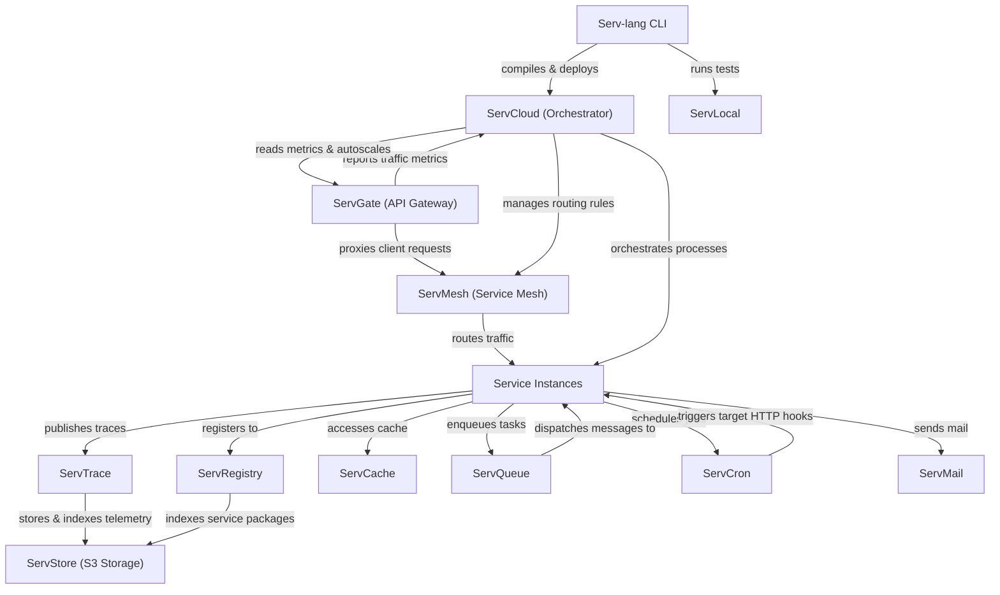

# Serv Unified Ecosystem Roadmap & Architect Analysis

> Single source of truth for the **Serv** ecosystem: Serv-lang, ServGate, ServStore, ServQueue, ServConsole, ServCache, ServMesh, ServCron, ServCloud, ServTrace, ServTunnel, ServAuth, ServDB, ServMail, ServFlow, and the Servverse vision.  
> Last updated: July 5, 2026

---

## Phase 9: Scale & Enterprise Hardening (Active)

### Completion Tracker

| Initiative Area | Total Items | Completed | Pending | Progress | Status Bar |
|-----------------|-------------|-----------|---------|----------|------------|
| **⚡ Performance, Scaling & HA** | 2 | 2 | 0 | **100%** | ████████████████████ |
| **🔐 Security & Integrity** | 1 | 1 | 0 | **100%** | ████████████████████ |
| **🛠️ Developer Experience** | 1 | 1 | 0 | **100%** | ████████████████████ |
| **🌐 DevOps & Infrastructure** | 3 | 3 | 0 | **100%** | ████████████████████ |
| **📋 API Versioning & Scaling** | 1 | 1 | 0 | **100%** | ████████████████████ |
| **📟 Diagnostics & Operations** | 1 | 1 | 0 | **100%** | ████████████████████ |
| **🚀 Next-Level Core Enhancements** | 4 | 4 | 0 | **100%** | ████████████████████ |
| **TOTAL WORK** | **13** | **13** | **0** | **100%** | ████████████████████ |

---

### 🚀 Next-Level Core Enhancements (Completed)

| CORE.6 | **Built-in Multi-Agent AI Framework** — ✅ First-class support for AI agents, memory, tools, RAG, and MCP schemas in `serv-lang` via `agent` block declarations | Serv-lang | High |
| ARCH.9 | **Unified Distributed Runtime (Serv Runtime)** — ✅ `ServRuntime` host agent with OTel init, mesh registration, heartbeat loop, and `MeshResolver` interface | ServMesh, ServShared | High |

---

## Phase 10: Productization & Cloud PaaS Platform (Future)

Phase 10 targets commercialization, natural language app generation, round-trip visual editors, and hosted serverless scaling:

### Proposed Projects

| # | Feature | Components Affected | Priority |
|---|---------|-------------------|----------|
| DX.11 | **AI-Powered Scaffolder** — ✅ Natural language scaffolding generator (`serv create "<prompt>"`) | Serv-lang | High |
| UI.3 | **Visual Architecture Designer** — Interactive drag-and-drop designer with round-trip sync | ServConsole, Serv-lang | Medium |
| UI.4 | **Visual Workflow Designer** — ✅ Drag-and-drop stateful workflow editor generating native `serv-lang` code | ServConsole, ServFlow | High | `d2a749e` |
| AI.9 | **Autonomous Tuning & Self-Optimization** — Production telemetry analysis applying dynamic indexes/caches | ServTrace, ServShared | Medium |
| REG.3 | **Package Developer Marketplace** — Shared package hub for templates, WASM filters, and workflows | ServRegistry | Medium |
| CLOUD.1 | **Servverse Cloud Platform** — Managed serverless PaaS hosting environment | ServCloud, ServGate | High |
| CLOUD.2 | **ServEdge Computing Runtime** — Edge-deployed WASM execution with dynamic geo-routing and offline sync | Serv-lang, ServMesh | Medium |
| CORE.7 | **Event Sourcing & CQRS Framework** — ✅ Native event-sourced projection engines utilizing ServQueue and ServStore | Serv-lang, ServQueue, ServStore | High | `1843400` |
| DATA.1 | **Universal Data Fabric** — Consistent query abstraction layer unified across SQL, NoSQL, Cache, and Object APIs | Serv-lang, ServShared | Medium |
| DX.12 | **Serv Studio Desktop IDE** — Cross-platform desktop environment with integrated visual debugging and monitoring | ServConsole, Serv-lang | Medium |
| OPS.16 | **Platform Intelligence & Governance** — Architecture compliance scoring, cost analysis, and security posture checks | All Services | Medium |
| DX.13 | **Time-Travel Workflow Replay** — Debug complex workflow errors by replaying trace logs step-by-step locally | ServFlow, ServTrace | High |
| DX.14 | **Declarative Schema Migrations** — ✅ Native `table` DSL with `@primary` / `@unique` / `@default` annotations; `serv migrate` applies CREATE/ALTER TABLE SQL | Serv-lang, ServDB | High |
| DX.15 | **Hot-Reloading Dev Server (`serv dev`)** — ✅ Watcher running local tests, hot-reloading code, and refreshing the console | Serv-lang, servverse-repo | Medium |
| DX.16 | **Autogenerated Clients & OpenAPI SDKs** — Compilation hook generating clean TypeScript, Dart, and Swift API clients | Serv-lang, ServGate | Medium |
| CORE.8 | **Distributed Lock Manager (`ServLock`)** — ✅ TTL-based lock store in `ServMesh/pkg/lock`; `/api/lock/{acquire,release,extend,status,list}` HTTP API; `DistributedLocker` interface + `HTTPLockClient` + `WithLock`/`WithLockRetry` helpers in `ServShared` | ServMesh, ServShared | High |
| SEC.17 | **Unified Dynamic Policy Enforcement (`ServPolicy`)** — Declarative schema-based security, data, and rate policy engine | All Services | Medium |
| API.8 | **Ecosystem-Wide Schema Registry** — ✅ Schema broker validating DTOs across REST requests, STOMP messages, and S3 payloads | ServRegistry, ServGate | High | `2400535` |
| OPS.17 | **Chaos Fault Injection Middleware** — ✅ Inject transport latencies, connection drops, and queue dropouts dynamically in development | ServMesh, ServShared | Medium |
| AI.10 | **Self-Defending AI WAF** — Semantic proxy engine protecting routes against prompt injection, API abuse, and access anomalies | ServGate | High |
| AI.11 | **Semantic Rate Limiter** — Intrinsic token and semantic similarity limits preventing cost exhaustion attacks on LLM routes | ServGate, ServShared | Medium |
| AI.12 | **Semantic DLQ Triaging** — Agentic dead-letter queue handlers analyzing message errors, classifying fault patterns, and requeuing patches | ServQueue, ServShared | High |
| AI.13 | **Automatic Vectorization Pipeline** — Native storage pipeline automatically generating vector embeddings on S3 object uploads | ServStore, ServDB | Medium |
| AI.14 | **Self-Healing Observability Loop** — Agent-led trace monitoring, root-cause diagnostics, and automatic rollback on telemetry alerts | ServTrace, ServCloud | High |
| AI.15 | **Natural Language Operational Tracing** — Context-aware query system summarizing service-wide incidents from trace logs | ServConsole, ServTrace | Medium |

---

---

## Phase 14: AI-Native Ecosystem Deepening (Pending — 2027)

> Servverse positions as an AI-native platform. These features extend AI capabilities across every layer — not just the language, but gateway, storage, messaging, observability, and operations.

### Serv-lang (Compiler + Runtime)

| # | Feature | Type | Components | Priority | Status |
|---|---------|------|------------|----------|--------|
| AI.10 | **RAG pipeline keyword** — `rag "servstore://docs" { embed: "openai", chunk: 512 }` declares retrieval-augmented generation as infrastructure. Auto-index on write, inject context on `ai.chat()` | OSS | Serv-lang, ServStore | 🔴 High | ✅ `2f5f28a` |
| AI.11 | **Structured output (JSON mode)** — `ai.complete(prompt, schema: UserSchema)` forces LLM responses to conform to a Serv struct. Compiler validates schema at build time | OSS | Serv-lang | 🔴 High | ✅ `fd90df6` |
| AI.12 | **Streaming responses** — `ai.stream(prompt, fn(chunk) { conn.send(chunk) })` for server-sent event streaming. Currently `ai.chat()` blocks until complete | OSS | Serv-lang | 🔴 High | ✅ `fd90df6` |
| AI.13 | **Prompt template library** — `import "stdlib/prompts"` with variable injection, versioning, and A/B testing hooks | OSS | Serv-lang | 🟡 Medium | ✅ `2f5f28a` |
| AI.14 | **AI eval framework** — `test "quality" { assert ai.eval(prompt, expected, threshold: 0.8) }` for LLM output quality testing in `serv test` | OSS | Serv-lang | 🟡 Medium | ✅ `2f5f28a` |

### ServGate (AI Gateway)

| # | Feature | Type | Components | Priority | Status |
|---|---------|------|------------|----------|--------|
| AI.15 | **Token budget enforcement per route** — Max tokens/cost per API key per day. Reject when exhausted. Dashboard burn rate | EE | ServGate, ServConsole | 🔴 High | ✅ `b172cf1`/`f684827` |
| AI.16 | **Prompt versioning & A/B routing** — Route % of traffic to different system prompts. Track outcome quality per version | EE | ServGate | 🟡 Medium | ✅ `b172cf1`/`f684827` |
| AI.17 | **Response quality scoring** — Auto-score LLM responses for hallucination risk via factual grounding check against RAG context | EE | ServGate | 🟡 Medium | ✅ `b172cf1`/`f684827` |
| AI.18 | **Multi-model fallback chain** — `models: [gpt-4o-mini, gpt-4o, claude-3-5-sonnet]` — try next on failure/timeout | OSS | ServGate | 🟡 Medium | ✅ `86f0dee` |
| AI.19 | **Semantic rate limiting** — Rate limit by semantic similarity of requests, not just IP. Prevent same question rephrased 100 ways | EE | ServGate | 🟢 Low | ✅ `b172cf1`/`f684827` |

### ServStore (AI Storage)

| # | Feature | Type | Components | Priority | Status |
|---|---------|------|------------|----------|--------|
| AI.20 | **Conversational object query** — `GET /bucket?ask=<question>` generates embedding, searches, synthesizes answer (RAG on stored objects) | OSS | ServStore | 🟡 Medium | ✅ `be9f8d1` |
| AI.21 | **Auto-summarization on upload** — Generate and store summaries as metadata on document upload. Browse-by-summary without downloading | OSS | ServStore | 🟡 Medium | ✅ `ef2aea4` |
| AI.22 | **Similarity deduplication** — On upload, check if semantically similar document exists (cosine > 0.95). Warn or auto-deduplicate | OSS | ServStore | 🟢 Low | ✅ `ef2aea4` |
| AI.23 | **Classification tags on ingest** — Auto-classify uploaded objects (invoices, contracts, logs, images) via lightweight model. Searchable tags | OSS | ServStore | 🟢 Low | ✅ `d98d578` |

### ServQueue (AI Messaging)

| # | Feature | Type | Components | Priority | Status |
|---|---------|------|------------|----------|--------|
| AI.24 | **Semantic message routing** — Route messages to subscribers based on content meaning: `subscribe "support" where ai.classify(msg) == "billing"` | OSS | ServQueue, Serv-lang | 🟡 Medium | ✅ `272d863` |
| AI.25 | **DLQ auto-summarization** — When messages pile up in DLQ, generate summary: "47 failed messages, mostly payment timeouts from US-East" | EE | ServQueue, ServConsole | 🟢 Low | ✅ `30db3e1`/`73239ee` |
| AI.26 | **Message pattern anomaly detection** — Learn normal throughput patterns. Alert on significant volume/content shifts | EE | ServQueue, ServTrace | 🟡 Medium | ✅ `30db3e1`/`73239ee` |

### ServConsole (AI Operations)

| # | Feature | Type | Components | Priority | Status |
|---|---------|------|------------|----------|--------|
| AI.27 | **Natural language log search** — "Show errors from ServAuth where users couldn't login" → structured log query + filters | EE | ServConsole | 🔴 High | ✅ `bb4f7ab`/`73239ee` |
| AI.28 | **Incident root cause synthesis** — On alert: analyze deploys, config changes, correlated metrics, similar past incidents. One-paragraph hypothesis | EE | ServConsole | 🔴 High | ✅ `bdb622b`/`1ce6503` |
| AI.29 | **Auto-generated runbooks** — Observe how operators respond to recurring alerts. After 3 manual resolutions, suggest automated runbook | EE | ServConsole | 🟡 Medium | ✅ `bdb622b`/`1ce6503` |
| AI.30 | **Anomaly explanation** — When metric spikes, explain why: "Latency increased because ServDB pool hit max after deploy doubled query volume" | EE | ServConsole, ServTrace | 🟡 Medium | ✅ `2dc52d5`/`ff1320e` |

### ServAuth (AI Security)

| # | Feature | Type | Components | Priority | Status |
|---|---------|------|------------|----------|--------|
| AI.31 | **Adaptive risk scoring** — Score login attempts: new device + unusual time + different geo = high risk → step-up to MFA | OSS | ServAuth | 🟡 Medium | ✅ `750d4cd` |
| AI.32 | **Credential stuffing detection** — Behavioral clustering to detect many IPs using same password list. Auto-block suspicious cohorts | OSS | ServAuth | 🟡 Medium | ✅ `750d4cd` |

### ServTrace (AI Observability)

| # | Feature | Type | Components | Priority | Status |
|---|---------|------|------------|----------|--------|
| AI.33 | **Auto-correlate slow spans** — Identify root cause span and explain: "95% latency in ServDB query — missing index on order_date" | OSS | ServTrace, ServConsole | 🟡 Medium | ✅ `cc6c13c` |
| AI.34 | **Predictive SLO breach** — Given current error rate trajectory, predict when SLO will be violated. "Error budget exhausted in 3 days" | OSS | ServTrace, ServConsole | 🟡 Medium | ✅ `cc6c13c` |

### ServCron & ServFlow (AI Automation)

| # | Feature | Type | Components | Priority | Status |
|---|---------|------|------------|----------|--------|
| AI.35 | **Smart scheduling** — Analyze job execution history (duration, resource usage, conflicts). Suggest optimal scheduling windows | OSS | ServCron | 🟢 Low | ✅ `b5a9da6` |
| AI.36 | **AI decision steps in workflows** — `step "classify" { ai.classify(input, ["approve", "review", "reject"]) }` — AI-powered branching | OSS | ServFlow, Serv-lang | 🟡 Medium | ✅ `ae91d05` |
| AI.37 | **Workflow generation from description** — NL prompt → DAG definition: "receives order → validates payment → notifies warehouse → sends email" | OSS | ServFlow, Serv-lang | 🟢 Low | ✅ `ae91d05` |

---

## Appendix A: Cross-Service Runtime Dependency Diagram

---

## Appendix B: Component Maturity Matrix

| Component | API Contract | Persistence | Security | Observability | Tests | Docs | Console Integration | Overall Maturity |
|-----------|--------------|-------------|----------|---------------|-------|------|---------------------|------------------|
| **Serv-lang** | 🟢 Production | ⚪ N/A | 🟡 Medium | 🟢 Production | 🟢 Production | 🟢 Production | ⚪ N/A | **Production-Ready** |
| **ServGate** | 🟢 Production | ⚪ N/A | 🟢 Production | 🟢 Production | 🟢 Production | 🟢 Production | 🟢 Full proxy + panel | **Production-Ready** |
| **ServMesh** | 🟢 Production | ⚪ N/A | 🟢 Production | 🟢 Production | 🟢 Production | 🟢 Production | 🔴 No integration | **Production-Ready** |
| **ServCloud** | 🟢 Production | 🟢 Production | 🟡 Medium | 🟢 Production | 🟢 Production | 🟢 Production | 🟡 Partial (deploy only) | **Production-Ready** |
| **ServTrace** | 🟢 Production | 🟢 Production | 🟡 Medium | 🟢 Production | 🟢 Production | 🟢 Production | 🟢 Full proxy + panel | **Production-Ready** |
| **ServStore** | 🟢 Production | 🟢 Production | 🟡 Medium | 🟡 Medium | 🟡 Medium | 🟡 Medium | 🟢 Full proxy + panel | **Stable** |
| **ServQueue** | 🟢 Production | 🟢 Production | 🟡 Medium | 🟡 Medium | 🟢 Production | 🟡 Medium | 🟢 Full proxy + panel | **Stable** |
| **ServConsole** | 🟢 Production | 🟡 Medium | 🟢 Production | 🟢 Production | 🟡 Medium | 🟡 Medium | ⚪ Self | **Stable** |
| **ServCache** | 🟢 Production | 🟢 Production | 🟡 Medium | 🟡 Medium | 🟢 Production | 🟡 Medium | 🔴 No integration | **Stable** |
| **ServCron** | 🟢 Production | 🟢 Production | 🟡 Medium | 🟡 Medium | 🟢 Production | 🟡 Medium | 🔴 No integration | **Stable** |
| **ServAuth** | 🟢 Production | 🟡 Medium | 🟡 Medium | 🟡 Medium | 🟢 Production | 🟡 Medium | 🟢 Full proxy + panel | **Stable** |
| **ServDB** | 🟢 Production | 🟡 Medium | 🟡 Medium | 🟡 Medium | 🟢 Production | 🟡 Medium | 🟢 Full proxy + panel | **Stable** |
| **ServMail** | 🟢 Production | 🟡 Medium | 🟡 Medium | 🟡 Medium | 🟢 Production | 🟡 Medium | 🟢 Full proxy + panel | **Stable** |
| **ServFlow** | 🟢 Production | 🟡 Medium | 🟡 Medium | 🟡 Medium | 🟢 Production | 🟡 Medium | 🟡 Proxy only (no panel) | **Stable** |
| **ServTunnel** | 🟢 Production | ⚪ N/A | 🟡 Medium | 🟢 Production | 🟢 Production | 🟡 Medium | 🟢 Full proxy + panel | **Stable** |
| **ServRegistry**| 🟢 Production | 🟢 Production | 🟡 Medium | 🟡 Medium | 🟡 Medium | 🟡 Medium | 🔴 No integration | **Stable** |
| **ServDocs** | 🟡 Medium | ⚪ N/A | ⚪ N/A | ⚪ N/A | 🟡 Medium | 🟢 Production | 🔴 No integration | **Beta** |

---

## Appendix C: Architectural Policy for OSS/EE Boundaries

All commercial enterprise features (**EE**) must have their core logic and implementations located exclusively inside the private `servverse-ee` repository. 
The open-source core repositories (such as `ServGate`, `ServStore`, etc.) must only expose clean interfaces, hooks, or config fields. The implementation of these hooks in the open-source code must use build-tagged placeholders (`//go:build !enterprise`), while the actual commercial code resides under the corresponding directories in `servverse-ee` and is built with `//go:build enterprise`.

