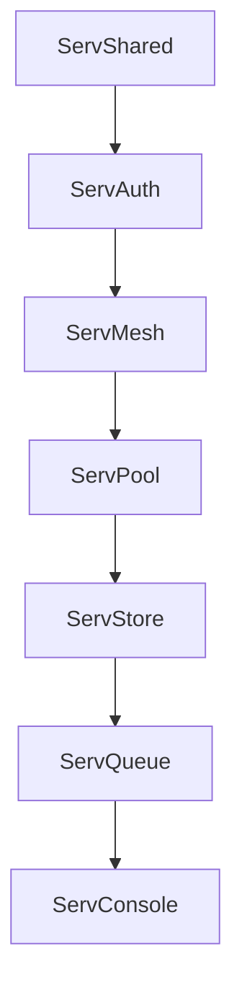

# Upgrading and Migration Guide

This document provides a template and guidelines for performing major and minor upgrades across the **Servverse** ecosystem.

---

## 1. Ecosystem Upgrade Order

When upgrading an entire Servverse installation (e.g. from `v1.0.x` to `v1.1.0`), services should be updated in the following dependency order to avoid service disruptions:

1. **Ecosystem Shared library** (`ServShared`)
2. **Identity & Auth Control Plane** (`ServAuth`)
3. **Service Mesh Discovery** (`ServMesh`)
4. **Database Proxies & Data Stores** (`ServPool`, `ServStore`)
5. **Message Queuing & Orchestration** (`ServQueue`, `ServFlow`)
6. **Dashboard & Dashboards** (`ServConsole`)

---

## 2. Database Schema Migrations

Every state-persisting service (like `ServAuth`, `ServConsole`, `ServMail`) handles database migrations automatically during startup.
- **Migration Policy**: We only support additive migrations (e.g., `ALTER TABLE ... ADD COLUMN`) in minor/patch releases.
- **Offline / Rollback**: Destructive changes (e.g. dropping columns, renaming tables) are strictly reserved for major releases and must be documented below.

---

## 3. Version Migration Log

### Upgrading to v1.0.0
- **Prefix Changes**: Ensure all HTTP clients target `/api/v1/...` instead of `/api/...`. Backward compatibility routes will remain active during the deprecation window, but are scheduled for removal in `v2.0.0`.
- **Payload Limits**: Request body size limits are now enforced at 10MB by default across all services. Large file uploads should utilize multipart S3 flows in `ServStore`.
