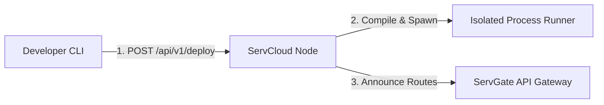

# ServCloud — Managed PaaS Orchestration Built for the Ecosystem

*How to build a lightweight process orchestrator that deploys, monitors, and dynamically routes microservices without the overhead of Kubernetes.*

---

## Kubernetes is Overkill for Small Teams

For small-to-medium teams, managing a Kubernetes cluster is often a full-time job. You need to write thousands of lines of YAML manifests, configure ingress controllers, coordinate DNS syncs, manage CSI storage volumes, and monitor node resources.

What if you could deploy and manage your microservices with a single CLI command — similar to Heroku or Fly.io — but hosted entirely on your own infrastructure?

This is why we built **ServCloud** — a lightweight process orchestrator and application deployment PaaS backend built specifically for the Servverse ecosystem.

---

## Architecture: Build, Run, and Auto-Route

ServCloud operates as a single compiled binary running on your host servers. It exposes a simple REST API and coordinates three lifecycle stages:

1. **Deploy & Build**: The developer pushes a code bundle (containing `.srv` files or binaries) via `POST /api/v1/deploy`. ServCloud unpacks it, resolves dependencies, and runs compile tasks in the background.
2. **Process Runner**: Once built, ServCloud spawns the application process. It automatically allocates available local ports, isolates process resource limits, and sets up environment variables.
3. **Dynamic Gateway Routing**: Immediately after a successful startup, ServCloud contacts **ServGate** to register new routing prefixes to point to the newly deployed process port. No proxy restarts, no DNS propagation delay.

---

## Core Capabilities

### 1. Isolated Process Execution
ServCloud does not require Docker or container runtimes to isolate applications. It manages native host processes, allocating isolated networking ports dynamically and monitoring memory usage per process.

### 2. Live Log Streaming
Standard output and error streams of spawned applications are redirected to memory-backed circular ring buffers. You can fetch or stream live log outputs using `GET /api/v1/apps/{id}/logs` or view them inside ServConsole.

### 3. Gateway Synchronization
ServCloud maintains a direct sync connection to ServGate. When an application is deployed, updated, or scaled down, route changes are pushed to ServGate's dynamic route mapping registry instantly.

---

## Summary

ServCloud delivers Heroku-like developer ergonomics directly on your native infrastructure. No YAML manifests, no complex Kubernetes engines, just simple deployments in seconds.

*— Yuvaraj*
