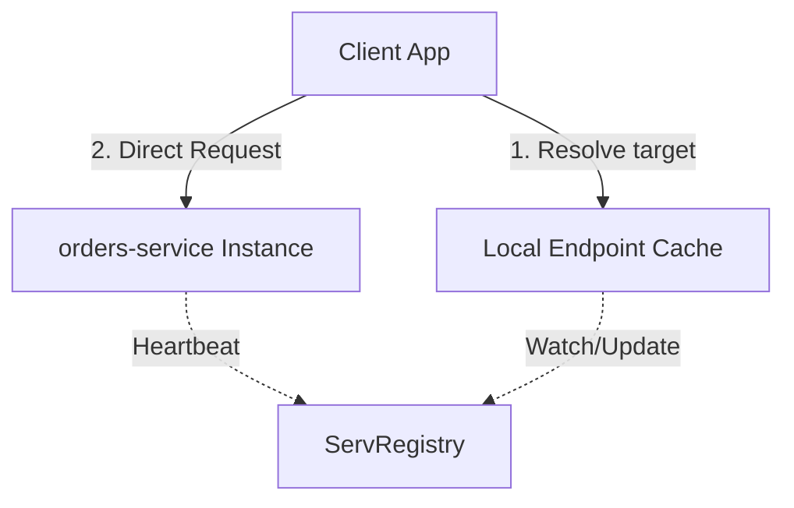

# ServMesh — Library-Level Service Discovery & Resilient Routing

*How to implement heartbeats, round-robin load balancing, and sandboxed half-open circuit breakers directly inside the service process without the overhead of sidecar proxies.*

---

## Sidecars Are Too Heavy

In traditional service mesh architectures (like Istio or Linkerd), traffic gets intercepted by a sidecar proxy (like Envoy) running next to every microservice container. 

While sidecars provide robust mutual TLS, telemetry, and circuit breaking, they introduce significant penalties:
- **CPU/Memory overhead**: Running Envoy next to every microservice container consumes significant memory at scale.
- **Latency hops**: Every network request must travel through the client-side sidecar, over the wire, and through the server-side sidecar, adding extra hops and milliseconds of latency.
- **Operational complexity**: Managing sidecar injections, Envoy configurations, and control planes is notoriously complex.

We designed **ServMesh** to solve this. It provides the core resilience and discovery benefits of a service mesh directly within your microservice processes as a lightweight compiled Go library.

---

## Architecture: Control Plane & Client Resolver

ServMesh operates via a simple two-tier architecture:
1. **ServRegistry (Control Plane)**: A lightweight registry catalog keeping track of healthy microservice instances, their IP/Port addresses, and heartbeats.
2. **ServMesh Library (Data Plane)**: Built directly into the client microservice.

When a client wants to call `orders-service`, it doesn't query a proxy sidecar. Instead:
- The ServMesh client resolver fetches the list of healthy instances for `orders-service` directly from `ServRegistry` (and caches it locally).
- It performs client-side load balancing (Round-Robin or Least Connections) directly in memory.
- It routes the request straight to the selected target instance.

---

## Resilient Routing Features

### 1. Heartbeats & Registry Eviction
Every ServMesh instance registers itself on startup via `ServRegistry`. It sends periodic heartbeat ticks. If heartbeats stop for more than 15 seconds, the instance is automatically evicted, preventing clients from hitting dead routes.

### 2. Client-Side Load Balancing
Clients maintain local endpoint tables and balance incoming calls using configurable policies. If one instance goes offline, ServMesh automatically retries on a different target before returning an error.

### 3. Sandboxed Circuit Breaker
To prevent cascading failures, ServMesh assigns a circuit breaker to every backend endpoint. It tracks request failure rates (5xx errors, timeouts) in sliding windows:
- **Closed (Normal)**: Requests pass through freely.
- **Open (Failing)**: Calls are short-circuited locally, returning `503 Service Unavailable` immediately.
- **Half-Open (Testing)**: Sends a limited amount of trial traffic. If it succeeds, the breaker resets to Closed; if it fails, it returns to Open.

---

## Summary

ServMesh delivers high-speed discovery and failsafe routing straight inside the compiled service runtime. No sidecars, no configuration overhead, just sub-millisecond resilience.

*— Yuvaraj*
