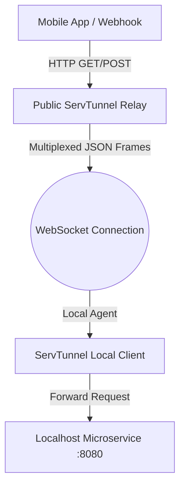

# ServTunnel — Secure Local Dev Tunneling Built for Microservices

*How to expose local microservices safely to the internet with subdomain routing, multiplexed WebSockets, and built-in OTel context propagation.*

---

## The Dev Tunnel Dilemma

When building distributed architectures, local development is always the hardest part. You compile your microservices locally, but then you need to:
- Test third-party webhook callbacks (Stripe, GitHub, Shopify).
- Connect mobile applications or frontend client portals directly to your localhost APIs.
- Share staging-like environments with colleagues without deploying to Kubernetes.

Traditional tunneling tools like ngrok or Cloudflare Tunnels are functional, but they operate as proprietary black-boxes. They require separate client binaries, lack native integration with OpenTelemetry headers, and don't understand custom service discovery schemas.

This is why we built **ServTunnel** — a secure, open-source tunnel relay and client built natively for the Servverse.

---

## Architecture: Multiplexed WebSockets

ServTunnel consists of two lightweight components compiled in a single Go binary:
1. **ServTunnel Server (Relay)**: Hosted on a public server (e.g. `*.tunnel.servverse.dev`). It listens for public HTTP/WebSocket traffic and matches subdomains to active agent connections.
2. **ServTunnel Client (Agent)**: Runs locally next to your service (e.g., `servtunnel client --local 8080 --subdomain test-app`).

Instead of establishing hundreds of TCP connections or spinning up complex TCP socket wrappers, ServTunnel multiplexes all public requests and private replies over a **single, secure WebSocket connection** between the client and the public relay.



When a public request hits the relay:
- The relay packs the HTTP request (method, headers, body, query) into a unified JSON frame.
- It pushes the frame through the multiplexed WebSocket stream.
- The local client unpacks the frame, performs the local request to your service, packs the reply, and streams it back.

---

## Key Features

### 1. Subdomain Routing
Each local agent requests a unique subdomain or gets assigned a random one (e.g., `https://green-field-45.tunnel.servverse.dev`). The public relay reads the incoming `Host` header to dynamically forward traffic to the appropriate agent stream.

### 2. Embedded Request Inspector
ServTunnel client comes with a built-in, local developer dashboard (served at `http://localhost:8443`). You can inspect every HTTP request/response payload passing through the tunnel, view headers, and click **Replay** to re-fire a webhook callback to localhost instantly.

### 3. Native OpenTelemetry Propagation
Because ServTunnel is built into the Servverse core, it propagates OTel `traceparent` headers transparently. If a webhook triggers a request through the tunnel, the waterfall trace maps the lifecycle starting at the public relay, through the tunnel agent, and into your local microservice.

---

## Getting Started

### 1. Launch a Local Tunnel Agent
Expose your local development port `3000` to the default public relay:
```bash
servtunnel client --local 3000 --subdomain my-order-api
```
Output:
```
✓ Tunnel established successfully!
Public URL:  https://my-order-api.tunnel.servverse.dev
Inspector:   http://localhost:8443
```

### 2. Configure in Serv-lang
You can declare tunnel mappings directly inside your `serv.toml` or announce configurations dynamically:
```toml
[tunnel]
local_port = 3000
subdomain = "my-order-api"
```

---

## Summary

ServTunnel makes local microservice debugging simple, open-source, and OTel-ready. No registration walls, no proprietary CLI limitations.

*— Yuvaraj*
