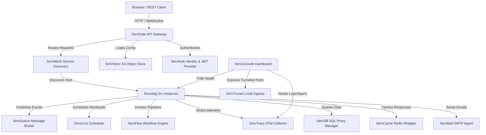

# Servverse Runtime Dependencies & Integration Matrix

This document maps the complete runtime dependencies and network flow patterns across all 15 operational services of the Servverse ecosystem.

## Interaction Architecture Graph

## Service Port Registry

| Port | Service Name | Protocol | Role |
|------|--------------|----------|------|
| `8080` | `ServGate` | HTTP | Ingress API Gateway |
| `8081` | `ServStore` | HTTP | S3 Storage Engine |
| `8082` | `ServQueue` | HTTP/STOMP | Queue Broker |
| `8083` | `ServConsole` | HTTP | Operational Dashboard |
| `8084` | `ServCache` | RESP/HTTP | Redis Cache Proxy |
| `8085` | `ServCron` | HTTP | Scheduler Control plane |
| `8089` | `ServMesh` | HTTP/UDP | Service Registry Node |
| `8090` | `ServTrace` | HTTP/gRPC | OpenTelemetry Collector |
| `8094` | `ServMail` | HTTP | Transactional Mail Agent |
| `8096` | `ServFlow` | HTTP | DAG Workflow Engine |
| `8097` | `ServDB` | HTTP | SQL Persistence Proxy |
| `8098` | `ServAuth` | HTTP | Identity and MFA provider |
| `8443` | `ServTunnel` | HTTPS | Tunnel and Let's Encrypt Ingress |

## Interaction Flows

### 1. Ingress Request Authentication
1. **Client** hits `ServGate` on `:8080/api/users`.
2. `ServGate` extracts the token and validates against keys fetched from `ServAuth` OIDC configurations.
3. If valid, request is forwarded down to the corresponding `ServMesh` registered target host.

### 2. Event-Driven Workflow Run
1. `ServCron` triggers a scheduled event on a timer payload.
2. The execution goes to `ServQueue` topics.
3. A listening worker consumer picks up the task, executes a step, and writes artifacts to `ServStore` S3 buckets.
