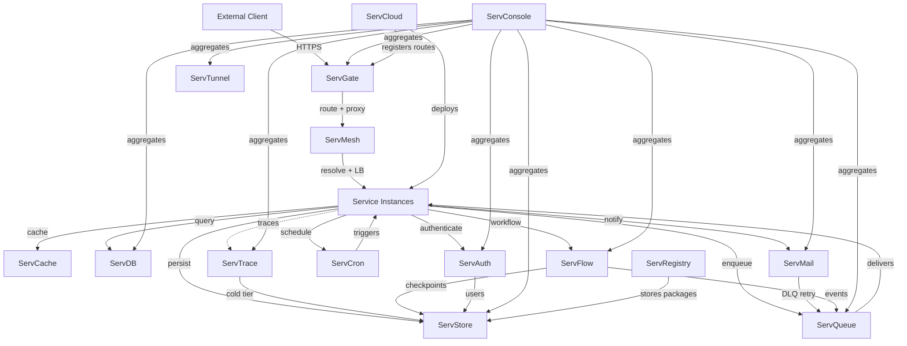

# Servverse Architecture

## Layers

```
┌─────────────────────────────────────────────────────────────────────┐
│                       DEVELOPER TOOLS                               │
│  Serv-lang Compiler │ VS Code LSP │ ServDocs │ ServRegistry         │
├─────────────────────────────────────────────────────────────────────┤
│                       PLATFORM LAYER                                │
│  ServGate │ ServMesh │ ServCloud │ ServTunnel │ ServConsole          │
├─────────────────────────────────────────────────────────────────────┤
│                     INFRASTRUCTURE LAYER                            │
│  ServStore │ ServQueue │ ServCache │ ServDB │ ServAuth               │
│  ServMail  │ ServCron  │ ServFlow                                   │
├─────────────────────────────────────────────────────────────────────┤
│                     FOUNDATION                                      │
│  ServShared (common library — health, OTel, JWT, logging)           │
│  ServTrace (distributed tracing backend)                            │
└─────────────────────────────────────────────────────────────────────┘
```

## Runtime Dependency Flow



## Service Discovery

All services locate each other via the `SERVVERSE_DISCOVERY` environment variable — a JSON manifest (or file path) mapping service names to URLs:

```json
{
  "gate": "http://localhost:8080",
  "store": "http://localhost:8081",
  "queue": "http://localhost:8082",
  "console_port": 8083,
  "cache": "http://localhost:8084",
  "cron": "http://localhost:8085",
  "cloud": "http://localhost:8086",
  "mesh": "http://localhost:8087",
  "registry": "http://localhost:8088",
  "docs": "http://localhost:8089",
  "trace": "http://localhost:8090",
  "mail": "http://localhost:8094",
  "flow": "http://localhost:8096",
  "db": "http://localhost:8097",
  "auth": "http://localhost:8098",
  "tunnel": "http://localhost:8443",
  "otlp_endpoint": "http://localhost:8090/v1/traces",
  "jwt_secret": "shared-secret"
}
```

## Shared Conventions

All services follow these patterns (enforced by ServShared):

| Convention | Implementation |
|------------|----------------|
| Health probe | `GET /healthz` → 200 OK |
| Readiness probe | `GET /readyz` → 200 OK |
| Error format | `{"error": "msg", "code": "ERR_CODE", "trace_id": "..."}` |
| Auth | Bearer JWT verified via `SERV_JWT_SECRET` |
| Tracing | OTel spans exported to `SERV_OTLP_ENDPOINT` |
| Logging | Structured JSON to stdout |
| Shutdown | Graceful on SIGTERM (drain + 5s timeout) |
| API versioning | `/api/v1/` prefix on all management endpoints |

## Communication Patterns

| Pattern | Used By |
|---------|---------|
| HTTP REST (sync) | All services for API calls |
| STOMP TCP (async) | ServQueue for pub/sub messaging |
| WebSocket (push) | ServConsole for real-time dashboards, ServTunnel for tunneling |
| `serv://` resolver | ServMesh for inter-service calls |
| S3 protocol | ServStore for object storage |
| OTLP/HTTP | ServTrace for span ingestion |
