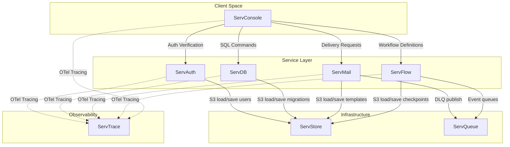

# Serv Runtime Cross-Service Dependencies & Tracing

This document defines the runtime dependency graph and OTel tracing flows across the core Servverse ecosystem.

## Runtime Architecture Diagram

The diagram below illustrates how components interact dynamically at runtime:

## Dependency Descriptions

1. **State Persistence**: On startup and write mutations, all 4 services query the **ServStore** S3 gateway bucket (or fail back gracefully to mock storage) to ensure dynamic state reload.
2. **Asynchronous Messaging**: **ServMail** pushes failed deliveries to the dead-letter-queue (DLQ) in **ServQueue**. **ServFlow** publishes execution steps to **ServQueue** for durable orchestrations.
3. **Observability Pipeline**: All services wrap handlers in OTel tracing middleware, sending span updates to **ServTrace** to monitor distributed transactions.
